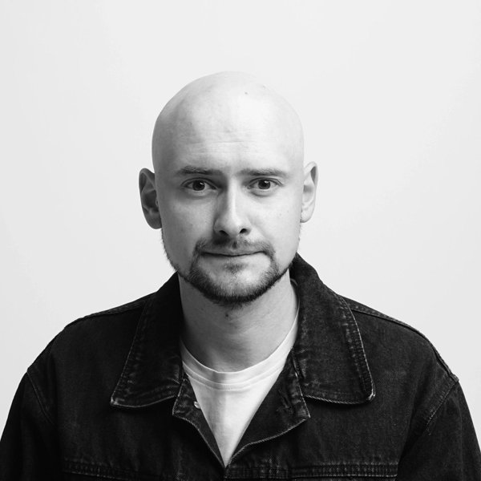

{ .cv-photo }

# Serhii Smetanskyi

Software Test Engineer

[:material-email: Email](mailto:smetanskyi@proton.me){ .md-button }
[:fontawesome-brands-linkedin: LinkedIn](https://www.linkedin.com/in/serhiismetanskyi){ .md-button target=_blank }
[:fontawesome-brands-telegram: Telegram](https://t.me/serhiismetanskyi){ .md-button target=_blank }
[:fontawesome-brands-github: GitHub](https://github.com/serhiismetanskyi){ .md-button target=_blank }
<button class="md-button md-button--primary cv-print" type="button" onclick="window.print()">:material-download: Save as PDF</button>

## Summary

I am a Software Test Engineer with over 5 years of experience ensuring software quality across the full testing spectrum, including UI, API, mobile, and AI/ML system testing. I specialize in functional, automation, performance testing, and quality management.

Skilled in designing and executing effective test strategies, selecting appropriate testing approaches and tools based on specific project needs to ensure reliable test coverage and high product quality.

I am detail-oriented and proactive, with strong problem-solving skills and a passion for collaboration and continuous learning.

## Experience

N

### Namecheap

Apr 2023 – Present · 2 positions

#### Release Coordinator in ML Team

Jul 2023 – Present

- Managed and coordinated software releases across multiple environments, ensuring timely and high-quality deployments.
- Collaborated with engineering, QA, and operations teams to plan releases, track progress, and mitigate delivery risks.
- Maintained release documentation and deployment procedures to ensure consistent and reliable release processes.
- Performed post-release monitoring to verify system stability and performance.
- Facilitated cross-functional team communication to ensure smooth and reliable software delivery.

#### General Backend / AI QA Engineer

Apr 2023 – Present

- Responsible for end-to-end quality assurance, including QA processes, test strategies, and functional and non-functional testing using manual and automated approaches.
- Designed and executed test strategies for backend systems, covering APIs, databases, distributed services, and event-based communication.
- Developed automated API tests using Pytest and Playwright, and performed performance testing with Locust.
- Validated data preprocessing, data pipelines, model outputs, and AI-driven features using multiple evaluation metrics.
- Developed automated evaluation tests for LLM outputs using DeepEval with Pytest.

aS

### airSlate

Jun 2022 – Apr 2023

#### QA Engineer

Jun 2022 – Apr 2023

- Performed end-to-end quality assurance for web and mobile applications, defining test strategies to ensure product quality.
- Created and maintained test documentation, including test plans, test cases, and regression test suites.
- Analyzed product requirements, ensured test coverage, and executed functional testing across integration and end-to-end scenarios.
- Managed the defect lifecycle, investigating issues and working with developers to resolve them.
- Acted as Release QA, coordinating releases and deployments, and as Maintenance QA, investigating customer-reported issues and providing technical support.

sX

### soft Xpansion

Sep 2019 – Jun 2022 · 2 positions

#### Business Analyst

Jan 2020 – Jun 2022

- Automated client business processes by implementing product-based software solutions.
- Extended product functionality by introducing new features and improvements.
- Collaborated with stakeholders during requirements and backlog refinement, breaking down features into development tasks.
- Managed the product backlog, supported sprint planning, and coordinated releases.
- Handled change requests and supported development teams to ensure timely delivery.
- Created product documentation, including specifications, guides, presentations, and release notes.
- Modeled business processes and workflows using UML and BPMN diagrams.
- Designed wireframes, mockups, and UI/UX prototypes to improve product usability.

#### QA Engineer

Sep 2019 – Jun 2022

- Performed QA for multiple web applications, executing functional testing across key product workflows.
- Analyzed requirements, identified quality risks, and reported issues to development teams.
- Managed the defect lifecycle, creating bug reports and tracking issue resolution.
- Created and maintained test documentation, including test strategies, test plans, and test cases.
- Improved QA processes and supported knowledge sharing within the team.
- Assisted customers by resolving support tickets, conducting product demos, and delivering training sessions.

## Technical Skills

**Programming**

- Python
- FastAPI
- Django
- Pydantic
- SQLAlchemy

**Testing Frameworks**

- Pytest
- Unittest
- Selenium
- Playwright
- DeepEval

**Testing Types**

- Functional
- Integration
- API
- UI
- Mobile
- E2E
- Regression
- Performance

**Communication Protocols**

- REST API
- gRPC
- WebSockets
- GraphQL

**Message Brokers**

- AWS SNS / SQS

**API Testing Tools**

- Requests
- Postman
- Swagger
- Fiddler
- Chrome DevTools

**Load Testing**

- Locust

**LLMs & AI**

- Prompt Engineering
- Prompt Injection & Jailbreak Testing
- LLM Evaluation (Automated & Manual)
- RAG Testing
- AI Agents Testing
- Voice Agents Testing

**Mobile Testing**

- Android Studio (ADB, Logcat)
- TestFlight
- Firebase (Test Lab, Crashlytics)

**Databases**

- PostgreSQL
- SQLite

**CI/CD**

- Jenkins
- GitHub Actions

**Containers & DevOps**

- Docker
- Kubernetes

**Version Control**

- Git (GitHub, GitLab, Bitbucket)

**Cloud Platforms**

- AWS EC2
- ECS
- S3
- Athena
- DynamoDB
- Lambda
- Cost Explorer
- Boto3

**Observability**

- Phoenix
- Langfuse
- MLflow

**Logging & Monitoring**

- AWS CloudWatch
- OpenSearch
- Elasticsearch / Kibana
- Sentry
- New Relic
- Grafana
- OpenLens

**Test Management**

- TestRail
- Qase

**Copilots & Automation**

- Claude Code
- Cursor
- n8n

**Documentation**

- SRS
- Technical Specifications
- API Contracts
- Test Documentation

## Education

:material-school-outline:

### Kyiv National University of Trade and Economics

Sep 2011 – Jan 2018

#### Master's Degree in Economic Cybernetics

Sep 2011 – Jan 2018

## Languages

- Ukrainian — Native
- English — Upper intermediate (B2)

## Projects

<!-- projects:list -->
