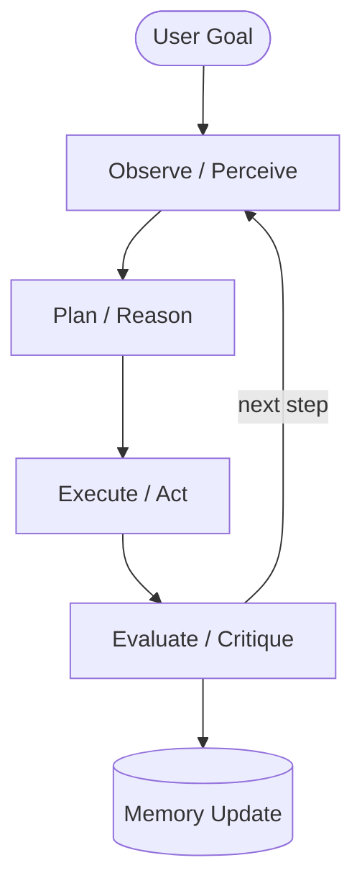

# Agentic AI — Fundamentals & Core Components

## What Is Agentic AI

**Agentic AI** is a system where an LLM acts as an autonomous agent that:
- Sets sub-goals and pursues them independently
- Executes multi-step actions via tools / APIs
- Persists and uses memory across reasoning steps
- Iteratively evaluates results and adjusts its plan

|  | Plain LLM App | Agentic AI |
|---|---|---|
| Interaction | Prompt -> Response | Goal -> Plans -> Actions -> Evaluation |
| Memory | Session context only | Short-term + long-term |
| Tools | None / limited | APIs, databases, code, search |
| Iterations | One step | Multiple steps (sense-plan-act loop) |
| Example | "Explain RAG" | "Plan a 3-day trip to Chicago under $1500" |

## Sense → Plan → Act → Observe Loop



The loop stops when:
- The agent produces a **Final Answer**
- **Max iterations** is reached (for example, 10)
- A **stop condition** defined in the prompt is triggered

## Example: ReAct Single-Agent Flow

```
Thought: I need flights from NYC to Chicago on April 5.
Action: search_flights({"from":"NYC","to":"CHI","date":"2026-04-05"})
Observation: [{"price":189,"airline":"United"},{"price":210,"airline":"Delta"}]

Thought: Cheapest is United at $189. Now checking hotels.
Action: search_hotels({"city":"Chicago","checkin":"2026-04-05","nights":3})
Observation: [{"name":"Marriott","price_per_night":120},...]

Final Answer: Best option — United $189 + Marriott 3 nights $360 = $549 total.
```

## 5 Core Components

### 1. Perception / World Modeling

Input layer of the agent. It converts different input types into one internal format.

- Parses text, images, and JSON events
- Converts multimodal input into context
- Reads data from sensors, APIs, or streaming events

### 2. Memory

| Type | Scope | Storage | Example |
|------|-------|---------|---------|
| **Short-Term (STM)** | Current session / reasoning chain | LLM context window, in-memory cache | Current plan, tool outputs |
| **Long-Term (LTM)** | Across sessions / persistent | Vector DB, SQL/NoSQL | User profile, past tasks, domain facts |

Promotion rule: move important facts from STM to LTM after task completion.

### 3. Planner / Reasoning

Turns the goal into a sequence of actions.

- Task decomposition (Chain-of-Thought)
- Generating the next action or tool call
- Evaluating alternative strategies
- Replanning when actions fail

### 4. Executor / Actuator

Executes the actions selected by the planner.

- Calls external APIs / tools with structured input
- Executes code inside a sandbox
- Applies retry and timeout logic
- Enforces budget and latency checks before each call

### 5. Observer / Evaluator (Critic)

Checks results after each action or milestone.

| Critic Type | Description |
|-------------|-------------|
| **Self-critique** | The same LLM evaluates its own output |
| **External critic** | A separate LLM or model verifies the answer |
| **Nested auditor** | A specialized sub-agent reviews results |

Critic responsibilities: detect errors, reduce hallucinations, and trigger replanning.

## Communication / Orchestration Layer

In multi-agent systems, a coordination layer manages workflow:

- **Centralized:** one supervisor LLM distributes tasks to sub-agents
- **Decentralized:** agents coordinate via message passing or consensus
- **Workflow graphs:** explicit DAGs for complex flows
- **Interfaces:** JSON task/result contracts for traceability

## 5 Key Design Patterns (Taxonomy)

Per Andrew Ng / DeepLearning.AI, there are 5 fundamental agentic patterns:

| # | Pattern | Core Idea | Framework |
|---|---------|-----------|-----------|
| 1 | **Reflection** | Agent reviews its own output and improves it | LangChain / LangGraph |
| 2 | **Tool Use** | Agent calls external tools / APIs | LangChain, LlamaIndex |
| 3 | **ReAct** | Alternates reasoning and action in a loop | LangChain, any LLM |
| 4 | **Planning** | Decomposes large tasks into sub-steps | AutoGen, LangGraph |
| 5 | **Multi-Agent Collaboration** | Multiple specialized agents work as a team | AutoGen, CrewAI |

### Reflection Pattern (in depth)

**What it is:** the agent generates output, critiques it, revises it, and repeats up to N times.
Analogy: a person writes an essay, then re-reads and edits it.

```
Generate(draft) → Critique(draft) → Revise(draft) → [repeat ≤ N] → Final
```

**Types of Reflection:**
- **Self-critique:** the same LLM evaluates its own output
- **External critic:** a separate LLM or validation model
- **Iterative refinement:** generator ↔ reflector cycle (LangGraph)

**LangGraph cycle example:**
```python
from langgraph.graph import StateGraph

graph = StateGraph(AgentState)
graph.add_node("generate", generator)
graph.add_node("reflect", reflector)
graph.add_edge("generate", "reflect")
graph.add_conditional_edges("reflect", should_continue)  # loop or finish
app = graph.compile()
```

**When to use reflection:**
- Code generation (write → test → fix)
- Content writing (draft → review → polish)
- Planning (plan → critique assumptions → replan)

## Agentic RAG vs Classic RAG

|  | Classic RAG | Agentic RAG |
|---|---|---|
| Query | Single embedded query | Agent formulates multiple queries dynamically |
| Sources | One vector store | Multiple tools + knowledge bases |
| Logic | Fixed pipeline | Dynamic retrieval strategy |
| Verification | None | Critic evaluates relevance |
