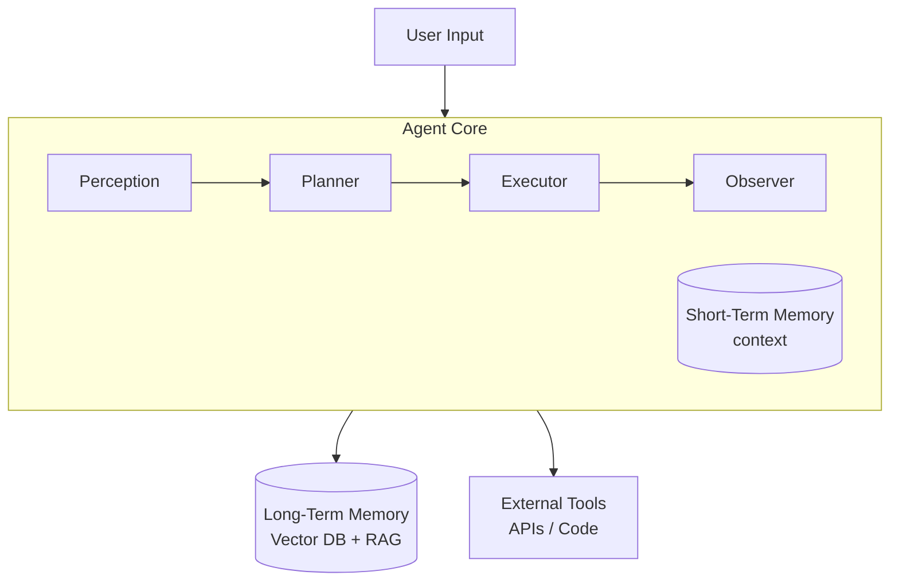

# Agentic AI Architecture

Agentic AI is an architecture where an LLM acts as an **autonomous agent**.
It plans and executes multi-step tasks with memory and tools.

Unlike a classic prompt→response app, an agentic system:
- Sets sub-goals and decomposes tasks
- Interacts with external tools / APIs
- Iterates through a sense → plan → act → observe loop
- Manages both short-term and long-term memory

## Sections

| File | Topics |
|------|--------|
| [Fundamentals & Components](01-fundamentals-components.md) | What agentic AI is, core components, ReAct loop, and how it differs from a plain LLM app |
| [Multi-Agent Patterns](02-multi-agent-patterns.md) | Main multi-agent patterns (Supervisor, Hybrid, BDI, Neuro-Symbolic) and coordination |
| [Memory & RAG](03-memory-rag.md) | STM/LTM, practical RAG pipeline, vector DB choices, retrieval methods |
| [Tool Integration & Prompting](04-tool-integration-prompting.md) | Function calling, tool registry, and prompting strategies (CoT, ReAct, ToT) |
| [LLM Config & Security](05-llm-config-security.md) | Model settings, model selection, guardrails, and security threats like prompt injection |
| [Testing & Observability](06-testing-observability.md) | Metrics, test layers, observability, failure modes, production checklist |
| [Agentic Search & Context Engineering (2025+)](07-agentic-search-context-engineering.md) | Context engineering vs prompt engineering, multi-source retrieval, context failure modes, compression strategies, GraphRAG, governance |
| [Vectorless RAG](08-vectorless-rag.md) | Reasoning-based retrieval, hierarchical tree index, PageIndex, traditional vs vectorless comparison, hybrid approach |

## Key Frameworks

| Framework | Maintainer | Strength | Typical Use Case |
|-----------|-----------|----------|-----------------|
| **LangChain** | LangChain Inc. | Tool use, chains, prompts, RAG | Chatbots, document Q&A, single-agent loops |
| **LangGraph** | LangChain Inc. | Stateful multi-agent graphs, cycles | Reflection loops, complex workflows |
| **LlamaIndex** | LlamaIndex | Enterprise data integration, RAG | Knowledge assistants over large corpora |
| **AutoGen** | Microsoft | Multi-agent group chats, code execution | Planning, multi-agent collaboration |
| **CrewAI** | CrewAI | Role-based agent teams | Business process automation |
| **Semantic Kernel** | Microsoft | .NET + Python, enterprise plugins | Enterprise AI assistants |

**Choosing a framework:**
- Single agent with tools → **LangChain**
- RAG over a large corpus → **LlamaIndex**
- Multi-agent with group chats → **AutoGen**
- Complex stateful workflows (reflection, branching) → **LangGraph**

## Quick Start: Implementation Checklist

1. **Define Goals** — clearly state objective and scope
2. **Select Components** — LLM + vector DB + tools
3. **Design Architecture** — perception -> planner -> executor -> memory -> observer
4. **Prototype Agent Loop** — minimal ReAct with 1-2 tools
5. **Integrate RAG** — embedding model + vector store
6. **Add Memory** — LTM via vector DB, define promotion rules
7. **Implement Orchestration** — supervisor logic or workflow engine
8. **Setup Prompt Strategy** — system prompt, tool schemas, few-shot examples
9. **Configure LLM** — temperature, token limits, loop caps
10. **Add Guardrails** — loop limits, input sanitization, logging
11. **Test Thoroughly** — unit, integration, scenario, adversarial
12. **Monitor & Iterate** — observability, logs, metrics, refinement

## Architecture Overview

---
## See also
- [Digital Garden: Knowledge Base](../index.md)
- [OWASP LLM Security](../owasp-llm-security/index.md)
- [DeepEval — LLM Testing Guide](../llm-evaluation/index.md)
- [API Architectures](../api-architectures/index.md)
- [LangChain — LLM Application Framework](../libs/langchain/index.md)
- [AI Skills for Coding Agents](../ai-skills/index.md)

