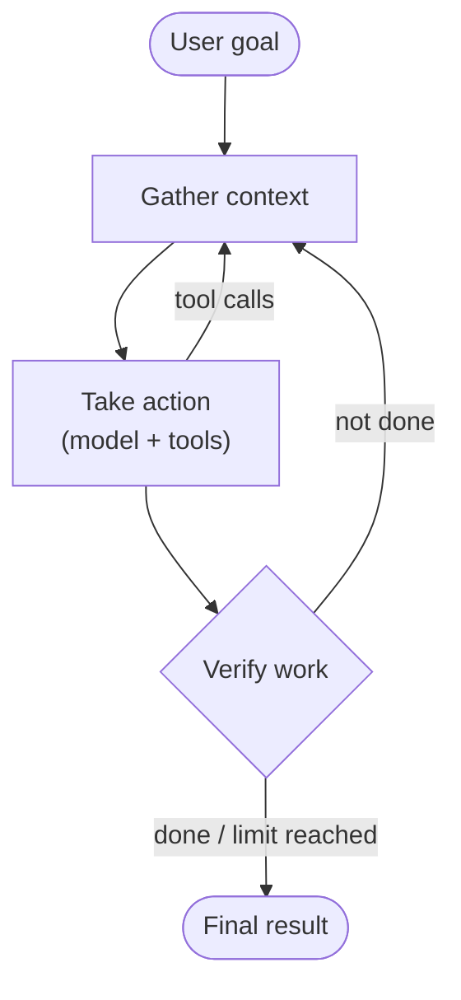

# Agent Harness — Concepts & Components

## What Is an Agent Harness

An **agent harness** (also called a *scaffold*) is the system that lets a model act as an agent.
It takes the input, runs the model in a loop, executes tool calls, manages context and returns the result.

The model decides *what* to do next. The harness decides *what the model can see, what it can touch,
and when to stop*.

| Source | Definition |
|---|---|
| Anthropic | "The system that enables a model to act as an agent: it processes inputs, orchestrates tool calls, and returns results." |
| LangChain | "Agent = model + harness." The harness is "the scaffolding around the model that connects it to the real world." |
| Research (arXiv, 2026) | Harness choice can change results more than model choice — model rankings can flip when the harness changes. |

**Why QA engineers should care:**
- Most agent bugs are harness bugs: wrong context, bad tool output, missing limits, no verification.
- A benchmark score without the harness description is not reproducible.
- The harness is ordinary code — you can unit-test it, mock it and put it in CI.

## The Agent Loop



This is the loop behind the Claude Agent SDK: **gather context → take action → verify work → repeat**.
Verification can be rule-based (tests, linters), visual (screenshots) or an LLM judge.

The loop must always have exit conditions:
- The agent produces a final answer and verification passes
- **Max turns / tokens / time** is reached
- A guardrail or a human stops it

## The 8 Jobs of a Harness

LangChain describes a harness as a set of jobs, each implemented as middleware around the model call:

| Job | What it does | Example |
|---|---|---|
| **Context management** | Decides what goes into the context window | Compaction, clearing old tool results |
| **Memory** | Keeps facts across steps and sessions | Progress file, memory directory |
| **Environment actions** | Lets the model act in the world | Shell, file edits, HTTP, browser |
| **Delegation** | Splits work between agents | Sub-agents with isolated context |
| **Failure handling** | Recovers from errors and loops | Retries, loop detection |
| **Policy enforcement** | Blocks unsafe actions | Permission rules, guardrails, hooks |
| **Steering** | Keeps the agent on track | Checklists, reminders, plans |
| **Cost control** | Limits spend | Token and turn limits, cheaper models for sub-tasks |

## Core Components

### 1. System Prompt and Instruction Files

The fixed instructions the model starts with. In coding agents they usually live in the repository:
`AGENTS.md`, `CLAUDE.md`, `.claude/` settings, skills and commands.

Rule of thumb from OpenAI's harness-engineering work: keep the root instruction file **short (~100 lines)**
and use it as a table of contents that points into `docs/`, not as an encyclopedia.

### 2. Tools

Functions the model can call: read and write files, run commands, query APIs, search.
Tools are the harness's "hands". Their names, descriptions and output format are part of the prompt.

### 3. Context Management

The context window is a limited budget. The harness decides:
- what to load up front (instructions, file map)
- what to fetch just in time (by path or query)
- when to **compact** (summarise old turns) or **reset** (start a fresh context from a progress file)

### 4. Memory

- **Short-term** — the current conversation and tool results
- **Long-term** — files the agent writes and reads back: progress logs, feature lists, notes, git history

### 5. Permissions and Sandbox

What the agent is allowed to do and where it runs:
- Allow / ask / deny rules per tool or command
- Isolated environment — container, VM, git worktree — so mistakes can't damage the host
- Network and secret access limited to what the task needs

### 6. Hooks and Guardrails

Code that runs **before or after** model and tool steps:
- Claude Code `PreToolUse` hooks run before a tool call; exit code `2` blocks the call and returns the reason to the model
- OpenAI Agents SDK guardrails validate input/output in parallel with the agent and fail fast

### 7. Sub-Agents

Separate agents with their own context for a focused job (search, review, testing).
They give parallelism and keep the main context clean — only the result comes back.

### 8. Observability

Every model call, tool call, handoff and guardrail decision should be traced.
Traces are what you read when something goes wrong, and the raw material for new eval cases.

## How Vendors Use the Term

| Vendor / Project | Harness | Notable parts |
|---|---|---|
| **Anthropic — Claude Agent SDK** | "The same tools, agent loop, and context management that power Claude Code" | Built-in tools, hooks, sub-agents, MCP, permissions, sessions (resume / fork), skills and memory from `.claude/` |
| **Anthropic — Managed Agents** | Hosted harness | Separates the "brain" (model + harness), "hands" (sandbox, tools) and session (event log) |
| **OpenAI — Agents SDK** | Agent runtime primitives | Agents, sandbox agents, handoffs, guardrails, sessions, built-in tracing |
| **OpenAI — Codex** | "Codex harness" — the agent loop behind Codex | Exposed to other apps through the Codex App Server |
| **LangChain — Deep Agents** | Open-source general-purpose harness | Planning, virtual filesystem, sub-agents, memory, skills, sandbox, human-in-the-loop |

## Minimal Harness in Python (Pseudocode)

```python
MAX_TURNS = 20


def run_agent(goal: str, model, tools: dict, verify) -> str:
    messages = [system_prompt(), user(goal)]

    for turn in range(MAX_TURNS):
        reply = model.generate(messages, tools=list(tools.values()))
        messages.append(reply)

        if reply.tool_calls:                      # act
            for call in reply.tool_calls:
                if not is_allowed(call):          # policy
                    messages.append(tool_error(call, "Denied by policy"))
                    continue
                result = tools[call.name].run(**call.args)
                messages.append(tool_result(call, truncate(result)))
            messages = compact_if_needed(messages)  # context management
            continue

        ok, feedback = verify(reply.text)         # verify
        if ok:
            return reply.text
        messages.append(user(f"Verification failed: {feedback}. Fix it."))

    raise RuntimeError("Turn limit reached")      # always have an exit
```

Every line here is a place where the system can fail — and a place you can test.

---
## Sources
- Anthropic — [Demystifying evals for AI agents](https://www.anthropic.com/engineering/demystifying-evals-for-ai-agents) (Jan 2026)
- Anthropic — [Building agents with the Claude Agent SDK](https://claude.com/blog/building-agents-with-the-claude-agent-sdk) (Sep 2025)
- Anthropic — [Scaling Managed Agents: decoupling the brain from the hands](https://www.anthropic.com/engineering/managed-agents) (Apr 2026)
- Claude Agent SDK — [Overview](https://code.claude.com/docs/en/agent-sdk/overview), [Hooks](https://code.claude.com/docs/en/hooks)
- OpenAI — [Agents SDK](https://openai.github.io/openai-agents-python/), [Guardrails](https://openai.github.io/openai-agents-python/guardrails/)
- LangChain — [How to build a custom agent harness](https://www.langchain.com/blog/how-to-build-a-custom-agent-harness) (Jun 2026), [Deep Agents](https://www.langchain.com/deep-agents)
- Zhang et al. — [Stop Comparing LLM Agents Without Disclosing the Harness](https://arxiv.org/abs/2605.23950) (May 2026)

## See also
- [AI Harness](index.md)
- [Agent Harness — Patterns & Anti-Patterns](02-agent-harness-patterns.md)
- [Agentic AI — Fundamentals & Core Components](../agentic-ai-architecture/01-fundamentals-components.md)
- [AI Skills for Coding Agents](../ai-skills/index.md)
