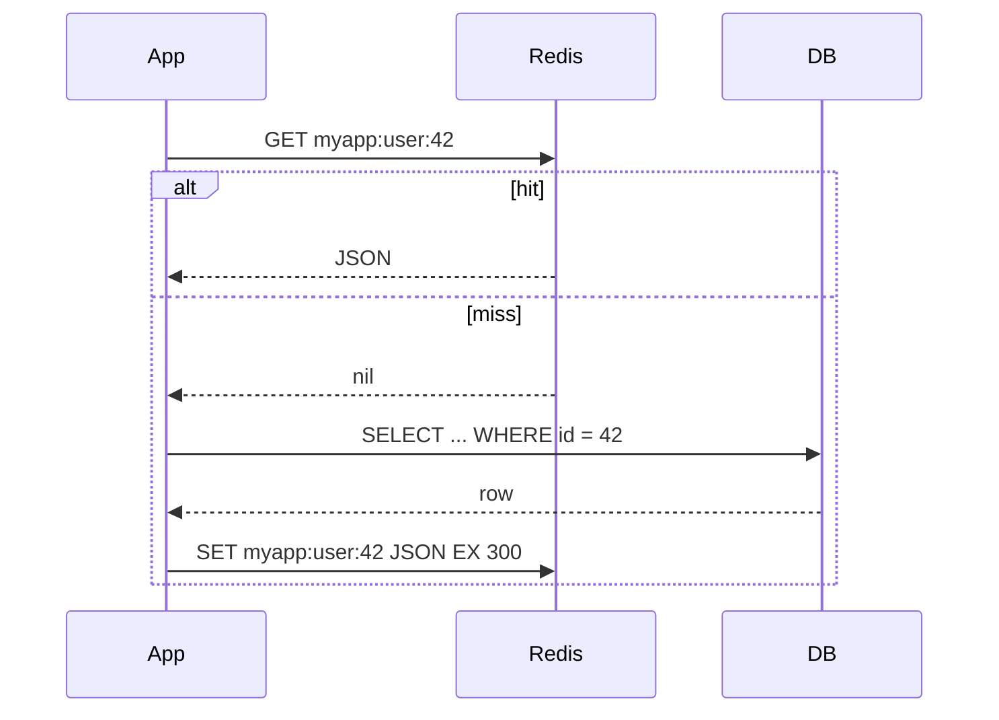

# Redis — Patterns: Caching, Rate Limits, Locks, Messaging

Examples use a redis-py client created with `decode_responses=True` ([04](./04-python-redis-py.md)):

```python
import redis

r = redis.Redis(host="localhost", port=6379, decode_responses=True)
```

## Cache-Aside

The application checks Redis first; on a miss it reads the database and writes the result back with a TTL. Redis never talks to the database itself.



```python
# app/cache.py
import json
from collections.abc import Callable

import redis

USER_TTL = 300                                    # seconds


def user_key(user_id: int) -> str:
    return f"myapp:user:{user_id}"


def get_user(r: redis.Redis, user_id: int, load: Callable[[int], dict]) -> dict:
    key = user_key(user_id)
    cached = r.get(key)
    if cached is not None:                        # hit
        return json.loads(cached)
    user = load(user_id)                          # miss: read the source of truth
    r.set(key, json.dumps(user), ex=USER_TTL)
    return user


def update_user(r: redis.Redis, user_id: int, data: dict, save: Callable[[int, dict], None]) -> None:
    save(user_id, data)                           # 1. write the database
    r.delete(user_key(user_id))                   # 2. drop the cached copy
```

This module is the code under test in [07 — Testing Recipes](./07-testing-recipes.md#testing-cache-aside-and-invalidation).

### Invalidation Strategies

| Strategy | How | Risk |
|----------|-----|------|
| TTL only | Entry expires after N seconds | Stale data for up to N seconds |
| Delete on write | `DEL` after the DB commit (above) | A concurrent reader can put the old value back right after the delete; a short TTL limits the damage |
| Write-through | Update the DB and `SET` the new value | Two writers can leave Redis and DB with different values |
| Versioned keys | `myapp:v7:user:42`; bump the version to drop everything | Old keys stay until their TTL ends |
| Event-driven | Consume DB change events (outbox, CDC) and delete keys | More moving parts, but covers writes from other services |

Rules that prevent most cache bugs:

- **Delete, do not update, on write** — the next read rebuilds the value from the database.
- **Delete after the DB transaction commits**, not before: deleting first lets a reader cache the old row again.
- **Always keep a TTL**, even with explicit invalidation — it caps the life of any value you forgot to invalidate.
- **Cache `None` results carefully** — without a short negative-cache entry, requests for a missing ID always hit the DB (cache penetration); with a long one, a newly created record stays "not found".
- **Put everything that changes the result in the key**: tenant, user permissions, locale, API version.

### Stampedes and Mass Expiry

When a hot key expires, many requests miss at once and all hit the database.

```python
import random


def cache_set(r: redis.Redis, key: str, value: str, ttl: int = 300) -> None:
    r.set(key, value, ex=ttl + random.randint(0, ttl // 10))   # jitter: keys written together do not expire together
```

Other options: let only one caller rebuild (`SET myapp:rebuild:<key> 1 NX EX 10`, others serve the stale value or wait briefly), or refresh hot keys in the background before they expire.

## Rate Limiting

### Fixed Window

One counter per subject per window. `INCR` creates the key; `EXPIRE ... NX` sets the TTL only on the first hit.

```python
# app/ratelimit.py
import time
from collections.abc import Callable

import redis


def allow(
    r: redis.Redis,
    subject: str,
    limit: int,
    window_s: int,
    now: Callable[[], float] = time.time,         # injectable clock for tests
) -> bool:
    window = int(now() // window_s)
    key = f"myapp:rl:{subject}:{window}"
    pipe = r.pipeline()                           # MULTI/EXEC by default
    pipe.incr(key)
    pipe.expire(key, window_s, nx=True)           # set TTL only on the first hit (Redis 7.0+)
    count, _ = pipe.execute()
    return count <= limit
```

Simple and cheap, but a client can send `2 × limit` requests around a window boundary (end of one window + start of the next).

### Sliding Window

A sorted set of request timestamps; a Lua script makes "clean up, count, add" one atomic step.

```python
import time
import uuid

SLIDING_WINDOW = r.register_script("""
local key, now_ms, window_ms, limit = KEYS[1], tonumber(ARGV[1]), tonumber(ARGV[2]), tonumber(ARGV[3])
redis.call('ZREMRANGEBYSCORE', key, 0, now_ms - window_ms)
if redis.call('ZCARD', key) >= limit then
  return 0
end
redis.call('ZADD', key, now_ms, ARGV[4])
redis.call('PEXPIRE', key, window_ms)
return 1
""")


def allow_sliding(r: redis.Redis, subject: str, limit: int, window_s: int) -> bool:
    now_ms = int(time.time() * 1000)
    member = uuid.uuid4().hex                     # unique member: two requests in the same ms both count
    return SLIDING_WINDOW(keys=[f"myapp:rl:sliding:{subject}"], args=[now_ms, window_s * 1000, limit, member]) == 1


[allow_sliding(r, "user:1", 3, 10) for _ in range(5)]   # [True, True, True, False, False]
```

Exact, but memory grows with the limit (one member per request). Token bucket and GCRA are other common algorithms; libraries such as `limits` implement them on Redis.

## Distributed Locks

### A Lock by Hand

```python
import uuid

RELEASE = r.register_script("""
if redis.call('GET', KEYS[1]) == ARGV[1] then
  return redis.call('DEL', KEYS[1])
end
return 0
""")


def acquire(r: redis.Redis, name: str, ttl_ms: int) -> str | None:
    token = uuid.uuid4().hex
    return token if r.set(f"myapp:lock:{name}", token, nx=True, px=ttl_ms) else None


def release(r: redis.Redis, name: str, token: str) -> bool:
    return RELEASE(keys=[f"myapp:lock:{name}"], args=[token]) == 1   # delete only our own lock
```

- `NX` — only one client gets the key; `PX` — the lock disappears if the owner crashes.
- The random **token** plus compare-and-delete in Lua prevents deleting a lock that already expired and was taken by someone else. A plain `DEL` in `finally` does exactly that.

### redis-py `Lock`

```python
from redis.exceptions import LockError

with r.lock("myapp:lock:import", timeout=30, blocking_timeout=5) as lock:   # LockError if not acquired in 5 s
    run_import()
    lock.extend(30)                               # add 30 s to the remaining TTL for a long step
    finish_import()

lock = r.lock("myapp:lock:nightly-report", timeout=60, blocking=False)
if lock.acquire():                                # False at once if someone else holds it
    try:
        build_report()
    finally:
        lock.release()                            # LockNotOwnedError if the lock already expired
```

`timeout` is the lock TTL (seconds); without it the lock never expires. `blocking_timeout` is how long to wait for it.

### Caveats

| Problem | What happens | Mitigation |
|---------|--------------|------------|
| Work takes longer than the TTL | Lock expires, a second worker starts, both run | Generous TTL, `extend()` from the worker, measure job duration |
| Process pause (GC, VM freeze, debugger) | Same as above, without any error in the first worker | Fencing token: a counter (`INCR`) that the protected resource checks and rejects if older |
| Failover to a replica | Replication is async: a new primary may not know about the lock | Accept it, or use a system with consensus (etcd, ZooKeeper, DB row locks) |
| Clock jumps on the Redis server | TTL counts wrong | NTP with slewing, not stepping |
| Redlock (lock on N independent servers) | Reduces the failover issue, but its safety under pauses and clock drift is disputed | Use Redis locks for **efficiency** (avoid duplicate work), not as the only guarantee of **correctness** |

For correctness put a guard in the system of record too: a unique constraint, a `WHERE version = ?` update, or an idempotency key.

## Pub/Sub vs Lists vs Streams

```python
# Pub/Sub: fire-and-forget
sub = r.pubsub()
sub.subscribe("myapp:events:orders")
r.publish("myapp:events:orders", '{"id": 1}')      # returns the number of receivers: 1
r.publish("myapp:events:orders", "lost")           # 0 receivers if nobody is subscribed: the message is dropped

# Stream with a consumer group: at-least-once
r.xgroup_create("myapp:orders", "billing", id="0", mkstream=True)
r.xadd("myapp:orders", {"order_id": 1}, maxlen=100_000, approximate=True)
for stream, entries in r.xreadgroup("billing", "worker-1", {"myapp:orders": ">"}, count=10, block=5000):
    for entry_id, fields in entries:
        handle(fields)
        r.xack("myapp:orders", "billing", entry_id)     # not acked → stays in XPENDING, can be reclaimed
```

| | Pub/Sub | List (`RPUSH` / `BLPOP`) | Stream + consumer group |
|--|---------|--------------------------|-------------------------|
| Delivery | To everyone subscribed **now** | To one consumer | To one consumer per group; every group gets all entries |
| Offline consumer | Misses messages | Messages wait | Entries wait |
| Consumer crash | Message lost | Popped job lost (unless `LMOVE`) | Entry stays pending; `XAUTOCLAIM` gives it to another consumer |
| Replay / history | No | No | Yes, by ID range, until trimmed |
| Acknowledgement | No | No | `XACK` |
| Good for | Cache invalidation broadcasts, WebSocket fan-out | Simple job queues | Event processing, work queues that must not lose jobs |

Consumers of a stream must be **idempotent**: after a crash between "handle" and `XACK`, the entry is delivered again. For long retention, partitions and many independent consumers at high volume, a log such as Kafka fits better.

## Transactions: MULTI / EXEC / WATCH

`MULTI` queues commands; `EXEC` runs them one after another with no other client's command in between.

```
MULTI
INCR myapp:orders:count
EXPIRE myapp:orders:count 3600
EXEC            -- 1) (integer) 1  2) (integer) 1
```

It is **not** a rollback transaction: if one command fails at runtime (for example `INCR` on a text value), the others still run.

```python
with r.pipeline() as pipe:                        # transaction=True by default
    pipe.set("s", "text")
    pipe.incr("s")                                # will fail on the server
    pipe.set("after", 1)
    pipe.execute()                                # raises ResponseError — but "s" and "after" were written
# pipe.execute(raise_on_error=False) → [True, ResponseError(...), True]
```

`WATCH` adds optimistic locking: `EXEC` does nothing and redis-py raises `WatchError` if a watched key changed.

```python
from redis.exceptions import WatchError


def withdraw(r: redis.Redis, account: int, amount: int) -> bool:
    key = f"myapp:balance:{account}"
    with r.pipeline() as pipe:
        while True:
            try:
                pipe.watch(key)                   # from here commands run immediately
                balance = int(pipe.get(key) or 0)
                if balance < amount:
                    pipe.unwatch()
                    return False
                pipe.multi()                      # from here commands are queued
                pipe.decrby(key, amount)
                pipe.execute()                    # WatchError if key changed since WATCH
                return True
            except WatchError:
                continue                          # another client wrote first: retry
```

`r.transaction(func, *watched_keys)` wraps the same retry loop. For logic like this a Lua script is usually simpler.

## Pipelines

A pipeline sends many commands in one network round trip. It is about latency, not atomicity.

```python
with r.pipeline(transaction=False) as pipe:       # no MULTI/EXEC, just batching
    for i in range(1000):
        pipe.set(f"myapp:item:{i}", i, ex=3600)
    results = pipe.execute()                      # list of 1000 replies
```

On a local server 1000 single `SET` calls took about 64 ms, the pipeline about 8 ms; over a real network the difference is much larger. Keep batches to thousands of commands, not millions — the server buffers all replies in memory.

## Lua Scripts

A script runs atomically on the server: no other command runs in the middle. Use it for "read, decide, write" logic (locks, rate limits, compare-and-set).

```python
# EVAL: keys first, then arguments
r.eval("return redis.call('INCRBY', KEYS[1], ARGV[1])", 1, "myapp:counter", 5)   # 5

# register_script: sends EVALSHA, falls back to EVAL on NOSCRIPT (after a restart or SCRIPT FLUSH)
cas = r.register_script("""
if redis.call('GET', KEYS[1]) == ARGV[1] then
  redis.call('SET', KEYS[1], ARGV[2])
  return 1
end
return 0
""")
cas(keys=["myapp:config:mode"], args=["v1", "v2"])
```

- Pass every key through `KEYS` — in Redis Cluster all keys of one script must be in the same slot.
- A long script blocks the whole server (`busy-reply-threshold`, 5 s by default, then only `SCRIPT KILL` / `SHUTDOWN NOSAVE` work). Keep scripts short, no loops over large collections.
- Redis 7+ also has **functions** (`FUNCTION LOAD`, `FCALL`): named, persisted with the data set, better for shared server-side logic.
- fakeredis runs Lua only with the `lua` extra (`fakeredis[lua]`); redis-py `Lock` needs it too.

## Other Common Patterns

| Pattern | Commands |
|---------|----------|
| Idempotency key for API requests / webhooks | `SET myapp:idem:<key> <response-id> NX EX 86400` — `nil` means "already processed" |
| Session store | `HSET myapp:session:<id> ...` + `EXPIRE`, or JSON string + `GETEX ... EX` for sliding expiry |
| Leaderboard | `ZINCRBY`, `ZRANGE ... REV WITHSCORES`, `ZREVRANK` |
| Unique visitors | `SADD` per day, or `PFADD` / `PFCOUNT` when approximate is enough |
| Feature flags | `HGET myapp:flags <name>` with a local in-process cache |
| Delayed jobs | Sorted set with run time as score, a poller moves due jobs to a queue |

---
## See also
- [Redis — Overview](./index.md)
- [Redis — Data Types & Commands](./02-data-types-commands.md)
- [Redis — Testing Recipes](./07-testing-recipes.md)
- [REST: Caching, Concurrency and Idempotency](../../api-architectures/01-rest/04-caching-concurrency.md)
- [Queues vs Streams: Message Delivery, Ordering & Reliability](../../software-design-patterns/05-composition-architectural/04-queues-streams-messaging.md)
