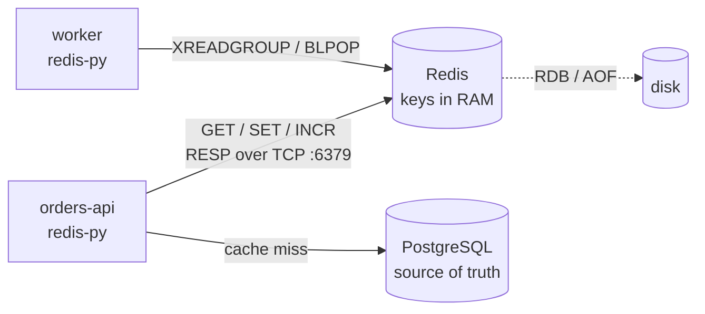

# Redis — Overview

## What Is Redis

Redis is an **in-memory data structure server**. Clients send commands over TCP (the RESP protocol), and the server keeps keys in RAM. A key holds a typed value: a string, hash, list, set, sorted set, stream, JSON document and more. Reads and writes usually take well under a millisecond, and every single command is atomic: the server runs commands one by one.

The data can be written to disk (RDB snapshots, AOF log), but Redis is designed around memory: the data set must fit in RAM, and the default setup (RDB snapshots only) can lose minutes of writes on a crash. Treat it as a fast shared state and messaging layer next to your main database, not as a replacement for it.



## Redis, Valkey and Licensing

| Period | What happened |
|--------|---------------|
| Up to Redis 7.2 | BSD-3-Clause open source |
| March 2024 | From Redis 7.4 the license changed to dual RSALv2 / SSPLv1 (source-available, not OSI open source) |
| March 2024 | The Linux Foundation started **Valkey**, a BSD-licensed fork of Redis 7.2.4, supported by several cloud vendors |
| Redis 8.0 (2025) | AGPLv3 added as a third license option; the former Redis Stack modules (JSON, Query Engine, time series, probabilistic types) ship in the main distribution |

For a test engineer the practical effect is small:

- The data model, commands and protocol of Valkey and Redis are the same for everything in this guide. `redis-py`, `redis-cli`, fakeredis and testcontainers work with both.
- Features added after the fork can differ (for example Redis 8 includes JSON and the Query Engine by default). Test against the same server and major version as production — managed services may run either one.
- Other servers speak the Redis protocol too (Dragonfly, KeyDB); compatibility with less common commands varies.

## Where QA Engineers Meet Redis

| Place | What Redis does there |
|-------|------------------------|
| Application cache | Cache-aside for DB or API responses: stale data and invalidation bugs |
| Sessions and tokens | Login sessions, OTP codes, password-reset tokens with TTL |
| Rate limiting | Per-user / per-IP counters: 429 responses, limit resets |
| Queues and background jobs | Celery, RQ, Dramatiq, Sidekiq use Redis lists or streams as a broker |
| Distributed locks | "Only one instance runs the cron job", idempotency keys |
| Real-time features | Pub/Sub fan-out for WebSocket servers, leaderboards, counters |
| LLM and AI stacks | Response caches (LiteLLM), checkpoints and chat history (LangGraph, LangChain), vector search |
| Test infrastructure | Shared state between test workers, a service container in CI |

## When to Use Redis

| Good fit | Consider an alternative |
|----------|-------------------------|
| Cache in front of a slow DB or API | Durable business records → PostgreSQL |
| Sessions, short-lived tokens with TTL | Complex queries, joins, reports → SQL database |
| Counters, rate limits, leaderboards | Data larger than RAM at a reasonable cost → disk-based store |
| Simple queues, background jobs | Long-term event log, replay for days, many consumers → Kafka |
| Pub/Sub fan-out where loss is acceptable | Guaranteed delivery with routing → RabbitMQ / Redis Streams |
| Locks for efficiency (avoid duplicate work) | Locks for correctness under failures → a consensus store or DB constraints |

## Section Map

| File | Topics |
|------|--------|
| [01 Setup & redis-cli](./01-setup-redis-cli.md) | Docker, Compose, config, redis-cli, `SCAN` vs `KEYS`, `INFO`, `SLOWLOG`, `MONITOR`, key naming, databases |
| [02 Data Types & Commands](./02-data-types-commands.md) | Strings, hashes, lists, sets, sorted sets, streams, JSON, TTL and expiry rules |
| [03 Patterns](./03-patterns.md) | Cache-aside, invalidation, stampedes, rate limiting, locks, Pub/Sub vs streams, `MULTI` / `WATCH`, pipelines, Lua |
| [04 Python Client (redis-py)](./04-python-redis-py.md) | Connections, `decode_responses`, pools, timeouts, retries, asyncio, pipelines, Pub/Sub and streams in Python |
| [05 Persistence, Scaling & Security](./05-operations-security.md) | RDB / AOF, `maxmemory-policy`, replication, Sentinel, Cluster, ACL, protected mode, monitoring |
| [06 Testing Setup & Isolation](./06-testing-setup-isolation.md) | fakeredis vs real Redis, testcontainers, fixtures, dependency overrides, `FLUSHDB` vs `FLUSHALL`, pytest-xdist, async, CI |
| [07 Testing Recipes](./07-testing-recipes.md) | Cache invalidation, TTL without sleep, rate limiters, locks, race conditions, Pub/Sub and streams, outages, pitfalls |

## Minimal Setup

```bash
docker run -d --name redis -p 127.0.0.1:6379:6379 redis:8   # pin a minor version in CI
docker exec -it redis redis-cli ping                         # PONG
```

```python
# uv add redis
import redis

r = redis.Redis(host="localhost", port=6379, decode_responses=True)
r.set("myapp:greeting", "hello", ex=60)          # expires in 60 s
print(r.get("myapp:greeting"))                   # 'hello'
print(r.ttl("myapp:greeting"))                   # 60
```

Examples in this guide were run with **Redis 8.10.2** (`redis:8` image), Redis 7.4.11 and Valkey 8.1.10 for compatibility checks, **redis-py 8.1.0**, fakeredis 2.38.0, testcontainers 4.15.0, pytest 9.1.1 and Python 3.13.

## Cheat Sheet

### Keys & Expiry ([02](./02-data-types-commands.md))

| Task | Command |
|------|---------|
| Set with TTL | `SET key value EX 60` |
| Set only if missing | `SET key value NX EX 60` |
| Read / delete | `GET key` / `DEL key` / `UNLINK key` (frees memory in background) |
| TTL left | `TTL key` (`-1` no TTL, `-2` no key) / `PTTL key` |
| Add / remove TTL | `EXPIRE key 60` / `PERSIST key` |
| Iterate keys | `SCAN 0 MATCH myapp:user:* COUNT 100` — never `KEYS *` in production |
| Type / memory | `TYPE key` / `MEMORY USAGE key` |

### Data Types ([02](./02-data-types-commands.md))

| Task | Command |
|------|---------|
| Counter | `INCR key` / `INCRBY key 5` |
| Object fields | `HSET user:42 name Ann` / `HGETALL user:42` |
| Queue | `RPUSH q job` + `BLPOP q 5` |
| Unique members | `SADD s a b` / `SISMEMBER s a` |
| Leaderboard | `ZADD lb 100 ann` / `ZRANGE lb 0 9 REV WITHSCORES` |
| Event log | `XADD s * k v` / `XREADGROUP GROUP g c STREAMS s >` |

### Server ([01](./01-setup-redis-cli.md), [05](./05-operations-security.md))

| Task | Command |
|------|---------|
| Keys per DB | `INFO keyspace` / `DBSIZE` |
| Memory | `INFO memory` |
| Slow commands | `SLOWLOG GET 10` |
| Connected clients | `CLIENT LIST` |
| Watch all commands (debug only) | `MONITOR` |
| Config | `CONFIG GET maxmemory-policy` |
| Clear current DB (test DB only) | `FLUSHDB` |

## Quick Rules

1. **Set a TTL on every cache and session key** — a key without TTL lives until someone deletes it.
2. **Use `SCAN`, not `KEYS`** — `KEYS *` blocks the single-threaded command loop on a large keyspace.
3. **Prefix keys with the app and entity** (`myapp:user:42`) — it makes scans, ACLs and cleanup safe.
4. **Never expose Redis to the internet** — bind to a private network, require a password or ACL user, and publish Docker ports on `127.0.0.1` only.
5. **Always set client timeouts** and know the retry policy — a hanging cache call can take the whole API down.
6. **Make multi-step updates atomic** — `INCR`, `SET NX`, `MULTI` / `EXEC` or a Lua script, not "read, change, write" from Python.
7. **Choose a `maxmemory-policy` on purpose** — `noeviction` for queues and locks, `allkeys-lru` / `allkeys-lfu` for pure caches.
8. **In tests use `FLUSHDB` on a dedicated database, never `FLUSHALL` on a shared server.**

---
## See also
- [Digital Garden: Knowledge Base](../../index.md)
- [Databases — Types, Differences & Selection Guide](../index.md)
- [PostgreSQL — Overview](../postgresql/index.md)
- [Queues vs Streams: Message Delivery, Ordering & Reliability](../../software-design-patterns/05-composition-architectural/04-queues-streams-messaging.md)
- [Pytest — Python Testing Framework](../../libs/pytest/index.md)
- [Docker & Docker Compose — Overview](../../tools/docker/index.md)
