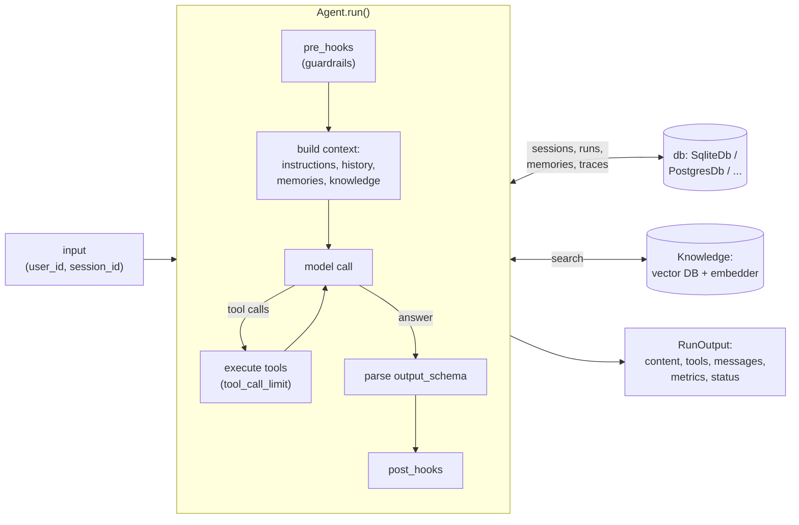

# Agno — Agents, Teams & Workflows in Python

Agno (formerly **Phidata**, GitHub `agno-agi/agno`, package `agno`) is an open-source Python framework for building **agents** (a model + instructions + tools + memory), **teams** of agents led by a coordinator, and **workflows** of deterministic steps. It also ships a runtime: **AgentOS**, a FastAPI app that serves your agents over HTTP and stores sessions, memories, evals and traces in your own database.

Where LangGraph asks you to draw a graph, Agno gives you a batteries-included `Agent` class: most features are constructor parameters (`tools=`, `db=`, `knowledge=`, `output_schema=`, `tool_call_limit=`), and the result of every run is one `RunOutput` object that is easy to assert on in tests.

## Installation

```bash
uv add agno                              # core: Agent, Team, Workflow, tools, evals
uv add openai                            # or anthropic, google-genai, ollama, ... (model SDK)
uv add "agno[sqlite]" "sqlalchemy[asyncio]"  # SqliteDb (sessions, memory); see note below
uv add "agno[postgres]"                  # PostgresDb (production storage)
uv add "agno[os]"                        # AgentOS: FastAPI, uvicorn, OpenTelemetry, OpenInference
uv add lancedb                           # a local vector DB for knowledge / RAG (one option of many)
uv add --dev pytest pytest-asyncio       # tests
```

!!! warning "`SqliteDb` needs `greenlet`"
    `agno.db.sqlite` imports SQLAlchemy's asyncio extension. With SQLAlchemy 2.1, `agno[sqlite]` alone fails on import with *"requires that the Python 'greenlet' library is installed"*. Add `sqlalchemy[asyncio]` (or `greenlet`) to your dependencies.

Examples in this guide were run against **agno 3.0.11** on Python 3.13 (with `openai` 3.22, SQLAlchemy 2.1, FastAPI 0.142, `pytest` 9.1, `pytest-asyncio` 1.4, `openinference-instrumentation-agno` 1.0.11, `lancedb` 0.39). No API keys were used: the model was replaced with the offline `ScriptedModel` from [05 Testing](./05-testing.md). In real code pass a model instance or a `"provider:model_id"` string such as `"openai:gpt-5-mini"`.

## Section Map

| File | Topics |
|------|--------|
| [01 Agents, Tools & Structured Output](./01-agents-tools.md) | `Agent` parameters, models, instructions, function tools, `@tool`, toolkits, MCP, tool errors and limits, human approval, `output_schema`, `RunOutput`, streaming events, async, hooks and guardrails |
| [02 Sessions, Memory & Knowledge](./02-sessions-memory-knowledge.md) | `db` backends, sessions and history, `session_state`, user memories, session summaries, `Knowledge` + vector DB + embedder, agentic RAG, reasoning |
| [03 Teams & Workflows](./03-teams-workflows.md) | `Team` and `TeamMode` (coordinate, route, broadcast, tasks), member IDs, `TeamRunOutput`; `Workflow`, `Step`, `Condition`, `Parallel`, `Loop`, `Router`, `StepInput` / `StepOutput` |
| [04 AgentOS & Observability](./04-agentos-observability.md) | AgentOS app and routes, mounting on your FastAPI app, auth, tracing to the database, OpenInference → Phoenix / Langfuse / any OTLP backend, telemetry opt-out |
| [05 Testing Agno Apps](./05-testing.md) | pytest layers, offline `ScriptedModel`, asserting tool calls, prompts and structured output, HITL, SQLite sessions and memory, teams and workflows, fake embedder, streaming |
| [06 API Tests, Evals & CI](./06-evals-ci.md) | AgentOS API tests, fake OpenAI server, span assertions, `ReliabilityEval` / `AccuracyEval` / `PerformanceEval`, DeepEval, real-model tests, flaky-test pitfalls, CI |

## When to Choose Agno

| Need | Good fit |
|------|----------|
| A tool-calling agent with memory, storage and structured output, with little code | **Agno** `Agent` |
| A supervisor that delegates to specialised agents | **Agno** `Team` — or LangGraph supervisor / CrewAI crew |
| Fixed pipeline where only some steps call an LLM | **Agno** `Workflow` — or LangGraph `StateGraph` |
| Custom control flow: arbitrary cycles, fan-out with reducers, time-travel over checkpoints | **LangGraph** |
| Large ecosystem of loaders, retrievers and integrations around LCEL | **LangChain** |
| Role-and-goal "crew" metaphor, business-process style | **CrewAI** |
| Serve agents as an HTTP API with sessions, memories and traces in your own DB | **Agno** AgentOS — or LangGraph Server |

Rule of thumb: pick Agno when an agent is mostly *configuration* (model, tools, storage, knowledge) and you want one object to test; pick LangGraph when the *control flow* is the product. For a wider comparison see [Agentic AI Architecture](../../agentic-ai-architecture/index.md).

## Mental Model



- **Agent** — model, instructions, tools, optional `db`, `knowledge` and `output_schema`. One `run()` = one `RunOutput`.
- **Tools** — plain Python functions (the docstring and type hints become the JSON schema), `@tool`-decorated functions, or `Toolkit` classes.
- **db** — one storage object for sessions, run history, session state, user memories, eval results and traces.
- **Team** — a leader model with a delegation tool plus member agents or nested teams.
- **Workflow** — ordered steps (agents, teams or plain functions) with conditions, loops, parallel branches and routers.

## Minimal Example

```python
from agno.agent import Agent


def get_order_status(order_id: str) -> str:
    """Return the delivery status of an order.

    Args:
        order_id: Order ID, for example "ord-42".
    """
    return f"{order_id}: shipped"


agent = Agent(
    model="openai:gpt-5-mini",
    instructions="You are a support agent. Use tools for order data.",
    tools=[get_order_status],
)

run = agent.run("Where is ord-42?")
print(run.content)                                   # "Order ord-42 has shipped."
print([(t.tool_name, t.tool_args, t.result) for t in run.tools])
# [('get_order_status', {'order_id': 'ord-42'}, 'ord-42: shipped')]
print(run.status, run.metrics.total_tokens)
```

`agent.print_response("...")` prints a formatted answer in the terminal; use `agent.run(...)` in code and tests.

## Names from Older Tutorials

Agno's API changed across major versions and many blog posts still show old names. In 3.0.11 these fail with `TypeError` / `ImportError`:

| Old name | Current |
|----------|---------|
| `from phi.agent import Agent` (Phidata) | `from agno.agent import Agent` |
| `Agent(response_model=Model)` | `Agent(output_schema=Model)` |
| `RunResponse` | `RunOutput` (`TeamRunOutput`, `WorkflowRunOutput`) |
| `Agent(storage=...)`, separate memory DB | `Agent(db=SqliteDb(...))` — one DB for sessions and memories |
| `Agent(show_tool_calls=True)` | Removed — read `run.tools` or stream tool events |
| `Agent(reasoning=True)` | `reasoning_model=...`, `reasoning_agent=...` or `tools=[ReasoningTools()]` |

## Quick Rules

1. **Build agents in a factory that receives the model and the db** — tests pass a fake model and a temporary SQLite file.
2. **Give agents, teams and members an explicit `id`** — otherwise the ID is derived from `name` (`"Orders Agent"` → `orders-agent`) or generated at random, and team delegation and AgentOS routes use it.
3. **Check `run.status`, not only `run.content`** — model errors, guardrail failures and async-tool misuse end with `RunStatus.error` instead of an exception.
4. **Check the type of `run.content` when you use `output_schema`** — invalid JSON only logs a warning and leaves a string.
5. **Set `tool_call_limit`** and put risky tools behind `requires_confirmation=True`.
6. **Always pass `user_id` and `session_id`** when you use a `db` — they are the keys for history, state and memories.
7. **Set `AGNO_TELEMETRY=false` in CI and tests** — telemetry is on by default.
8. **Trace every environment** (Agno tracing to your DB, Phoenix, Langfuse or any OTLP backend) and keep a small real-model eval suite for releases.

---
## See also
- [Digital Garden: Knowledge Base](../../index.md)
- [Python Libraries](../index.md)
- [LangGraph — Stateful Agent Orchestration](../langgraph/index.md)
- [LangChain — LLM Application Framework](../langchain/index.md)
- [Agentic AI Architecture](../../agentic-ai-architecture/index.md)
- [DeepEval — LLM Testing Guide](../../llm-evaluation/index.md)
