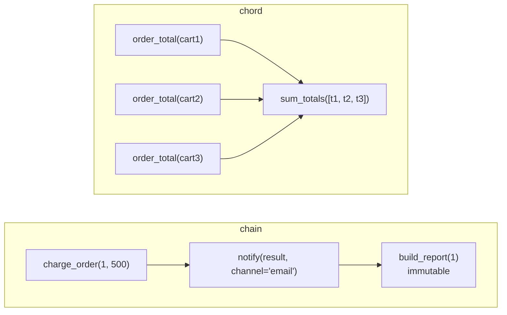

# Celery — Canvas Workflows

Canvas is Celery's API for combining tasks: run them **in sequence** (`chain`), **in parallel** (`group`), or **in parallel and then a callback** (`chord`). The building block is a **signature** — a serializable description of one task call.



Examples use the tasks from [01 Tasks & Calling](./01-tasks-calling.md), trivial arithmetic tasks `add`, `sub`, `mul`, and these two:

```python
@shared_task
def notify(result: dict, channel: str = "email") -> str:
    return f"{channel}: order {result['order_id']} {result['status']}"


@shared_task
def sum_totals(totals: list[int]) -> int:
    return sum(totals)
```

## Signatures

```python
from celery import signature

sig = add.s(2, 2)                       # add(2, 2) — not called yet
sig.delay()                             # send it; returns AsyncResult

partial = sub.s(2)                      # partial: one argument missing
partial.delay(10)                       # sub(10, 2) == 8 — new args are prepended

fixed = add.si(2, 2)                    # immutable: ignores the parent's result in a chain
by_name = signature("orders.tasks.add", args=(4, 4))   # no import of the task module
with_opts = add.s(1, 1).set(countdown=10, queue="reports")

dict(notify.s(channel="sms"))           # plain dict: task, args, kwargs, options...
```

| Form | Meaning |
|------|---------|
| `task.s(*args, **kwargs)` | Signature; in a chain it receives the previous result as the **first** argument |
| `task.si(*args, **kwargs)` | Immutable signature; runs with exactly these arguments |
| `signature("name", args=..., kwargs=...)` | Signature by task name |
| `sig.set(**options)` | Attach `apply_async` options (`countdown`, `queue`, `priority`, ...) |

A signature is a `dict` subclass, so it is JSON-serializable and can be passed as a task argument or stored.

## Chain

```python
from celery import chain

workflow = chain(add.s(2, 2), mul.s(10), add.s(1))   # ((2 + 2) * 10) + 1
workflow.apply_async().get(timeout=10)                # 41
```

The `|` operator builds the same chain: `add.s(2, 2) | mul.s(10)`.

```python
def checkout_workflow(order_id: int, amount_cents: int):
    return chain(
        charge_order.s(order_id, amount_cents),   # returns {"order_id": 1, "status": "paid", ...}
        notify.s(channel="email"),                # notify(<charge result>, channel="email")
        build_report.si(order_id),                # immutable: does not get notify's string
    )


checkout_workflow(1, 500).delay().get(timeout=30)   # 'report-1.pdf'
```

- The `AsyncResult` of a chain is the result of the **last** task; `.parent` walks back to earlier ones.
- If a task in the chain fails, the rest of the chain does not run; the chain result gets state `FAILURE`.
- Each step is a separate message: steps can run on different workers and queues.
- Keep workflow construction in a function (`checkout_workflow`): the shape becomes testable without a broker (see [05 Testing](./05-testing.md)).

## Group

```python
from celery import group

job = group(add.s(i, i) for i in range(5))
result = job.apply_async()          # GroupResult
result.get(timeout=10)              # [0, 2, 4, 6, 8] — in the order of the signatures
result.successful(), result.completed_count()
```

- `GroupResult.get()` returns results in **signature order**, not completion order.
- If one member fails, `get()` raises that exception. `get(propagate=False)` returns the list with exception objects in place: `[0, ValueError('bad value 1'), 2]`.
- Other members keep running — a group is not cancelled by one failure.

## Chord

A chord is a group (the **header**) plus a callback (the **body**) that runs after all header tasks succeed and receives the list of their results.

```python
from celery import chord, group

header = group(order_total.s(cart) for cart in carts)
chord(header, sum_totals.s()).apply_async().get(timeout=30)   # 600

(group(order_total.s(c) for c in carts) | sum_totals.s()).delay()   # a group chained to a task becomes a chord
```

- **A chord needs a result backend.** Without one, `apply_async()` raises `NotImplementedError: Starting chords requires a result backend to be configured.`
- Header tasks must not use `ignore_result=True` — the body needs their results.
- If a header task fails, the body does not run. The chord result gets state `FAILURE` with `ChordError("Dependency <id> raised ValueError(...)")`; `get()` raised the original `ValueError` in our run.
- The Redis backend joins chords natively; backends without native chord support poll with the `celery.chord_unlock` task, which adds latency.

## Callbacks: `link` and `link_error`

```python
@shared_task
def on_error(request, exc, traceback) -> None:
    logger.error("task %s failed: %r", request.id, exc)


add.apply_async((1, 1), link=mul.s(5))             # mul(2, 5) runs after success
charge_order.apply_async((1, 500), link_error=on_error.s())
```

The error callback receives the failed task's `request`, the exception and the traceback. It runs in the worker — use it for logging, alerts or compensation, not to decide the caller's control flow.

## `map`, `starmap`, `chunks`

```python
add.starmap([(1, 2), (3, 4)]).apply_async().get(timeout=10)                  # [3, 7] — one task
add.chunks(zip(range(6), range(6)), 3).group().apply_async().get(timeout=10)   # [[0, 2, 4], [6, 8, 10]]
```

`starmap` runs all calls inside **one** task. `chunks` splits many small calls into a few tasks — fewer messages than a huge group of tiny tasks.

## Pitfalls

| Pitfall | What happens | Instead |
|---------|--------------|---------|
| `result.get()` inside a task | `RuntimeError: Never call result.get() within a task!` — waiting would block a worker slot and can deadlock the pool | Chain the next step, or use a chord |
| Chord without a result backend | `NotImplementedError` at `apply_async()` | Configure a backend (Redis) |
| Group of 100 000 tiny tasks | Broker and backend overload, slow chord join | `chunks`, batching, or one task that loops |
| Mutable signature after a step that returns a large value | The value is sent as an argument to the next task | `si()` when the next step does not need it; return IDs |
| Assuming chain steps run on the same worker | Local files or in-memory state are missing | Share data through a DB or object storage |
| Nested chords and chains of groups | Hard to reason about and to debug | Flatten the workflow; split it into named functions |
| Retrying a whole workflow from the caller | Steps that already succeeded run again | Retry inside each task; keep each step idempotent |

## Checklist

- [ ] Workflows are built in named functions that return a signature
- [ ] Steps that do not need the previous result use `si()`
- [ ] No `result.get()` inside tasks
- [ ] Chords run with a result backend and header results are not ignored
- [ ] Large fan-outs use `chunks` or batching
- [ ] Every step is idempotent — a failed workflow may be restarted
- [ ] Error callbacks (`link_error`) log and alert, they do not hide failures

---
## See also
- [Celery — Distributed Task Queue for Python](./index.md)
- [Celery — Tasks & Calling](./01-tasks-calling.md)
- [Celery — Testing Celery Code](./05-testing.md)
- [Software Design Patterns](../../software-design-patterns/index.md)
