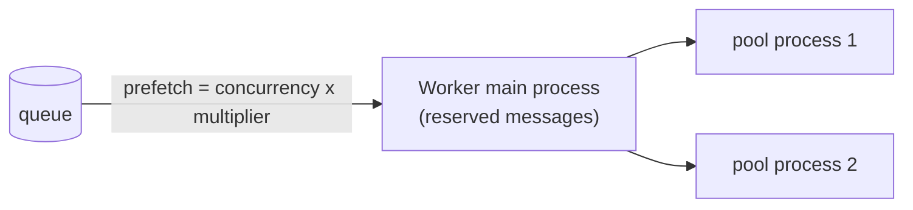

# Celery — Configuration, Workers & Beat

Celery defaults favour throughput: early acks, prefetching several messages per process, results kept for a day. For most business tasks you want the opposite — do not lose work, do not let one slow task hold others. This page covers the settings that matter, how tasks reach workers (routing), how workers run them (pools, concurrency, prefetch) and periodic tasks with beat.

## Setting Names

Celery 4+ uses **lowercase** setting names: `broker_url`, `task_acks_late`, `worker_prefetch_multiplier`. The old uppercase names (`CELERY_ACKS_LATE`, `BROKER_URL`, `CELERYD_PREFETCH_MULTIPLIER`) are deprecated — do not copy them from old answers. Mixing old and new names in one config raises `ImproperlyConfigured`.

```python
# 1. In code
app.conf.update(task_acks_late=True, worker_prefetch_multiplier=1)

# 2. From a module: orders/celeryconfig.py contains lowercase variables
app.config_from_object("orders.celeryconfig")

# 3. Django: CELERY_-prefixed names in settings.py (CELERY_TASK_ACKS_LATE = True)
app.config_from_object("django.conf:settings", namespace="CELERY")
```

With `namespace="CELERY"` the Django setting is the new lowercase name, uppercased, with the `CELERY_` prefix: `task_acks_late` becomes `CELERY_TASK_ACKS_LATE`.

## Recommended Baseline

```python
# orders/celeryconfig.py
import os

broker_url = os.environ["CELERY_BROKER_URL"]
result_backend = os.environ.get("CELERY_RESULT_BACKEND")
broker_connection_retry_on_startup = True

task_serializer = "json"
result_serializer = "json"
accept_content = ["json"]
timezone = "UTC"

task_acks_late = True
task_reject_on_worker_lost = True
worker_prefetch_multiplier = 1
task_time_limit = 300
task_soft_time_limit = 240
result_expires = 3600
task_track_started = True

worker_max_tasks_per_child = 1000
worker_send_task_events = True
task_send_sent_event = True

broker_transport_options = {"visibility_timeout": 3600}   # Redis: longer than the longest task
```

| Setting | Default | Why change it |
|---------|---------|---------------|
| `task_acks_late` | `False` | Ack after the task finishes — a crash does not lose the task |
| `task_reject_on_worker_lost` | not set (off) | With late acks, requeue the task if the pool process is killed |
| `task_acks_on_failure_or_timeout` | `True` | Failed tasks are still acked (not redelivered forever) — keep it |
| `worker_prefetch_multiplier` | 4 | 1 for long tasks: a worker does not hoard messages other workers could run |
| `worker_concurrency` | number of CPUs | Size for the workload: CPU-bound ≈ cores; I/O-bound with threads / gevent can be much higher |
| `task_time_limit` / `task_soft_time_limit` | none | Kill stuck tasks; let them clean up first |
| `task_track_started` | `False` | Show `STARTED` state (useful for UIs and tests) |
| `result_expires` | 1 day | Shorter if you store many results in Redis |
| `task_ignore_result` | `False` | `True` if nobody reads results |
| `worker_max_tasks_per_child` | none | Restart pool processes periodically — protects against memory leaks |
| `worker_max_memory_per_child` | none | Restart a pool process after it exceeds this many KiB |
| `worker_send_task_events` / `task_send_sent_event` | `False` | Needed by Flower and `celery events` |
| `broker_connection_retry_on_startup` | not set | Set to `True` explicitly: keep retrying when the broker is not up yet (containers start in any order) |
| `worker_cancel_long_running_tasks_on_connection_loss` | `False` | With late acks, cancel running tasks when the broker connection is lost — they will be redelivered anyway |
| `worker_soft_shutdown_timeout` | 0 (off) | Celery 5.5+: time-limited soft shutdown phase before a cold shutdown |

Print the effective config of a running worker with `celery -A orders.celery_app inspect conf`.

## Routing and Queues

By default every task goes to the queue `celery`. Put tasks with different profiles (fast API side effects, slow reports, CPU-heavy exports) into different queues and run separate workers for them — a burst of reports then cannot delay password-reset emails.

```python
from kombu import Queue

app.conf.update(
    task_default_queue="default",
    task_queues=[Queue("default"), Queue("emails"), Queue("reports")],
    task_routes={
        "orders.tasks.send_*": {"queue": "emails"},       # glob patterns work
        "orders.tasks.build_report": {"queue": "reports"},
    },
)
```

```bash
celery -A orders.celery_app worker -Q emails -n emails@%h --concurrency=4
celery -A orders.celery_app worker -Q default,reports -n main@%h --concurrency=2
```

- `apply_async(queue="...")` overrides the routes for one call.
- `task_create_missing_queues` is `True` by default: a route to an unknown queue creates it. A typo in a queue name therefore does not fail — the task silently waits in a queue that **no worker consumes**. Check with `celery -A proj inspect active_queues`.
- `-n name@%h` gives each worker a unique node name (`%h` = hostname). Two workers with the same name on one host conflict.
- RabbitMQ: `task_default_queue_type="quorum"` switches the default queue to quorum queues (replicated). Redis has no queue types.

## Prefetch and Concurrency



The worker reserves up to `concurrency × worker_prefetch_multiplier` messages. With the default 4 and 8 processes, one worker can hold 32 messages while other workers stay idle. For short tasks this improves throughput; for long tasks it causes uneven load and long waits.

| Workload | Settings |
|----------|----------|
| Many short tasks (< 1 s) | Default prefetch, or higher |
| Long tasks (seconds–minutes) | `worker_prefetch_multiplier=1`, `task_acks_late=True` |
| Very long tasks on Redis | Celery 5.6+: `celery worker --disable-prefetch` — fetch a message only when a process slot is free (Redis broker only) |

## Pools

| Pool (`-P`) | Runs tasks in | Good for | Notes |
|-------------|---------------|----------|-------|
| `prefork` (default) | Child processes (billiard) | CPU-bound work, isolation, any code | Time limits enforced; `worker_max_tasks_per_child` works; each process has its own memory |
| `threads` | Thread pool | I/O-bound tasks with thread-safe libraries | Time limits **not** enforced; GIL limits CPU-bound work |
| `gevent` | Greenlets | Thousands of concurrent I/O waits (HTTP calls) | `uv add "celery[gevent]"`; code must be gevent-friendly (no blocking C calls) |
| `eventlet` | Greenlets | Legacy deployments | Celery's `eventlet` extra installs only on Python < 3.10; the eventlet project recommends migrating away — use `gevent` or `threads` |
| `solo` | The worker's main thread, one task at a time | Debugging, tests, Windows, one-task-per-container setups | While a task runs, the worker cannot answer `inspect` / `ping` |

```bash
celery -A orders.celery_app worker -P prefork -c 8
celery -A orders.celery_app worker -P threads -c 32 -Q emails
celery -A orders.celery_app worker --autoscale=10,3        # grow to 10 processes, shrink to 3
```

Things that break in prefork workers:

- **Connections created before fork** (DB pools, HTTP clients, OpenTelemetry exporters) are shared by child processes. Create them per process, for example in the `worker_process_init` signal.
- **Module-level caches** are per process — a value set in one pool process is not visible in another.

## Rate Limits

```python
@shared_task(rate_limit="10/m")      # also "5/s", "100/h"
def call_partner_api(payload: dict) -> None: ...
```

A rate limit is applied **per worker instance**, not across the cluster. Four workers with `10/m` send up to 40 requests per minute. For a global limit use a shared token bucket (for example in Redis) or a single dedicated worker for that queue. Change a limit at runtime with `celery -A proj control rate_limit orders.tasks.call_partner_api 5/m`.

## Periodic Tasks with Beat

`celery beat` reads a schedule and sends due tasks to the broker. It does not run them — workers do.

```python
from datetime import timedelta

from celery.schedules import crontab

app.conf.timezone = "UTC"
app.conf.beat_schedule = {
    "nightly-sales-report": {
        "task": "orders.tasks.build_report",
        "schedule": crontab(hour=2, minute=30),
        "args": (0,),
    },
    "sync-exchange-rates": {
        "task": "orders.tasks.sync_rates",
        "schedule": timedelta(minutes=15),
        "options": {"queue": "default", "expires": 600},
    },
}
```

```bash
celery -A orders.celery_app beat --loglevel=INFO --schedule=/var/lib/celery/celerybeat-schedule
celery -A orders.celery_app worker -B            # beat inside a worker: local development only
```

| Schedule | Example |
|----------|---------|
| Seconds / `timedelta` | `30.0`, `timedelta(minutes=15)` |
| `crontab` | `crontab(minute=0, hour="*/3")`, `crontab(hour=7, minute=30, day_of_week="mon-fri")` |
| `solar` | `solar("sunset", lat, lon)` |

Rules:

- Run **exactly one** beat process. Two beats send every periodic task twice. In Kubernetes use one replica; do not run `-B` in scaled workers.
- `expires` in `options` stops a pile-up: if workers were down, stale runs are dropped instead of all running at once.
- The default scheduler keeps its state in a local file (`--schedule`). In containers put it on a volume or in `/tmp` (state is then lost on restart — acceptable for most schedules).
- Schedules in a database, editable at runtime: `django-celery-beat` (`--scheduler django_celery_beat.schedulers:DatabaseScheduler`). A Redis-backed scheduler with a lock against two beats: `celery-redbeat`.
- Periodic tasks must be idempotent like any other task — beat gives no "exactly once" guarantee.

## Checklist

- [ ] Only lowercase setting names; one config source
- [ ] `task_acks_late`, `task_reject_on_worker_lost`, `worker_prefetch_multiplier=1` for long or critical tasks
- [ ] Time limits and `worker_max_tasks_per_child` are set
- [ ] Separate queues and workers for fast and slow tasks; `inspect active_queues` matches the routes
- [ ] Pool chosen for the workload; connections are created per process
- [ ] Rate limits account for the number of workers
- [ ] Exactly one beat; periodic tasks have `expires` and are idempotent

---
## See also
- [Celery — Distributed Task Queue for Python](./index.md)
- [Celery — Tasks & Calling](./01-tasks-calling.md)
- [Celery — Monitoring & Deployment](./04-monitoring-deployment.md)
- [Performance Testing](../../performance-testing/index.md)
