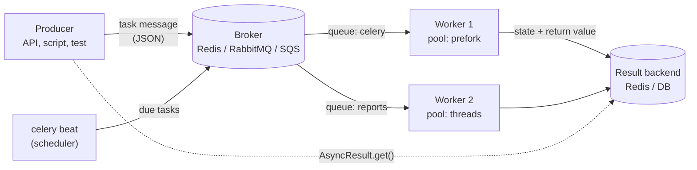

# Celery — Distributed Task Queue for Python

Celery runs Python functions **outside the request that asked for them**: in other processes, on other machines, later, on a schedule, with retries. The caller puts a task message into a **broker** (Redis, RabbitMQ, Amazon SQS); **workers** take messages from the broker and run the task; an optional **result backend** stores the state and the return value.

For a QA engineer Celery shows up in two ways: the application under test sends work to Celery (emails, reports, payments, imports), or the test framework itself uses Celery to spread work across machines. In both cases the hard part is the same — the work is **asynchronous and can run twice, late, or not at all**.

## Architecture



| Part | Role | Typical choice |
|------|------|----------------|
| Producer | Calls `task.delay()` / `apply_async()`; gets an `AsyncResult` with a task id | Web app, CLI, another task |
| Broker | Stores task messages in queues until a worker takes them | Redis (simple), RabbitMQ (routing, durability), SQS (AWS) |
| Worker | Process that consumes one or more queues and runs tasks in a pool | `celery -A proj worker` |
| Pool | How a worker runs tasks in parallel | `prefork` (processes, default), `threads`, `gevent`, `solo` |
| Result backend | Stores task state and return value | Redis, a database (SQLAlchemy / Django), none |
| Beat | Sends tasks on a schedule (cron-like); **exactly one** per deployment | `celery -A proj beat` |

## When to Use Celery

| Tool | Runs where | Brokers | Retries | Scheduling | Workflows | Good fit |
|------|------------|---------|---------|------------|-----------|----------|
| FastAPI `BackgroundTasks` | Same process, after the response | None | No | No | No | Small fire-and-forget work that is allowed to be lost on restart |
| RQ | Separate worker processes | Redis only | Yes (`Retry`) | Delayed jobs | Job dependencies | Simple Redis-only job queue with little setup |
| Dramatiq | Separate worker processes | RabbitMQ, Redis | Yes, on by default | External scheduler | Pipelines, groups | Celery-like tool with a smaller API and safer defaults |
| arq | asyncio worker | Redis only | Yes | Cron jobs | No | asyncio apps (FastAPI, aiohttp) with Redis |
| **Celery** | Separate worker processes | Redis, RabbitMQ, SQS and more | Yes (opt-in) | Beat | Chains, groups, chords | Many task types, routing to dedicated workers, schedules, workflows, big ecosystem (Flower, Django, OpenTelemetry) |

Pick Celery when you need several of: routing to different worker pools, periodic tasks, retries with backoff, workflows, several brokers, mature monitoring. Pick something smaller when you only need "run this later in Redis" — Celery has many settings and its defaults are tuned for throughput, not for safety (see [Tasks & Calling](./01-tasks-calling.md)).

Celery tasks are **regular functions**. An `async def` task does not work: the worker calls it, gets a coroutine back and fails with `EncodeError: Object of type coroutine is not JSON serializable`. Call async code with `asyncio.run(...)` inside a sync task, or use an async-native queue.

## Installation

```bash
uv add "celery[redis]"              # Celery + redis-py for Redis broker and result backend
uv add flower                       # web UI and Prometheus metrics (optional)
uv add --dev pytest pytest-celery   # test fixtures (see 05 and 06)
uv run celery --version
```

Examples in this guide were run with **Celery 5.6.3** (kombu 5.6.2, billiard 4.3.0, redis-py 6.4.0), **Flower 2.2.0**, **pytest-celery 1.3.0**, **opentelemetry-instrumentation-celery 0.66b0** and pytest 9.1 on Python 3.13, against a Redis 8 container (`redis:8-alpine`). Celery 5.6 supports Python 3.9+.

## Section Map

| File | Topics |
|------|--------|
| [01 Tasks & Calling](./01-tasks-calling.md) | App, `@app.task` / `@shared_task`, `delay` / `apply_async`, `countdown`, `eta`, `expires`, results and states, `bind=True`, retries and backoff, `acks_late`, idempotency, time limits, JSON serialization, `pydantic=True` |
| [02 Canvas Workflows](./02-canvas-workflows.md) | Signatures, `chain`, `group`, `chord`, immutable signatures, `link` / `link_error`, `chunks` / `starmap`, canvas pitfalls |
| [03 Configuration, Workers & Beat](./03-config-workers-beat.md) | Setting names, recommended config, routing and queues, prefetch, concurrency, pools, rate limits, periodic tasks with beat |
| [04 Monitoring & Deployment](./04-monitoring-deployment.md) | `celery inspect` / `control`, events, Flower, OpenTelemetry, logging, Docker Compose, health checks, graceful shutdown |
| [05 Testing Celery Code](./05-testing.md) | Direct calls, `apply()`, why `task_always_eager` hides bugs, `celery.contrib.pytest` fixtures, embedded worker, retries, idempotency, canvas, beat schedule, tracing |
| [06 Integration Tests & Flakiness](./06-integration-testing.md) | Real Redis in Docker (testcontainers), prefork worker subprocess, crash and redelivery test, pytest-celery containers, xdist, flaky test causes |

## Minimal Example

```python
# proj/celery_app.py
import os

from celery import Celery

app = Celery(
    "proj",
    broker=os.getenv("CELERY_BROKER_URL", "redis://localhost:6379/0"),
    backend=os.getenv("CELERY_RESULT_BACKEND", "redis://localhost:6379/1"),
    include=["proj.tasks"],
)
```

```python
# proj/tasks.py
from proj.celery_app import app


@app.task
def add(x: int, y: int) -> int:
    return x + y
```

```bash
docker run -d --name redis -p 6379:6379 redis:8-alpine
uv run celery -A proj.celery_app worker --loglevel=INFO
```

```python
>>> from proj.tasks import add
>>> result = add.delay(2, 3)       # returns at once: the message is in Redis
>>> result.id
'6dde829c-d7a5-4195-bea3-1b1d3f87a3c1'
>>> result.get(timeout=10)         # blocks until the worker stores the result
5
>>> result.state
'SUCCESS'
>>> add(2, 3)                      # a plain call runs in this process, no broker
5
```

## Quick Rules

1. **Pass IDs, not objects** — task arguments must be JSON; send `order_id`, load fresh data inside the task.
2. **Make every task idempotent** — with `acks_late` a task can run twice; with retries it runs several times by design.
3. **Retry only transient errors** — `autoretry_for=(TimeoutError, ConnectionError)` with `retry_backoff=True` and a `max_retries` limit.
4. **Set time limits** — `soft_time_limit` to clean up, `time_limit` to kill stuck tasks (enforced by the prefork pool).
5. **Never call `result.get()` inside a task** — build a `chain` or `chord` instead.
6. **Always pass `timeout=` to `result.get()`** in scripts and tests — without it a lost task blocks forever.
7. **Route slow and fast tasks to different queues** and run separate workers for them; use `worker_prefetch_multiplier=1` for long tasks.
8. **Run exactly one beat**; keep it separate from workers in production.
9. **Test with a real worker** (embedded or in Docker), not only with `task_always_eager`.

---
## See also
- [Digital Garden: Knowledge Base](../../index.md)
- [Python Libraries](../index.md)
- [FastAPI](../fastapi/index.md)
- [OpenTelemetry](../opentelemetry/index.md)
- [Pytest](../pytest/index.md)
- [Redis](../../databases/redis/index.md)
- [Docker & Docker Compose](../../tools/docker/index.md)
