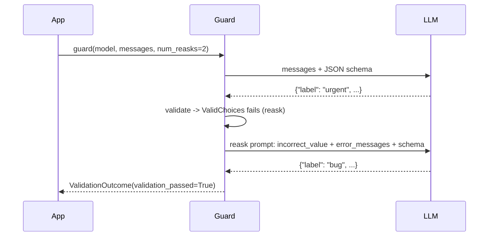

# Guardrails AI — Structured Output

## Why a Guard for JSON

A typed output contract has two layers — Guardrails checks both and reports them separately:

| Layer | Checked by | Example failure |
|-------|-----------|-----------------|
| **Schema** | JSON Schema generated from the Pydantic model | `priority: "critical"` not in `Literal["low", "medium", "high"]`, missing field, not JSON |
| **Quality** | Validators attached to fields | Label not in allowed list, summary too long, PII in a free-text field |

## `Guard.for_pydantic`

```python
from typing import Literal

from pydantic import BaseModel, Field

from guardrails import Guard
from guardrails_ai.valid_choices import ValidChoices
from guardrails_ai.valid_length import ValidLength


class Triage(BaseModel):
    label: str = Field(
        description="Ticket category",
        validators=[ValidChoices(choices=["bug", "feature", "question"], on_fail="reask")],
    )
    priority: Literal["low", "medium", "high"]
    summary: str = Field(
        description="One-line summary for the queue",
        validators=[ValidLength(min=5, max=80, on_fail="fix")],
    )


triage_guard = Guard.for_pydantic(Triage)
```

- `validators=[...]` inside `Field(...)` attaches validators to that field (Pydantic keeps them as extra field info).
- `Guard.for_pydantic(list[Triage])` validates a JSON array of objects.
- Renamed APIs: `Guard.from_pydantic` → `Guard.for_pydantic`, `Guard.from_string` → `Guard.for_string`. `Guard.for_rail` / `.rail` XML specs are deprecated and scheduled for removal — use Pydantic.
- Validators can also be attached by JSON path: `Guard.for_pydantic(Triage).use(ValidLength(min=3, max=8), on="$.label")`.

## Validating a Fixed String (`parse`)

`parse()` validates text you already have — ideal for tests and for outputs produced by another SDK.

```python
outcome = triage_guard.parse(
    '{"label": "bug", "priority": "high", "summary": "Checkout crashes on Safari"}'
)
assert outcome.validation_passed
ticket = Triage.model_validate(outcome.validated_output)   # validated_output is a dict, not a model
```

Results verified on 0.11.0 with `num_reasks=0`:

| Input | `validation_passed` | `validated_output` | Where to look |
|-------|--------------------|--------------------|---------------|
| Valid JSON | `True` | dict | — |
| `label: "urgent"` (validator with `reask`) | `False` | `None` | `outcome.reask`, `guard.history.last` |
| `priority: "critical"` (schema) | `False` | `None` | `outcome.reask.fail_results[0].error_message` = `JSON does not match schema` |
| `not json at all` | `False` | `None` | `outcome.error` = JSON decode error |
| JSON wrapped in a Markdown fence | `True` | dict | Fences are stripped automatically |
| Required field with `on_fail="filter"` fails | `False` | `None` | Field is dropped, then the schema fails |

## The Reask Loop



The reask prompt is generated from the failures — verified with a scripted fake LLM:

```text
I was given the following JSON response, which had problems due to incorrect values.
{
  "label": {
    "incorrect_value": "urgent",
    "error_messages": ["Value urgent is not in choices ['bug', 'feature', 'question']."]
  },
  ...
}
Help me correct the incorrect values based on the given error messages.
```

```python
outcome = triage_guard(
    model="anthropic/claude-sonnet-5",
    messages=[
        {"role": "system", "content": "You triage support tickets."},
        {"role": "user", "content": "Ticket: ${ticket}"},
    ],
    prompt_params={"ticket": ticket_text},
    num_reasks=2,                 # default 1; each reask = one more LLM call
    temperature=0,
)
```

- `num_reasks` can also be set once with `guard.configure(num_reasks=1)`.
- Only failing fields are re-asked by default; `full_schema_reask=True` asks for the whole object again (more tokens, sometimes more reliable on small models).
- Custom reask wording: `Guard.for_pydantic(Triage, reask_messages=[...])`.
- Iterations are in `guard.history.last.iterations` — assert the count in tests to catch prompt regressions that make the model need extra rounds.

## Function Calling vs Prompt-Based

| Mode | How | When |
|------|-----|------|
| Tool / function calling | `tools=guard.json_function_calling_tool()`, `tool_choice="required"` | Models with reliable tool calling (Claude, GPT-4o family) |
| JSON schema response format | `response_format=guard.response_format_json_schema()` (marked experimental) | Providers with native structured output |
| Prompt-based | Schema is appended to the prompt; the text answer is parsed | Local / older models without tool calling |

```python
outcome = triage_guard(
    model="openai/gpt-4o-mini",
    messages=[{"role": "user", "content": f"Triage this ticket: {ticket_text}"}],
    tools=triage_guard.json_function_calling_tool(),   # tool named "gd_response_tool"
    tool_choice="required",
)
```

Native structured output removes most *schema* failures, but not *quality* failures — field validators are still where business rules live.

## Handling Failures

```python
from guardrails.errors import ValidationError


def triage(ticket_text: str) -> Triage | None:
    try:
        outcome = triage_guard(model="anthropic/claude-haiku-4-5", messages=build_messages(ticket_text), num_reasks=1)
    except ValidationError:                       # a validator with on_fail="exception"
        metrics.guard_blocked.add(1, {"guard": "triage"})
        return None
    if not outcome.validation_passed:
        log.warning("triage failed", extra={"error": outcome.error, "reask": str(outcome.reask)})
        return None                               # route to a human queue
    return Triage.model_validate(outcome.validated_output)
```

| Symptom | Likely cause | Fix |
|---------|-------------|-----|
| `validated_output is None`, `error` set | Model returned prose or broken JSON | Tool calling / `response_format`, lower temperature |
| Many reasks for one field | Field description vague, choices not in the prompt | Improve `Field(description=...)`, list allowed values |
| Passing in tests, failing in prod | Tests only use happy-path fixtures | Add broken JSON, extra fields, wrong enums to the dataset ([06](./06-testing.md)) |
| Cost spike | `num_reasks` too high on a flaky field | Cap at 1–2, monitor `iterations` per call |

---
## See also
- [Guardrails AI — Input & Output Guards for LLMs](./index.md)
- [Guardrails AI — Guards & Validators](./01-guards-validators.md)
- [LiteLLM — Tools & Structured Output](../litellm/02-tools-structured-output.md)
- [Pydantic](../pydantic/index.md)
