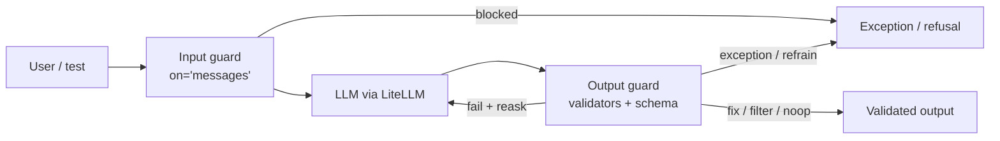

# Guardrails AI — Input & Output Guards for LLMs

Open-source Python framework (Apache-2.0) that wraps LLM calls with **validators**: checks run on the prompt before it reaches the model and on the answer before it reaches the user. It also turns free text into **validated structured output** (Pydantic) and can **re-ask** the model to fix what failed.



## Installation

```bash
uv add guardrails-ai                            # core: Guard, Validator, CLI, LiteLLM
uv add guardrails-ai-regex-match guardrails-ai-detect-pii   # validators = normal PyPI packages
guardrails configure --disable-metrics --disable-remote-inferencing --token ""   # optional, non-interactive
```

!!! warning "Validators moved to PyPI (0.11)"
    Validators are now published as `guardrails-ai-<name>` and imported from `guardrails_ai.<name>`. `guardrails hub install hub://guardrails/<name>` and `from guardrails.hub import X` are deprecated (removal in the next major). Guardrails' hosted remote inference ended on 2026-08-25 — ML validators must run locally (`use_local=True`) or against your own endpoint. `guardrails configure` and a Hub token are no longer needed to install validators.

Also avoid `guardrails-ai==0.10.1` — that release was a malicious upload (May 2026) and was quarantined. Pin the version in the lockfile.

## Section Map

| File | Topics |
|------|--------|
| [01 Guards & Validators](./01-guards-validators.md) | `Guard`, `use`, `validate` vs LLM call, `ValidationOutcome`, `on_fail` actions, history, async, streaming |
| [02 Structured Output](./02-structured-output.md) | `Guard.for_pydantic`, field validators, schema checks, reask loop, function calling vs prompt |
| [03 Input & Output Safety](./03-input-output-safety.md) | `on="messages"`, PII, toxicity, jailbreak, secrets, topics, provenance, latency and local models |
| [04 Custom Validators](./04-custom-validators.md) | `register_validator`, `PassResult` / `FailResult`, `fix_value`, metadata, LLM-as-judge, packaging |
| [05 Server & Production](./05-server-production.md) | `guardrails start`, `config.py`, OpenAI-compatible endpoint, Docker, OpenTelemetry, fail-open vs fail-closed |
| [06 Testing Guardrails](./06-testing.md) | pytest without LLM calls, FP/FN rates, regression datasets, mocked reask, CI gates, red teaming |

## Minimal Example

```python
from guardrails import Guard, OnFailAction
from guardrails.errors import ValidationError
from guardrails_ai.secrets_present import SecretsPresent
from guardrails_ai.valid_choices import ValidChoices

# Output guard for a ticket-triage bot: the label must be one of three values
triage_guard = Guard(name="ticket-label").use(
    ValidChoices(choices=["bug", "feature", "question"], on_fail=OnFailAction.EXCEPTION),
)

outcome = triage_guard.validate("bug")                  # no LLM call — validate a fixed string
assert outcome.validation_passed and outcome.validated_output == "bug"

try:
    triage_guard.validate("urgent")
except ValidationError as e:
    print(e)   # Validation failed for field with errors: Value urgent is not in choices [...]

# Same guard around a real model call (routed through LiteLLM)
support_guard = Guard().use(SecretsPresent(on_fail=OnFailAction.FIX))
result = support_guard(
    model="anthropic/claude-haiku-4-5",
    messages=[{"role": "user", "content": "How do I rotate my API key?"}],
)
print(result.validated_output)                          # secrets masked as ********
```

## Quick Commands

| Command | Use |
|---------|-----|
| `uv add guardrails-ai-<name>` | Install a validator (e.g. `guardrails-ai-detect-pii`) |
| `python -m guardrails_ai.<name>.post_install` | Download models for ML validators (PII, jailbreak, toxicity) |
| `guardrails configure --disable-metrics` | Write `~/.guardrailsrc`, opt out of anonymous usage metrics |
| `guardrails start --config config.py --port 8000` | Run guards as a REST / OpenAI-compatible service |
| `curl localhost:8000/health-check` | Server health probe |
| <code>pip list &#124; grep guardrails-ai-</code> | Installed validators (replaces `guardrails hub list`) |

## Guardrails AI vs Alternatives

| Tool | What it is | Strong at | Weak at |
|------|-----------|-----------|---------|
| **Guardrails AI** | Python library + optional server, composable validators | Output validation, structured output + reask, custom checks in plain Python | Dialogue flow control; ML validators add latency |
| **NeMo Guardrails** (NVIDIA) | Framework with Colang dialogue "rails" | Topical/dialogue flows, input/output/retrieval rails for chatbots | Steeper learning curve (Colang), less focus on typed output |
| **Llama Guard** (Meta) | Safety classifier model (hazard taxonomy) | Classifying prompts/answers as safe/unsafe | It is a model, not a framework — wrap it (e.g. as a custom validator) |
| **LiteLLM guardrails** | Pre/post-call hooks in the LiteLLM proxy | Central enforcement for every service behind the gateway | Checks are configured per gateway, less per-feature logic |
| **Provider guardrails** (Bedrock Guardrails, Azure AI Content Safety) | Managed content filters at the cloud provider | Zero code, content categories, PII masking, prompt attack detection | Tied to one cloud; limited custom logic; opaque to tests |

They combine well: provider filters as a baseline, gateway checks for org-wide policy, Guardrails AI for feature-specific rules and typed output.

## Where Guardrails Help (OWASP LLM Top 10)

| Risk | How guards help | Limits |
|------|-----------------|--------|
| [LLM01 Prompt Injection](../../owasp-llm-security/01-owasp-llm-security-guide.md#llm01-prompt-injection) | Jailbreak / unusual-prompt detection on input | Classifiers are bypassable — never the only control |
| [LLM02 Sensitive Information Disclosure](../../owasp-llm-security/01-owasp-llm-security-guide.md#llm02-sensitive-information-disclosure) | PII and secrets detection on input and output, `fix` = redact | Recall is never 100%; tune entities per domain |
| [LLM05 Improper Output Handling](../../owasp-llm-security/01-owasp-llm-security-guide.md#llm05-improper-output-handling) | Schema validation, regex, choices, web sanitization before output hits code/HTML/SQL | Still escape and parameterize downstream |
| [LLM06 Excessive Agency](../../owasp-llm-security/01-owasp-llm-security-guide.md#llm06-excessive-agency) | Validate tool-call arguments against a schema and allowed values | Authorization belongs in the tools, not in the guard |
| [LLM07 System Prompt Leakage](../../owasp-llm-security/01-owasp-llm-security-guide.md#llm07-system-prompt-leakage) | Custom validator that flags system-prompt fragments or canary tokens in output | Do not keep secrets in the system prompt at all |
| [LLM09 Misinformation](../../owasp-llm-security/01-owasp-llm-security-guide.md#llm09-misinformation) | Provenance / grounding checks against RAG sources, LLM-as-judge | Judges are models too — measure their error rate |
| [LLM10 Unbounded Consumption](../../owasp-llm-security/01-owasp-llm-security-guide.md#llm10-unbounded-consumption) | Input length limits, capped `num_reasks` | Rate limits and budgets live in the gateway |

## Quick Rules

1. **Guards are one layer, not the fix** — combine with least privilege, output encoding and human approval for risky actions.
2. **Install validators as pinned PyPI packages** (`guardrails-ai-<name>`) — no more `guardrails hub install`.
3. **Run ML validators locally or on your own endpoint** — hosted remote inference is gone.
4. **Pick `on_fail` deliberately**: `exception` for input, `fix` for redaction, `reask` for format errors, `noop` while tuning.
5. **Check `validation_summaries`, not only `validation_passed`** — a `fix` action returns `validation_passed=True` even though a validator failed.
6. **Cap `num_reasks`** (0–2) — every reask is a full extra LLM call.
7. **Unit-test every guard with `validate()` on fixed strings** — no keys, no network, fast CI.
8. **Measure false positives and false negatives** on labelled datasets before switching a guard from `noop` to blocking.
9. **Disable anonymous metrics in CI and production** (`guardrails configure --disable-metrics` or `guard.configure(allow_metrics_collection=False)`).

---
## See also
- [Digital Garden: Knowledge Base](../../index.md)
- [Python Libraries](../index.md)
- [LiteLLM — One API for 100+ LLM Providers](../litellm/index.md)
- [Pydantic](../pydantic/index.md)
- [OWASP LLM Security Guide](../../owasp-llm-security/01-owasp-llm-security-guide.md)
- [LLM Evaluation](../../llm-evaluation/index.md)
