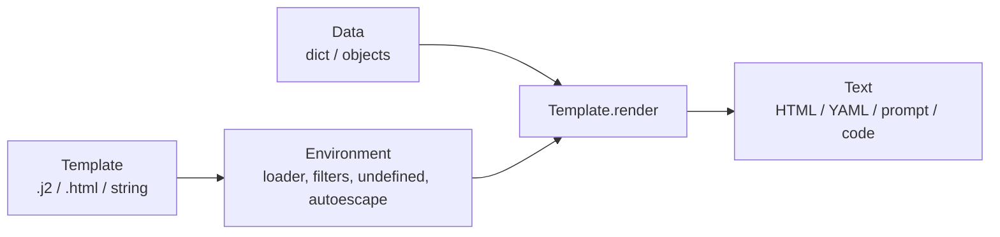

# Jinja — Templates for Python

Jinja (package `Jinja2`) is a text template engine: it takes a template with placeholders and logic, adds data from Python, and produces text. The output can be anything — HTML, Markdown, YAML, JSON, XML, SQL, Python code or an LLM prompt. Templates are compiled to Python code once and then rendered fast. HTML escaping comes from its companion library **MarkupSafe**.



## Where QA Engineers Meet Jinja

| Place | What Jinja does there |
|-------|------------------------|
| Test data and config generation | Render per-environment YAML/JSON configs, request bodies, XML/SOAP payloads |
| Test reports | HTML reports, Markdown summaries for CI (for example `$GITHUB_STEP_SUMMARY`), release notes |
| LLM prompts | Prompt templates in your own code, LangChain `template_format="jinja2"`, Hugging Face chat templates (`tokenizer.chat_template`) |
| Ansible | Variables in playbooks, `ansible.builtin.template` module for `.j2` files |
| dbt | SQL models with `{{ ref('orders') }}`, macros and control flow |
| Web apps under test | Flask `render_template`, FastAPI / Starlette `Jinja2Templates` |
| Docs sites | MkDocs and Material theme templates; Zensical renders the same theme templates with MiniJinja, a Rust engine for Jinja syntax (this site's `overrides/` are such templates) |
| Project scaffolding | Cookiecutter and Copier render whole project trees from Jinja templates |

Helm charts look similar but use Go templates, not Jinja. The ideas (variables, loops, escaping, missing values) are the same.

## Installation

```bash
uv add jinja2          # installs MarkupSafe as a dependency
uv run python -c "import importlib.metadata as m; print(m.version('jinja2'), m.version('markupsafe'))"
```

Examples in this guide were run with **Jinja2 3.1.6** and **MarkupSafe 3.0.3** on Python 3.13. Use `importlib.metadata` for the version — the `__version__` attribute is deprecated in MarkupSafe and is being deprecated in Jinja.

## Section Map

| File | Topics |
|------|--------|
| [01 Syntax Basics](./01-syntax-basics.md) | Variables, expressions, filters, tests, `if` / `for`, `loop`, whitespace control, comments, `raw`, `set`, `namespace` |
| [02 Environment, Loaders & Inheritance](./02-environment-inheritance.md) | `Environment`, loaders, `extends` / `block` / `super()`, `include`, macros, `import`, `call`, context, globals |
| [03 Filters, Escaping & Security](./03-customization-security.md) | Custom filters and tests, autoescape, `Markup`, `StrictUndefined`, sandbox, SSTI, async, `NativeEnvironment` |
| [04 QA Recipes](./04-qa-recipes.md) | Configs and payloads, HTML and Markdown reports from JUnit XML, LLM prompts, generated pytest modules, Jinja in YAML |
| [05 Testing Templates](./05-testing-templates.md) | pytest for templates, missing variables, golden files and snapshots, custom filters, linting, common pitfalls |

## Minimal Example

```python
from jinja2 import Environment, StrictUndefined

env = Environment(undefined=StrictUndefined, trim_blocks=True, lstrip_blocks=True)
template = env.from_string("""\
Run: {{ run_name }}

- {{ t.name }}: {{ t.status | upper }}

""")

print(template.render(
    run_name="smoke",
    tests=[{"name": "login", "status": "passed"}, {"name": "logout", "status": "failed"}],
))
# Run: smoke
# - login: PASSED
# - logout: FAILED
```

## Delimiters

| Syntax | Meaning |
|--------|---------|
| `{{ ... }}` | Expression — the result goes into the output |
| `` | Statement — `if`, `for`, `set`, `block`, `macro`, `include`, … |
| `{# ... #}` | Comment — not in the output |
| ``, `{{- ... -}}` | Same, but strip whitespace before / after the tag |

## Quick Rules

1. **Create one `Environment`** per template set and reuse it — it caches compiled templates.
2. **Use `StrictUndefined`** for configs, prompts, generated code and in tests — a missing variable must fail, not render as an empty string.
3. **Turn on autoescape for HTML/XML** (`select_autoescape(["html", "xml"])`) and keep it off for plain text, YAML and prompts.
4. **Never build template source from user input** — pass user data as variables. `from_string(f"... {user_input}")` is server-side template injection.
5. **Use `SandboxedEnvironment`** only when templates themselves come from users, and keep Jinja updated — sandbox bypasses were fixed in 3.1.5 and 3.1.6.
6. **Keep logic in Python** — templates should format data, not calculate it. Pass ready values or add a custom filter.
7. **Use `trim_blocks=True` and `lstrip_blocks=True`** for text formats where whitespace matters (YAML, Markdown, code).
8. **Test templates like code** — render with fixed data in pytest, compare with golden files, lint HTML templates.

---
## See also
- [Digital Garden: Knowledge Base](../../index.md)
- [Python Libraries](../index.md)
- [Pytest](../pytest/index.md)
- [Pydantic](../pydantic/index.md)
- [FastAPI](../fastapi/index.md)
- [Code Security](../../code-security/index.md)
