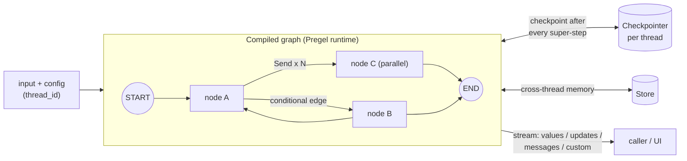

# LangGraph — Stateful Agent Orchestration

Low-level framework for building agents and workflows as **graphs of steps over a shared state**: loops, branching, parallel fan-out, persistence, human-in-the-loop and streaming. It is part of the LangChain ecosystem but does not require LangChain chains — a node is any Python function.

This guide goes beyond the basics covered in [LangChain — LangGraph & Production](../langchain/06-langgraph-production.md) (first `StateGraph`, simple tool loop, `MemorySaver`, `interrupt_before`) and focuses on graph design, memory, streaming, multi-agent patterns and — above all — **how to test LangGraph apps**.

## Installation

```bash
uv add langgraph                         # core: StateGraph, checkpointers, Store
uv add langchain                         # create_agent, middleware (optional)
uv add langchain-anthropic               # or langchain-openai, ... (model provider)
uv add langgraph-checkpoint-sqlite       # SqliteSaver (local persistence)
uv add langgraph-checkpoint-postgres     # PostgresSaver (production persistence)
uv add --dev "langgraph-cli[inmem]"      # `langgraph dev` local server + Studio
```

Examples in this guide were run against `langgraph` 1.2, `langchain` 1.4 and `langchain-core` 1.6, with fake chat models (no API keys).

## Section Map

| File | Topics |
|------|--------|
| [01 Graph Design & State](./01-graph-design-state.md) | State schemas, reducers, `MessagesState`, conditional edges, `Command`, `Send`, subgraphs, Functional API |
| [02 Persistence, Memory & Interrupts](./02-persistence-memory-interrupts.md) | Checkpointers, threads, state history, time-travel, `Store`, `interrupt()` / `Command(resume=...)` |
| [03 Streaming & Runtime](./03-streaming-runtime.md) | Stream modes, async, context and config, retries, caching, timeouts, error handlers, recursion limit |
| [04 Multi-Agent Patterns](./04-multi-agent-patterns.md) | `create_agent`, middleware, supervisor, subagents as tools, handoffs, `create_react_agent` migration |
| [05 Testing LangGraph Apps](./05-testing.md) | Unit tests for nodes and routers, fake models, checkpointer tests, interrupts, graph snapshots, trajectories |
| [06 Observability & Deployment](./06-observability-deployment.md) | LangSmith, Phoenix, Langfuse, MLflow tracing; `langgraph.json`, `langgraph dev`, SDK, Docker |

## When to Use LangGraph

| Need | Pick |
|------|------|
| One prompt → one answer, fixed pipeline | Plain model call or LCEL chain |
| Standard tool-calling agent (model ↔ tools loop) | `langchain.agents.create_agent` — it is a prebuilt LangGraph graph |
| Custom control flow: loops with exit criteria, branches, fan-out, retries per step | LangGraph `StateGraph` |
| Pause for human approval and resume hours later | LangGraph + checkpointer + `interrupt()` |
| Several specialised agents with explicit routing | LangGraph (supervisor / handoffs) |
| Durable long-running workflows across restarts | LangGraph with a persistent checkpointer |

Rule of thumb: start with `create_agent`; drop down to `StateGraph` when you need a step the agent loop cannot express, or when the flow must be deterministic and testable step by step. For a framework comparison (CrewAI, AutoGen, etc.) see [Agentic AI Architecture](../../agentic-ai-architecture/index.md).

## Mental Model



- **State** — a typed dict (or Pydantic model / dataclass) shared by all nodes. Nodes return **partial updates**; **reducers** decide how updates merge.
- **Nodes** — plain functions `state -> update`. They can also receive `config` and `runtime` (context, store, stream writer).
- **Edges** — static, conditional (a routing function) or dynamic (`Command(goto=...)`, `Send`).
- **Super-step** — all nodes scheduled for the same step run in parallel; their updates are applied together, then a checkpoint is saved.
- **Checkpointer** — saves state per `thread_id`, which enables memory, resume after failure, interrupts and time-travel.

## Minimal Example

```python
from typing import Literal, TypedDict

from langgraph.graph import END, START, StateGraph


class TriageState(TypedDict):
    title: str
    label: str
    reply: str


def classify(state: TriageState) -> dict:
    label = "bug" if "error" in state["title"].lower() else "question"
    return {"label": label}


def route(state: TriageState) -> Literal["bug", "question"]:
    return state["label"]


def handle_bug(state: TriageState) -> dict:
    return {"reply": f"Bug ticket created: {state['title']}"}


def handle_question(state: TriageState) -> dict:
    return {"reply": "Routed to the support FAQ."}


builder = StateGraph(TriageState)
builder.add_node("classify", classify)
builder.add_node("bug", handle_bug)
builder.add_node("question", handle_question)
builder.add_edge(START, "classify")
builder.add_conditional_edges("classify", route)
builder.add_edge("bug", END)
builder.add_edge("question", END)

graph = builder.compile()
print(graph.invoke({"title": "Checkout returns error 500"}))
# {'title': 'Checkout returns error 500', 'label': 'bug', 'reply': 'Bug ticket created: ...'}
```

No LLM here on purpose: the same structure works when `classify` calls a model — and the routing logic stays a plain, testable function.

## Quick Rules

1. **Keep nodes small and pure-ish** — read state, do one thing, return a partial update. They become trivial to unit-test.
2. **Put routing in named functions** with `Literal[...]` return types — they document the graph and are testable without a model.
3. **Use reducers for every key written by parallel nodes** — otherwise you get `InvalidUpdateError`.
4. **Compile with a checkpointer whenever you need memory, interrupts or resume** — and always pass a stable `thread_id`.
5. **Set `recursion_limit` deliberately** and design an explicit exit condition for every loop.
6. **Stream `updates` for progress and `messages` for tokens** — do not poll `invoke`.
7. **Inject the model** (factory, context or module attribute) so tests can swap in a fake chat model.
8. **Trace every run** (LangSmith, Phoenix, Langfuse or MLflow) and tag runs with test and suite IDs.

---
## See also
- [Digital Garden: Knowledge Base](../../index.md)
- [LangChain — LLM Application Framework](../langchain/index.md)
- [LangChain — LangGraph & Production](../langchain/06-langgraph-production.md)
- [Agentic AI Architecture](../../agentic-ai-architecture/index.md)
- [DeepEval — LLM Testing Guide](../../llm-evaluation/index.md)
- [Python Libraries](../index.md)
- [Agno — Agents, Teams & Workflows in Python](../agno/index.md)
