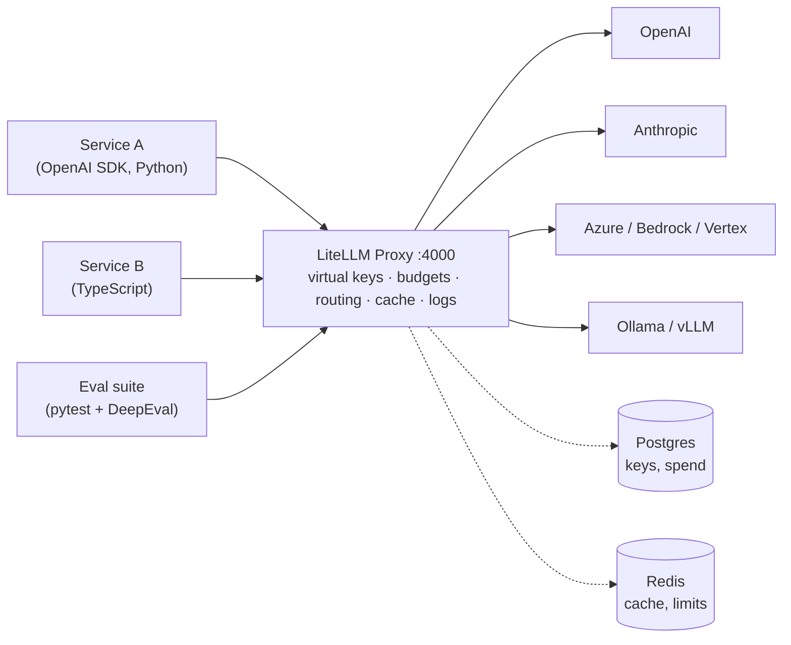

# LiteLLM — Proxy (AI Gateway)

## What the Proxy Adds



- One **OpenAI-compatible endpoint** (`/v1/chat/completions`, `/v1/embeddings`, ...) for all providers.
- **Virtual keys** per team, service or developer — provider keys never leave the gateway.
- **Budgets, rate limits and model access** per key, user and team.
- **Central logging and spend tracking**, plus the Router features from [03](./03-router-reliability.md).

## Configuration

```yaml
# config.yaml
model_list:
  - model_name: smart
    litellm_params:
      model: anthropic/claude-sonnet-5
      api_key: os.environ/ANTHROPIC_API_KEY        # read from env, never hardcode
  - model_name: smart
    litellm_params:
      model: openai/gpt-4o
      api_key: os.environ/OPENAI_API_KEY
  - model_name: fast
    litellm_params:
      model: anthropic/claude-haiku-4-5
      api_key: os.environ/ANTHROPIC_API_KEY
  - model_name: local
    litellm_params:
      model: ollama/llama3.2
      api_base: http://ollama:11434
  - model_name: embeddings
    litellm_params:
      model: openai/text-embedding-3-small
      api_key: os.environ/OPENAI_API_KEY

litellm_settings:
  drop_params: true
  num_retries: 2
  request_timeout: 60
  fallbacks: [{ "smart": ["fast"] }]
  cache: true
  cache_params:
    type: redis
    host: redis
    port: 6379
    ttl: 3600
  callbacks: ["otel"]

router_settings:
  routing_strategy: simple-shuffle
  redis_host: redis
  redis_port: 6379

general_settings:
  master_key: os.environ/LITELLM_MASTER_KEY      # must start with "sk-"
  database_url: os.environ/DATABASE_URL          # Postgres: enables virtual keys and spend tracking
```

```bash
litellm --config config.yaml --port 4000
```

## Calling the Proxy

Any OpenAI-compatible client works — point it at the proxy and use a virtual key.

```python
from openai import OpenAI

client = OpenAI(base_url="http://localhost:4000", api_key="sk-team-qa-...")

response = client.chat.completions.create(
    model="smart",                                   # model_name from config.yaml
    messages=[{"role": "user", "content": "Summarize this failing test log: ..."}],
    extra_body={"metadata": {"test_run": "nightly-2026-09-27"}},   # appears in logs and callbacks
)
```

```bash
curl http://localhost:4000/v1/chat/completions \
  -H "Authorization: Bearer sk-team-qa-..." \
  -H "Content-Type: application/json" \
  -d '{"model": "fast", "messages": [{"role": "user", "content": "ping"}]}'
```

The LiteLLM SDK can also call the proxy: `completion(model="litellm_proxy/smart", api_base="http://localhost:4000", api_key=...)`.

## Virtual Keys

Requires `database_url`. Generate keys with the master key:

```bash
curl -X POST http://localhost:4000/key/generate \
  -H "Authorization: Bearer $LITELLM_MASTER_KEY" \
  -H "Content-Type: application/json" \
  -d '{
        "key_alias": "qa-eval-suite",
        "models": ["fast", "smart"],
        "max_budget": 50,
        "budget_duration": "30d",
        "rpm_limit": 120,
        "tpm_limit": 200000,
        "metadata": {"team": "qa"}
      }'
```

| Endpoint | Purpose |
|----------|---------|
| `POST /key/generate`, `/key/update`, `/key/delete` | Manage virtual keys |
| `GET /key/info?key=...` | Spend and limits of a key |
| `POST /team/new`, `/user/new` | Teams and users with their own budgets |
| `GET /spend/logs` | Per-request spend |
| `GET /model/info` | Models, deployments and prices |
| `GET /health/liveliness`, `/health/readiness` | Probes for Kubernetes / Compose |
| `GET /health` | Calls every model — use sparingly, it costs tokens |

The Admin UI at `http://localhost:4000/ui` covers the same operations.

## Docker Compose

```yaml
# compose.yaml
services:
  litellm:
    image: ghcr.io/berriai/litellm:main-stable       # pin a specific version tag in production
    command: ["--config", "/app/config.yaml", "--port", "4000"]
    volumes:
      - ./config.yaml:/app/config.yaml:ro
    environment:
      LITELLM_MASTER_KEY: ${LITELLM_MASTER_KEY}
      DATABASE_URL: postgresql://litellm:litellm@db:5432/litellm
      ANTHROPIC_API_KEY: ${ANTHROPIC_API_KEY}
      OPENAI_API_KEY: ${OPENAI_API_KEY}
    ports:
      - "4000:4000"
    depends_on: [db, redis]
    healthcheck:
      test: ["CMD-SHELL", "wget -qO- http://localhost:4000/health/liveliness || exit 1"]
      interval: 15s

  db:
    image: postgres:17
    environment:
      POSTGRES_USER: litellm
      POSTGRES_PASSWORD: litellm
      POSTGRES_DB: litellm
    volumes:
      - pgdata:/var/lib/postgresql/data

  redis:
    image: redis:7

volumes:
  pgdata:
```

## Guardrails and Policies

| Feature | Config |
|---------|--------|
| Block models per key / team | `models` list on the key or team |
| PII masking, prompt-injection checks | `guardrails:` section (Presidio, Lakera, Bedrock Guardrails, custom) |
| Max request size / tokens | `max_tokens` limits per model, key-level `tpm_limit` |
| Request/response logging off for sensitive teams | `turn_off_message_logging: true` |

Guardrails run `pre_call` (input), `post_call` (output) or `during_call` (in parallel with the LLM call).

## Production Notes

- Run several proxy replicas behind a load balancer; share state through Postgres and Redis.
- Keep `master_key` for admin automation only; every service gets its own virtual key.
- Set `LITELLM_SALT_KEY` before storing any provider keys in the DB — it encrypts them and cannot be changed later.
- Pin the image tag and the `litellm` package version; upgrade deliberately after reading release notes.
- Export traces and metrics (`callbacks: ["otel"]`, Prometheus `/metrics`) — see [05](./05-observability-testing.md).

---
## See also
- [LiteLLM — One API for 100+ LLM Providers](./index.md)
- [LiteLLM — Router & Reliability](./03-router-reliability.md)
- [Edge Layer: Reverse Proxy, Forward Proxy, API Gateway, WAF](../../client-server-architecture/02-edge-layer/02-reverse-proxy-api-gateway.md)
- [OWASP LLM Security](../../owasp-llm-security/index.md)
- [Redis — Persistence, Scaling & Security](../../databases/redis/05-operations-security.md)
