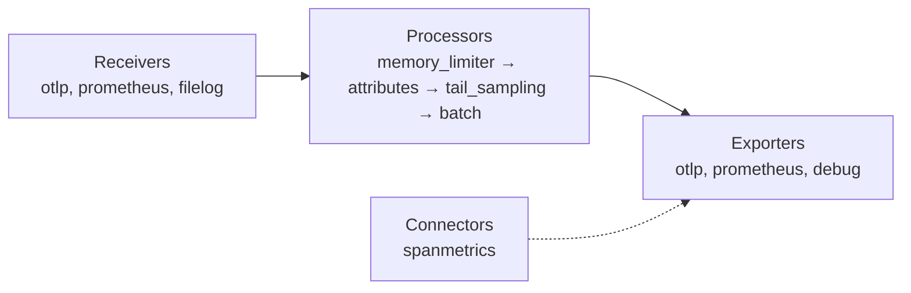

# OpenTelemetry — Collector & Backends

## Why a Collector

| Without Collector | With Collector |
|-------------------|----------------|
| Every service holds vendor endpoints and API keys | Services only know `collector:4317` |
| Changing backend = redeploying every service | Changing backend = editing one config |
| Sampling decided per service, blind to outcome | Tail sampling on complete traces |
| Retries and buffering eat app memory | Buffering and retries offloaded |
| Sensitive attributes leave the app as-is | Redaction in one place |

## Pipeline Model



- **Receivers** — accept data (push or pull).
- **Processors** — transform, filter, sample, batch. **Order matters**: they run top to bottom.
- **Exporters** — send data to backends.
- **Connectors** — act as an exporter of one pipeline and a receiver of another (e.g. derive metrics from spans).
- **Extensions** — health check, pprof, auth.

## Distributions

| Image | Contents | Use |
|-------|----------|-----|
| `otel/opentelemetry-collector` | Core components only | Minimal, OTLP in / OTLP out |
| `otel/opentelemetry-collector-contrib` | Core + community components (`tail_sampling`, `filelog`, `k8sattributes`, vendor exporters) | Most real setups |
| Custom build (`ocb`) | Only the components you list | Smaller attack surface in production |

## Baseline Configuration

```yaml
# otel-collector.yaml
receivers:
  otlp:
    protocols:
      grpc:
        endpoint: 0.0.0.0:4317
      http:
        endpoint: 0.0.0.0:4318

processors:
  memory_limiter:            # first: protects the collector from OOM
    check_interval: 1s
    limit_percentage: 80
    spike_limit_percentage: 20
  resource:
    attributes:
      - key: deployment.environment.name
        value: staging
        action: upsert
  attributes/redact:
    actions:
      - key: http.request.header.authorization
        action: delete
      - key: user.email
        action: hash
  batch:                     # last: fewer, larger export requests
    send_batch_size: 8192
    timeout: 5s

exporters:
  otlp/tempo:
    endpoint: tempo:4317
    tls:
      insecure: true
  prometheus:
    endpoint: 0.0.0.0:8889
  otlphttp/loki:
    endpoint: http://loki:3100/otlp
  debug:
    verbosity: basic         # detailed = full span dump to collector stdout

extensions:
  health_check:
    endpoint: 0.0.0.0:13133

service:
  extensions: [health_check]
  pipelines:
    traces:
      receivers: [otlp]
      processors: [memory_limiter, resource, attributes/redact, batch]
      exporters: [otlp/tempo, debug]
    metrics:
      receivers: [otlp]
      processors: [memory_limiter, resource, batch]
      exporters: [prometheus]
    logs:
      receivers: [otlp]
      processors: [memory_limiter, resource, attributes/redact, batch]
      exporters: [otlphttp/loki]
```

A component declared but not listed in `service.pipelines` is ignored. `type/name` (e.g. `otlp/tempo`) lets you have several instances of one component.

## Tail Sampling

Head sampling in the SDK drops traces before knowing the outcome. Tail sampling waits for a whole trace and then decides.

```yaml
processors:
  tail_sampling:
    decision_wait: 10s             # how long to buffer spans of one trace
    num_traces: 50000
    policies:
      - name: keep-errors
        type: status_code
        status_code: { status_codes: [ERROR] }
      - name: keep-slow
        type: latency
        latency: { threshold_ms: 1000 }
      - name: keep-test-traffic
        type: string_attribute
        string_attribute: { key: test.run.id, values: [".+"], enabled_regex_matching: true }
      - name: sample-rest
        type: probabilistic
        probabilistic: { sampling_percentage: 5 }
```

A trace is kept if **any** policy matches. All spans of a trace must reach the **same** collector instance — with several replicas put a `loadbalancing` exporter (routing by `trace_id`) in front.

## Span Metrics

Derive RED metrics from traces, so every service gets rate, errors and latency even without metric instrumentation:

```yaml
connectors:
  spanmetrics:
    histogram:
      explicit:
        buckets: [50ms, 100ms, 250ms, 500ms, 1s, 2.5s]
    dimensions:
      - name: http.request.method
      - name: http.response.status_code

service:
  pipelines:
    traces:
      receivers: [otlp]
      processors: [memory_limiter, batch]
      exporters: [otlp/tempo, spanmetrics]
    metrics/spanmetrics:
      receivers: [spanmetrics]
      exporters: [prometheus]
```

Put `spanmetrics` **before** tail sampling (in a separate pipeline), otherwise metrics only count the sampled traces.

## Local Stack with Docker Compose

### Option 1 — all-in-one (fastest)

```yaml
# compose.yaml
services:
  lgtm:
    image: grafana/otel-lgtm
    ports:
      - "3000:3000"   # Grafana (admin / admin)
      - "4317:4317"   # OTLP gRPC
      - "4318:4318"   # OTLP HTTP
```

Contains a Collector, Tempo (traces), Loki (logs), Prometheus (metrics) and Grafana with data sources preconfigured. For development and demos only.

### Option 2 — Collector + Jaeger

```yaml
# compose.yaml
services:
  collector:
    image: otel/opentelemetry-collector-contrib
    command: ["--config=/etc/otelcol/config.yaml"]
    volumes:
      - ./otel-collector.yaml:/etc/otelcol/config.yaml:ro
    ports:
      - "4317:4317"
      - "4318:4318"
      - "13133:13133"   # health check
    depends_on: [jaeger]

  jaeger:
    image: jaegertracing/jaeger
    ports:
      - "16686:16686"   # Jaeger UI

  app:
    build: .
    environment:
      OTEL_SERVICE_NAME: orders-api
      OTEL_EXPORTER_OTLP_ENDPOINT: http://collector:4317
      OTEL_EXPORTER_OTLP_PROTOCOL: grpc
    ports:
      - "8000:8000"
    depends_on: [collector]
```

With exporter `otlp/jaeger: { endpoint: jaeger:4317, tls: { insecure: true } }` in the collector config. Open `http://localhost:16686`, pick `orders-api`, find traces. Jaeger storage, UI and test usage: [Jaeger guide](../../tools/jaeger/index.md).

## Deployment Patterns

| Pattern | Where the collector runs | Good for |
|---------|--------------------------|----------|
| **Agent** | Sidecar or DaemonSet next to the app | Host/k8s metadata, local buffering, low latency |
| **Gateway** | Central deployment behind a load balancer | Tail sampling, redaction, auth to vendors |
| **Agent + Gateway** | Both | Production at scale |

## Backend Choices

| Signal | Open source | Notes |
|--------|-------------|-------|
| Traces | Jaeger, Grafana Tempo, Zipkin | Tempo stores traces in object storage, queried by TraceQL |
| Metrics | Prometheus, Grafana Mimir, VictoriaMetrics | Prometheus accepts OTLP natively (`--web.enable-otlp-receiver`) |
| Logs | Grafana Loki, OpenSearch / Elasticsearch | Loki has a native OTLP endpoint (`/otlp`) |
| All-in-one | SigNoz, Uptrace, Grafana LGTM | One UI for all signals |

Commercial platforms (Datadog, New Relic, Honeycomb, Dynatrace, Grafana Cloud, Elastic) accept OTLP — the app code stays the same.

---
## See also
- [OpenTelemetry — Python Observability](./index.md)
- [OpenTelemetry — Testing with OpenTelemetry](./06-testing.md)
- [Client–Server: Observability](../../client-server-architecture/06-reliability-security-observability/03-observability.md)
- [uv — Workspaces & Docker](../uv/04-workspaces-docker.md)
- [Jaeger — Setup & Architecture](../../tools/jaeger/01-setup-architecture.md)
