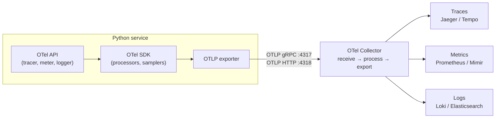

# OpenTelemetry — Python Observability

Vendor-neutral standard for traces, metrics and logs: one API in the code, any backend behind the Collector.

## Installation

```bash
# API + SDK + OTLP exporter (manual instrumentation)
uv add opentelemetry-api opentelemetry-sdk opentelemetry-exporter-otlp

# Zero-code instrumentation for installed libraries (FastAPI, httpx, requests, SQLAlchemy, ...)
uv add opentelemetry-distro
uv run opentelemetry-bootstrap -a requirements   # prints the instrumentation packages to add
```

## Section Map

| File | Topics |
|------|--------|
| [01 Core Concepts](./01-core-concepts.md) | Signals, API vs SDK, resource, context propagation, semantic conventions, OTLP |
| [02 Tracing](./02-tracing.md) | Tracer setup, spans, attributes, events, status, exceptions, links, sampling |
| [03 Metrics & Logs](./03-metrics-logs.md) | Counters, histograms, gauges, views, log correlation with traces |
| [04 Auto-Instrumentation](./04-auto-instrumentation.md) | `opentelemetry-instrument`, env vars, FastAPI, httpx, requests, SQLAlchemy |
| [05 Collector & Backends](./05-collector-backends.md) | Collector pipelines, processors, tail sampling, local stack with Docker Compose |
| [06 Testing with OpenTelemetry](./06-testing.md) | In-memory exporters, asserting spans in pytest, linking tests to backend traces |

## How the Pieces Fit



- **API** — what library and application code calls. Without an SDK it is a no-op, so libraries can depend on it safely.
- **SDK** — the implementation: batching, sampling, resource, exporters. Configured once, at application startup.
- **Collector** — a separate process that receives, filters, enriches and routes telemetry. Keeps vendor config out of the app.

## Minimal Setup (Traces)

```python
from opentelemetry import trace
from opentelemetry.exporter.otlp.proto.grpc.trace_exporter import OTLPSpanExporter
from opentelemetry.sdk.resources import Resource
from opentelemetry.sdk.trace import TracerProvider
from opentelemetry.sdk.trace.export import BatchSpanProcessor

resource = Resource.create({"service.name": "orders-api", "service.version": "1.4.0"})
provider = TracerProvider(resource=resource)
provider.add_span_processor(BatchSpanProcessor(OTLPSpanExporter(endpoint="http://localhost:4317", insecure=True)))
trace.set_tracer_provider(provider)

tracer = trace.get_tracer(__name__)

with tracer.start_as_current_span("checkout") as span:
    span.set_attribute("order.id", "ord-42")
```

## Quick Commands

| Command | Use |
|---------|-----|
| `opentelemetry-bootstrap -a requirements` | List instrumentation packages for installed libraries |
| `opentelemetry-instrument python app.py` | Run with zero-code instrumentation |
| `OTEL_TRACES_EXPORTER=console opentelemetry-instrument python app.py` | Print spans to stdout (no backend needed) |
| `docker run -p 3000:3000 -p 4317:4317 -p 4318:4318 grafana/otel-lgtm` | Local all-in-one backend (Grafana, Tempo, Loki, Prometheus) |
| `docker run -p 16686:16686 -p 4317:4317 -p 4318:4318 jaegertracing/jaeger` | Local Jaeger with OTLP ingest |

## Key Environment Variables

| Variable | Example | Purpose |
|----------|---------|---------|
| `OTEL_SERVICE_NAME` | `orders-api` | `service.name` resource attribute |
| `OTEL_RESOURCE_ATTRIBUTES` | `service.version=1.4.0,deployment.environment.name=staging` | Extra resource attributes |
| `OTEL_EXPORTER_OTLP_ENDPOINT` | `http://collector:4317` | Where to send OTLP |
| `OTEL_EXPORTER_OTLP_PROTOCOL` | `grpc` / `http/protobuf` | Transport (HTTP uses port 4318) |
| `OTEL_TRACES_SAMPLER` | `parentbased_traceidratio` | Sampling strategy |
| `OTEL_TRACES_SAMPLER_ARG` | `0.1` | Ratio for the sampler (10%) |
| `OTEL_PROPAGATORS` | `tracecontext,baggage` | Header formats for context propagation |

## Quick Rules

1. **Depend on the API in libraries, configure the SDK only in the application entry point.**
2. **Always set `service.name`** — without it every backend shows `unknown_service`.
3. **Use `BatchSpanProcessor` in production**, `SimpleSpanProcessor` only in tests and debugging.
4. **Start with auto-instrumentation**, then add manual spans around business operations.
5. **Follow semantic conventions** for attribute names — dashboards and queries rely on them.
6. **Keep high-cardinality values out of metric attributes** (user IDs, URLs with IDs) — put them on spans.
7. **Send to a Collector, not straight to a vendor** — switching backends becomes a config change.
8. **Flush on exit** in short-lived scripts and jobs: `provider.shutdown()`.

---
## See also
- [Digital Garden: Knowledge Base](../../index.md)
- [Client–Server: Observability](../../client-server-architecture/06-reliability-security-observability/03-observability.md)
- [Cross-Cutting: Security and Observability](../../api-architectures/05-cross-cutting/01-security-observability.md)
- [FastAPI](../fastapi/index.md)
- [Python Libraries](../index.md)
- [Jaeger — Distributed Tracing for OpenTelemetry](../../tools/jaeger/index.md)
