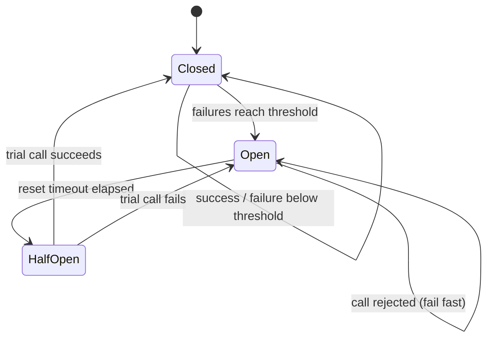

# Resilience — Timeouts, Fallbacks & Circuit Breakers

Retries handle short failures. Long failures need different tools: a **timeout** so one slow call cannot hold a request forever, a **deadline** shared by every call inside one operation, a **fallback** that returns something useful when the dependency is gone, a **circuit breaker** that stops calling a dependency that is clearly down, and **bulkheads** that keep one bad dependency from taking all workers with it.

## Timeouts Everywhere

| Client | Default | How to set | What the number limits |
|--------|---------|------------|------------------------|
| requests | **None — waits forever** | `requests.get(url, timeout=(3.05, 10))` | Connect; then the gap **between bytes** of the response |
| HTTPX | 5 s for connect, read, write and pool | `httpx.Client(timeout=httpx.Timeout(10.0, connect=2.0))`, per request `timeout=` | Each operation separately; `pool` = waiting for a free connection |
| asyncio | None | `async with asyncio.timeout(5):`, `asyncio.timeout_at(when)`, `await asyncio.wait_for(aw, 5)` | **Total** time of the block; cancels the work inside |
| redis-py | 5 s socket timeouts (redis-py 8) | `socket_timeout=`, `socket_connect_timeout=` | One command / one connect |
| PostgreSQL (psycopg) | None | `connect_timeout=` in the DSN, `SET statement_timeout = '5s'` | Connect; one statement on the server |
| `subprocess.run` | None | `timeout=` | Total; kills the child process |

Client timeouts limit **one operation**, not the whole call. A server that sends one byte every 0.3 seconds never trips a 1-second read timeout. Checked against a local server that sends 10 bytes, 0.3 s apart:

```text
requests read timeout=1:  10 bytes in 2.7 s    (no error)
httpx timeout=1:          10 bytes in 2.7 s    (no error)
asyncio.timeout(1.5):     TimeoutError after 1.5 s
```

For a hard limit on the total time in async code, wrap the call:

```python
async with asyncio.timeout(5):                     # whole request, slow body included
    response = await client.get(url)
```

- `asyncio.timeout()` raises the built-in `TimeoutError` (`asyncio.TimeoutError` is the same class since Python 3.11). Inside the block the work sees `asyncio.CancelledError` — code that swallows `CancelledError` breaks timeouts, `TaskGroup` and shutdown.
- In **sync** code nothing can safely interrupt a blocking call from outside. `future.result(timeout=5)` on a thread pool stops **waiting**, but the thread keeps running. Use the client's own timeouts, server-side limits (`statement_timeout`), or move the call to async code / a subprocess.
- A timeout without a retry policy and a fallback just turns "slow" into "error". Decide what happens next.

## Deadline Propagation

One user request may call five services in sequence. Giving each call a 5-second timeout allows 25 seconds in total — long after the user's browser or the API gateway gave up. Instead, set **one deadline** at the edge and let every call use what is left of it:

```python
# app/deadline.py
import time
from collections.abc import Iterator
from contextlib import contextmanager
from contextvars import ContextVar

_deadline: ContextVar[float | None] = ContextVar("deadline", default=None)


class DeadlineExceeded(TimeoutError):
    pass


@contextmanager
def deadline(seconds: float) -> Iterator[None]:
    """Set a deadline for everything inside; a nested deadline can only be shorter."""
    new = time.monotonic() + seconds
    current = _deadline.get()
    token = _deadline.set(new if current is None else min(current, new))
    try:
        yield
    finally:
        _deadline.reset(token)


def remaining(default: float) -> float:
    """Timeout for the next call: what is left of the deadline, at most `default`."""
    at = _deadline.get()
    if at is None:
        return default
    left = at - time.monotonic()
    if left <= 0:
        raise DeadlineExceeded("deadline exceeded before the call")
    return min(default, left)
```

```python
from app.deadline import deadline, remaining

with deadline(2.0):                                  # set once, e.g. in middleware
    print(round(remaining(10), 1))                   # 2.0  - capped by the deadline
    with deadline(0.5):                              # a stricter step inside
        print(round(remaining(10), 1))               # 0.5
    print(round(remaining(0.3), 1))                  # 0.3  - capped by the call's own limit
print(remaining(7))                                  # 7    - no deadline set
```

```python
response = await client.get(url, timeout=remaining(5.0))                 # never longer than what is left
headers = {"X-Deadline-Ms": str(int(remaining(5.0) * 1000))}           # tell the next service, too
```

- A `ContextVar` follows the code through `await` and into tasks created inside the block, without passing it as an argument — and each request keeps its own value ([05 — contextvars](./05-race-conditions.md#contextvars-instead-of-globals)).
- `DeadlineExceeded` subclasses `TimeoutError`, so retry and fallback code treats it like any timeout — and a retry loop stops at once instead of sleeping.
- HTTP has no standard deadline header; pick one name (here `X-Deadline-Ms`) for your services. gRPC propagates deadlines itself (`grpc-timeout`).

## Fallback Chains

A fallback answers when the real answer is not available: a second provider, a cached value, a default, an empty list. The chain below asks the primary rates API (behind a circuit breaker), then a secondary one, then the last good value if it is less than an hour old, then a default — and always says which one answered:

```python
# app/fallbacks.py
import asyncio
import logging
import time
from collections.abc import Awaitable, Callable
from dataclasses import dataclass

from app.breaker import CircuitBreaker, CircuitOpenError

logger = logging.getLogger(__name__)

Fetcher = Callable[[], Awaitable[dict[str, float]]]
DEFAULT_RATES = {"USD": 1.0}
FALLBACK_ON = (TimeoutError, ConnectionError, CircuitOpenError)


@dataclass(frozen=True)
class Rates:
    values: dict[str, float]
    source: str                  # primary, secondary, cache, default
    degraded: bool               # tell the caller (and the UI, and metrics)


class RatesService:
    def __init__(
        self,
        primary: Fetcher,
        secondary: Fetcher,
        *,
        breaker: CircuitBreaker | None = None,
        timeout: float = 1.0,
        max_stale: float = 3600.0,
        clock: Callable[[], float] = time.monotonic,
    ) -> None:
        self._primary = primary
        self._secondary = secondary
        self._breaker = breaker or CircuitBreaker(failure_types=FALLBACK_ON)
        self._timeout = timeout
        self._max_stale = max_stale
        self._clock = clock
        self._last_good: tuple[dict[str, float], float] | None = None

    async def _timed(self, fetch: Fetcher) -> dict[str, float]:
        async with asyncio.timeout(self._timeout):              # each step gets its own budget
            return await fetch()

    async def _call_primary(self) -> dict[str, float]:
        # timeout INSIDE the breaker: a slow primary counts as a failure
        return await self._breaker.call_async(lambda: self._timed(self._primary))

    async def _call_secondary(self) -> dict[str, float]:
        return await self._timed(self._secondary)

    async def get(self) -> Rates:
        for source, fetch in (("primary", self._call_primary), ("secondary", self._call_secondary)):
            try:
                values = await fetch()
            except FALLBACK_ON as exc:
                logger.warning("rates: %s failed: %r", source, exc)
                continue
            self._last_good = (values, self._clock())
            return Rates(values, source, degraded=source != "primary")

        if self._last_good and self._clock() - self._last_good[1] <= self._max_stale:
            return Rates(self._last_good[0], "cache", degraded=True)
        return Rates(DEFAULT_RATES, "default", degraded=True)
```

```text
WARNING app.fallbacks: rates: primary failed: TimeoutError()
WARNING app.fallbacks: rates: secondary failed: ConnectionError('refused')
Rates(values={'USD': 1.0, 'EUR': 0.91}, source='cache', degraded=True)
```

The timeout sits **inside** the breaker call on purpose. With `asyncio.timeout()` around `breaker.call_async(...)`, the breaker sees `CancelledError` instead of `TimeoutError`, does not count it as a failure, and never opens for a dependency that is slow rather than down.

### Graceful degradation

| Dependency down | Degraded behaviour | Never |
|-----------------|--------------------|-------|
| Recommendations, ads, "people also bought" | Empty block, cached popular items | Fail the product page |
| Exchange rates, prices from a partner | Last good value for a limited time, marked as such | Serve a value of unknown age |
| Search | Simpler DB query, "search is limited" banner | Hang the page |
| Feature-flag service | Built-in defaults | Turn every flag on |
| Auth / permissions | Deny the request (fail closed) | Fail open: let requests through unchecked |
| Payments | Accept the order, charge later from a queue (if the business agrees) | Charge twice "just in case" |

Rules for fallbacks:

- **Independent**: a fallback that reads the same database as the primary fails together with it.
- **Cheaper** than the primary — otherwise it overloads during exactly the moment the system is weakest.
- **Visible**: return a `degraded` flag, add a response header, count fallbacks in metrics. A silent fallback hides an outage for weeks.
- **Tested**: the fallback path runs rarely in production, so it rots. Test it on purpose ([06](./06-testing.md#fallbacks)), and use LiteLLM / LangChain fallbacks the same way for LLM providers ([LiteLLM — Router & Reliability](../litellm/03-router-reliability.md)).

## Circuit Breaker

A breaker watches calls to one dependency. After enough consecutive failures it **opens**: calls fail at once with an error of its own, without touching the dependency. After a timeout it lets **one trial call** through (half-open); success closes the circuit, failure opens it again.



| State | Calls | Moves when |
|-------|-------|------------|
| Closed | Go through; failures are counted, a success resets the count | `failure_threshold` consecutive failures → Open |
| Open | Rejected at once (`CircuitOpenError`) | `reset_timeout` passed → Half-open |
| Half-open | One trial call goes through; others are rejected | Trial succeeds → Closed; fails → Open |

What a breaker gives you: callers fail in microseconds instead of waiting for timeouts, the struggling dependency gets a pause to recover, and the fallback runs right away. It does not fix anything by itself — pair it with a fallback and with alerts on state changes.

### A small breaker you can read

```python
# app/breaker.py
import threading
import time
from collections.abc import Awaitable, Callable
from enum import StrEnum


class State(StrEnum):
    CLOSED = "closed"
    OPEN = "open"
    HALF_OPEN = "half_open"


class CircuitOpenError(Exception):
    """Fail fast: the dependency is considered down."""


class CircuitBreaker:
    def __init__(
        self,
        failure_threshold: int = 5,
        reset_timeout: float = 30.0,
        failure_types: tuple[type[BaseException], ...] = (Exception,),
        clock: Callable[[], float] = time.monotonic,
    ) -> None:
        self.failure_threshold = failure_threshold
        self.reset_timeout = reset_timeout
        self.failure_types = failure_types
        self._clock = clock
        self._lock = threading.Lock()            # guards state only, never held during the call
        self._state = State.CLOSED
        self._failures = 0
        self._opened_at = 0.0
        self._probe_in_flight = False

    @property
    def state(self) -> State:
        with self._lock:
            return self._current_state()

    def _current_state(self) -> State:
        if self._state is State.OPEN and self._clock() - self._opened_at >= self.reset_timeout:
            self._state = State.HALF_OPEN
        return self._state

    def _before_call(self) -> None:
        with self._lock:
            state = self._current_state()
            if state is State.OPEN:
                raise CircuitOpenError("circuit is open")
            if state is State.HALF_OPEN:
                if self._probe_in_flight:
                    raise CircuitOpenError("half-open: a trial call is already running")
                self._probe_in_flight = True     # exactly one trial call

    def _on_success(self) -> None:
        with self._lock:
            self._state = State.CLOSED
            self._failures = 0
            self._probe_in_flight = False

    def _on_neutral(self) -> None:
        with self._lock:
            self._probe_in_flight = False        # not a verdict on the dependency

    def _on_failure(self) -> None:
        with self._lock:
            self._probe_in_flight = False
            self._failures += 1
            if self._state is State.HALF_OPEN or self._failures >= self.failure_threshold:
                self._state = State.OPEN
                self._opened_at = self._clock()

    def call[T](self, fn: Callable[[], T]) -> T:
        self._before_call()
        try:
            result = fn()
        except self.failure_types:
            self._on_failure()
            raise
        except BaseException:
            self._on_neutral()                   # e.g. ValueError, CancelledError
            raise
        self._on_success()
        return result

    async def call_async[T](self, fn: Callable[[], Awaitable[T]]) -> T:
        self._before_call()
        try:
            result = await fn()
        except self.failure_types:
            self._on_failure()
            raise
        except BaseException:
            self._on_neutral()
            raise
        self._on_success()
        return result
```

- **Failure types are explicit.** A `404` or a validation error means the dependency answered; it must not open the circuit. Here such errors are "neutral", and so is `CancelledError`.
- **The lock guards only the state**, never the call — otherwise all calls through the breaker run one at a time.
- **The clock is injectable**, so tests move time instead of sleeping ([06](./06-testing.md#circuit-breaker-states)).
- **One breaker per dependency** (per host or per API), shared by all callers in the process. A breaker per request never opens.
- **Do not retry `CircuitOpenError`.** Put the retry loop outside the breaker (each attempt is counted) and exclude the breaker's error from the retried types.

### Libraries

| Library | Last release | Sync / async | Notes from checking it |
|---------|--------------|--------------|------------------------|
| `pybreaker` 1.4.1 | Sep 2025 | Sync (async only via Tornado) | Listeners, `exclude`, `success_threshold`, Redis storage for state shared by processes. Holds a lock **during** the call: 5 parallel 0.2 s calls through one breaker took 1.0 s instead of 0.2 s. On an `async def` it never sees the failures. The call that trips it raises `CircuitBreakerError`, not the original error |
| `purgatory` 3.0.1 | Nov 2024 | Async-first, sync too | Factory with named breakers, `exclude` with predicates, event hooks, in-memory or Redis state. Open state raises `OpenedState`. In half-open every call goes through until one result decides |
| `circuitbreaker` 2.1.3 | Mar 2025 | Sync and async decorator | Small, `fallback_function`, `CircuitBreakerMonitor` registry. No lock; half-open lets every call through. On Python 3.14 decorating a function emits a `DeprecationWarning` |
| `aiobreaker` 1.2.0 | May 2021 | Async | No release for five years — do not start with it |

Recommendation: for **asyncio** use `purgatory`, or the small breaker above if you want one trial call and full control in tests. For **sync** code with low concurrency per breaker, or when several processes must share one state through Redis, use `pybreaker` — keeping its call lock in mind for threaded servers.

**pybreaker** (sync):

```python
import logging

import httpx
import pybreaker

logger = logging.getLogger("breakers")


class LogTransitions(pybreaker.CircuitBreakerListener):
    def state_change(self, cb, old_state, new_state) -> None:
        logger.warning("breaker %s: %s -> %s", cb.name, old_state.name, new_state.name)


def is_client_error(exc: BaseException) -> bool:
    return isinstance(exc, httpx.HTTPStatusError) and exc.response.status_code < 500


rates_breaker = pybreaker.CircuitBreaker(
    name="rates-api",
    fail_max=3,                      # consecutive failures that open the circuit
    reset_timeout=30,                # seconds in "open" before one trial call
    exclude=[is_client_error],       # 4xx: the service is up; counts as success
    listeners=[LogTransitions()],
)


@rates_breaker
def get_rates(client: httpx.Client) -> dict:
    response = client.get("https://rates.test/latest", timeout=2)
    response.raise_for_status()
    return response.json()
```

Five calls against an API that always answers `503`:

```text
real call failed: 503
real call failed: 503
WARNING breaker rates-api: closed -> open
fail fast: Failures threshold reached, circuit breaker opened
fail fast: Timeout not elapsed yet, circuit breaker still open
fail fast: Timeout not elapsed yet, circuit breaker still open
```

The third call **did** reach the API; pybreaker replaced its `HTTPStatusError` with `CircuitBreakerError`. Excluded errors are treated as successes: they reset the failure counter.

**purgatory** (asyncio):

```python
import httpx
from purgatory import AsyncCircuitBreakerFactory
from purgatory.domain.model import OpenedState

breakers = AsyncCircuitBreakerFactory(default_threshold=3, default_ttl=30)
# shared state for several processes: AsyncCircuitBreakerFactory(uow=AsyncRedisUnitOfWork("redis://localhost:6379/0"))


@breakers("rates-api", exclude=[(httpx.HTTPStatusError, lambda exc: exc.response.status_code < 500)])
async def get_rates(client: httpx.AsyncClient) -> dict:
    response = await client.get("https://rates.test/latest", timeout=2)
    response.raise_for_status()
    return response.json()


async def fetch_or_none(client: httpx.AsyncClient) -> dict | None:
    try:
        return await get_rates(client)
    except OpenedState:                          # "Circuit rates-api is open"
        return None
```

Against the same API: three real calls fail with `503`, then `OpenedState: Circuit rates-api is open`; `(await breakers.get_breaker("rates-api")).context.state` is `"opened"`.

## Bulkheads

A ship's bulkheads keep one flooded compartment from sinking the ship. In a service, a bulkhead gives each dependency its **own** limited pool — of concurrent calls, connections or threads — so a dependency that hangs can block only its own pool:

```python
# app/bulkhead.py
import asyncio
from collections.abc import Awaitable, Callable


class BulkheadFull(Exception):
    """No free slot for this dependency: fail fast instead of queueing."""


class Bulkhead:
    """At most `size` concurrent calls; extra callers wait up to `max_wait` seconds, then fail."""

    def __init__(self, name: str, size: int, max_wait: float = 0.0) -> None:
        self.name = name
        self.max_wait = max_wait
        self._slots = asyncio.Semaphore(size)

    async def call[T](self, fn: Callable[[], Awaitable[T]]) -> T:
        try:
            async with asyncio.timeout(self.max_wait):
                await self._slots.acquire()
        except TimeoutError:
            raise BulkheadFull(self.name) from None
        try:
            return await fn()
        finally:
            self._slots.release()


payments = Bulkhead("payments", size=20, max_wait=0.5)          # critical: may wait a little
recommendations = Bulkhead("recommendations", size=5)           # optional: never queue
```

With `size=2` and five simultaneous calls, two run and three fail at once with `BulkheadFull` — the caller can fall back immediately instead of queueing behind a dependency that is not answering.

| Resource | Bulkhead |
|----------|----------|
| Concurrent calls (async) | One `asyncio.Semaphore` per dependency (above) |
| HTTP connections | A separate `httpx.Client` / `AsyncClient` per dependency, each with its own `httpx.Limits(max_connections=...)` |
| Threads | A separate `ThreadPoolExecutor` per dependency instead of one shared pool |
| Background jobs | Separate queues and workers per job type ([Celery routing](../celery/03-config-workers-beat.md)) |
| Whole service | Separate deployments / instances for critical and best-effort traffic |

Semaphores and rate limiters themselves are on the [next page](./04-semaphores-rate-limits.md).

## Checklist

- [ ] Every network and database call has a timeout; requests calls always pass `timeout=`
- [ ] Async code bounds total time with `asyncio.timeout()`; nothing swallows `CancelledError`
- [ ] One deadline per incoming request; inner calls use what is left of it
- [ ] Each fallback is independent, cheaper than the primary, marked as degraded and tested
- [ ] Auth and money paths fail closed; only optional features degrade
- [ ] One circuit breaker per dependency; timeouts count as failures; client errors do not
- [ ] Breaker state changes are logged and alerted on; `CircuitOpenError` is not retried
- [ ] Each dependency has its own concurrency / connection / thread pool (bulkhead)

---
## See also
- [Resilience — Retry Libraries](./02-retry-libraries.md)
- [Resilience — Semaphores & Rate Limits](./04-semaphores-rate-limits.md)
- [Client–Server: Reliability](../../client-server-architecture/06-reliability-security-observability/01-reliability.md)
- [Microservice Production Readiness Checklist](../../software-design-patterns/07-decisions-testing-production/03-production-readiness.md)
- [Cross-Cutting: Performance, Scalability and Reliability](../../api-architectures/05-cross-cutting/02-performance-reliability.md)
- [LiteLLM — Router & Reliability](../litellm/03-router-reliability.md)
