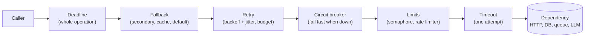

# Resilience — Retries, Fallbacks, Semaphores & Race Conditions

Every call to a network, a database or another process can be slow, fail for a moment, fail for an hour, or succeed twice. Resilience code decides what happens then: **try again** (retry with backoff), **stop trying** (deadline, retry budget, circuit breaker), **do something else** (fallback, degraded answer), **send less** (concurrency and rate limits) — and does it without breaking shared state when many things run at once (locks, queues, database constraints).

For a QA engineer this shows up twice. The **system under test** has retries, timeouts and breakers that need tests of their own: they only run when something fails, so normal happy-path tests never touch them. And **test code** itself polls, retries, runs in parallel and calls rate-limited APIs — with the same bugs: endless retries, shared state between workers, races that show up once in fifty runs.

## Where Each Pattern Sits



Read it from the outside in: the deadline bounds everything; the fallback runs only when retries are exhausted or the breaker is open; every retry attempt passes through the breaker (so failed attempts are counted) and takes a concurrency slot only for the attempt itself (not for the sleep between attempts); the per-attempt timeout is innermost, so a slow call counts as a failure. The pages explain each choice and show the mistakes the other orders cause.

## Section Map

| File | Topics |
|------|--------|
| [01 Retries & Backoff](./01-retries-backoff.md) | Transient vs permanent errors, HTTP 429/503 and `Retry-After`, idempotency and idempotency keys, attempts vs deadlines, exponential backoff, full / equal / decorrelated jitter, thundering herd, retry budgets, hand-written retry loop (sync and asyncio) |
| [02 Retry Libraries](./02-retry-libraries.md) | `tenacity` (stop / wait / retry, `wait_random_exponential`, `before_sleep_log`, `reraise`, async, statistics), `stamina`, `backoff`, comparison; urllib3 `Retry` in requests, HTTPX transport retries, redis-py; retry multiplication across layers |
| [03 Timeouts, Fallbacks & Circuit Breakers](./03-timeouts-fallbacks-breakers.md) | Timeouts in requests / HTTPX / asyncio, deadline propagation with `contextvars`, fallback chains, graceful degradation, circuit breaker states, `pybreaker` / `purgatory` / `circuitbreaker`, bulkheads |
| [04 Semaphores & Rate Limits](./04-semaphores-rate-limits.md) | `asyncio.Semaphore` / `BoundedSemaphore`, `TaskGroup`, `threading` semaphores, `ThreadPoolExecutor`, `anyio.CapacityLimiter`, `aiolimiter.AsyncLimiter`, limits per host, semaphores together with retries, distributed limits |
| [05 Race Conditions](./05-race-conditions.md) | What the GIL does not protect, free-threaded Python, races across `await`, locks / conditions / events, queues, `contextvars`, multiprocessing, file TOCTOU, lost updates in SQL (`FOR UPDATE`, version column, constraints, upserts), distributed locks, idempotent consumers |
| [06 Testing Resilience Code](./06-testing.md) | Retries without real sleeps, attempt counts, non-idempotent calls, respx / responses, stamina test mode, time-machine / freezegun, fallbacks and breaker states, Hypothesis stateful tests, measuring max concurrency, reproducing races with barriers, PostgreSQL race tests, xdist, flaky-test pitfalls |

## Installation

```bash
uv add tenacity httpx aiolimiter anyio          # what most projects need
uv add stamina                                  # alternative to tenacity with safe defaults
uv add pybreaker                                # or purgatory / circuitbreaker, see page 03
uv add --dev pytest pytest-asyncio respx responses hypothesis time-machine pytest-xdist
```

Examples in this guide were run with **tenacity 9.1.4**, **stamina 26.1.0**, **backoff 2.2.1**, **aiolimiter 1.3.0**, **anyio 4.15.1**, **pybreaker 1.4.1**, **purgatory 3.0.1**, **circuitbreaker 2.1.3**, HTTPX 0.28.1, requests 2.34.2 (urllib3 2.8.0), redis-py 8.1.0, psycopg 3.3.6, pytest 9.1.1, pytest-asyncio 1.4.0, respx 0.23.1, responses 0.26.3, Hypothesis 6.168.3, time-machine 3.5.1, freezegun 1.5.5 and pytest-xdist 3.8.0 on **Python 3.14.8**; the test suite also passed on Python 3.13.6 and on the free-threaded 3.14.8 build (there without the PostgreSQL tests: no `psycopg-binary` wheel for it). Database examples ran against PostgreSQL 18.6 (`postgres:18-alpine`). Code uses Python 3.12+ syntax (`def f[T](...)`).

## Retries Already Built into Tools on This Site

Many libraries retry on their own. Know where, before adding another layer (see [retry multiplication](./02-retry-libraries.md#retry-multiplication)).

| Tool | What it retries by itself | Page |
|------|---------------------------|------|
| requests + urllib3 | `Retry` on an `HTTPAdapter`: connection errors, chosen status codes, `Retry-After` | [Requests — Advanced Patterns](../requests-http/02-advanced-patterns.md#retries-with-backoff) |
| HTTPX | `HTTPTransport(retries=n)`: connection failures only, not status codes | [HTTPX — Advanced Configuration](../httpx/03-advanced-config.md#transport-retries) |
| redis-py | Built-in `Retry` with backoff on `ConnectionError` / `TimeoutError` (on by default) | [Redis — Python Client](../../databases/redis/04-python-redis-py.md#timeouts-retries) |
| LiteLLM | `num_retries`, `timeout`, fallbacks per call; Router with cooldowns | [LiteLLM — Router & Reliability](../litellm/03-router-reliability.md) |
| LangChain | `.with_retry()`, `.with_fallbacks()` on runnables | [LangChain — LCEL & Chains](../langchain/02-lcel-chains.md#fallbacks) |
| LangGraph | `RetryPolicy` per node, node timeouts, error handlers | [LangGraph — Streaming & Runtime](../langgraph/03-streaming-runtime.md#retries) |
| Celery | `autoretry_for`, `retry_backoff`, `retry_jitter`, `max_retries` | [Celery — Tasks & Calling](../celery/01-tasks-calling.md#retries) |
| RabbitMQ clients | Delayed retries through a dead-letter exchange; idempotent consumers | [RabbitMQ — Python Clients](../../tools/rabbitmq/03-python-clients.md#retries-with-delay-through-a-dlx) |
| Queues in general | Redelivery, backoff, dead-letter queues | [Queues vs Streams](../../software-design-patterns/05-composition-architectural/04-queues-streams-messaging.md#retries-backoff) |
| Redis patterns | Rate limiting, distributed locks and their caveats | [Redis — Patterns](../../databases/redis/03-patterns.md) |
| Client–server systems | Retry, circuit breaker, timeout, graceful degradation as architecture | [Client–Server: Reliability](../../client-server-architecture/06-reliability-security-observability/01-reliability.md) |
| Microservices | Timeouts, retries and breakers in a production readiness review | [Production Readiness Checklist](../../software-design-patterns/07-decisions-testing-production/03-production-readiness.md#timeouts-retries-circuit-breakers) |
| Test runs | Retrying flaky tests, retry with backoff in test code | [Test Execution Strategies](../../test-design-patterns/06-execution-reliability/01-execution-strategies.md#retry-strategies) |

## Minimal Example

```python
import httpx
from tenacity import retry, retry_if_exception, stop_after_attempt, wait_random_exponential


def is_transient(exc: BaseException) -> bool:
    if isinstance(exc, httpx.TransportError):                 # connect / read timeout, reset
        return True
    return isinstance(exc, httpx.HTTPStatusError) and exc.response.status_code in {429, 502, 503, 504}


@retry(
    retry=retry_if_exception(is_transient),                   # only errors that can go away
    stop=stop_after_attempt(4),                               # 1 call + 3 retries
    wait=wait_random_exponential(multiplier=0.2, max=10),     # backoff with full jitter
    reraise=True,                                             # the caller sees the real error
)
def get_order(client: httpx.Client, order_id: int) -> dict:
    response = client.get(f"/orders/{order_id}", timeout=5)  # every attempt has a timeout
    response.raise_for_status()
    return response.json()
```

## Quick Rules

1. **Retry only transient errors** — timeouts, connection resets, 429, 502, 503, 504. A 400, 401, 404 or 422 fails the same way every time.
2. **Retry only idempotent operations** — GET, PUT, DELETE, or a POST with an idempotency key the server honours. Never retry "send SMS" or "charge card" blindly.
3. **Always backoff with jitter** — fixed or un-jittered delays synchronise clients into waves.
4. **Bound every retry loop twice** — max attempts **and** a total deadline; add a timeout to each attempt.
5. **Retry in one layer only** — retries in the HTTP client, the SDK, your code and the job queue multiply.
6. **Honour `Retry-After`**, but cap it and give up if it does not fit the deadline.
7. **Fail fast when a dependency is down** — a circuit breaker and a fallback beat a queue of waiting requests.
8. **Limit concurrency and rate** with semaphores and rate limiters; release the slot while sleeping between retries.
9. **Protect shared state** — locks for in-process state, constraints and atomic SQL for the database, idempotent consumers for queues.
10. **Test the failure paths** — fake failures, fake time, count attempts, measure concurrency, reproduce races with barriers.

---
## See also
- [Digital Garden: Knowledge Base](../../index.md)
- [Python Libraries](../index.md)
- [HTTPX](../httpx/index.md)
- [Celery — Distributed Task Queue for Python](../celery/index.md)
- [Redis — Patterns: Caching, Rate Limits, Locks, Messaging](../../databases/redis/03-patterns.md)
- [Client–Server: Reliability](../../client-server-architecture/06-reliability-security-observability/01-reliability.md)
- [gRPC: Retry and Hedging Policy](../../api-architectures/03-grpc/05-retry-hedging-policy.md)
- [Pytest — Flakiness Debugging](../pytest/02-practical-playbooks/03-flakiness-debugging.md)
