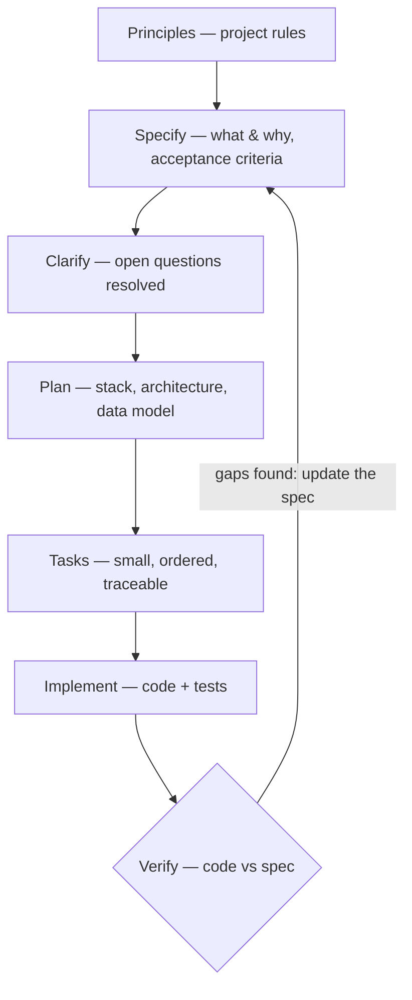

# Spec-Driven Development

**Spec-driven development (SDD)** is a way of working with AI coding agents where you start from a
structured, behaviour-oriented **specification** and let the agent turn it into a plan, tasks and code —
instead of prompting for code directly.

> "Code is truth" → "intent is truth." — GitHub, Spec Kit announcement

The spec is written in natural language, lives in the repository and acts as a **contract** the agent
follows and the team reviews. For QA engineers it is the most direct link between requirements,
acceptance criteria and tests that AI-assisted development has.

## Sections

| File | Topics |
|------|--------|
| [SDD — Concepts & Workflow](01-concepts-workflow.md) | What SDD is, vibe coding vs SDD vs TDD/BDD, spec-first / spec-anchored / spec-as-source, workflow phases, artifacts |
| [SDD — Writing Good Specs](02-writing-specs.md) | Spec structure, user stories and priorities, Given/When/Then, EARS requirements, non-goals, clarification markers, review checklist |
| [SDD — Tools](03-tools.md) | GitHub Spec Kit, AWS Kiro, OpenSpec, Tessl, BMAD Method, plain markdown with Claude Code / Cursor / Codex, how to choose |
| [SDD — QA, Testing & Best Practices](04-qa-testing-best-practices.md) | Acceptance criteria → tests, traceability, verifying code against the spec, spec drift, anti-patterns, when not to use SDD |
| [SDD — Open Knowledge Format (OKF)](05-open-knowledge-format.md) | Google's markdown format for agent knowledge: bundles, concepts, frontmatter, trust and lifecycle, attested computations, CI checks |

## The Workflow at a Glance

## Vibe Coding vs Spec-Driven Development

|  | Vibe coding | Spec-driven development |
|---|---|---|
| Starting point | A prompt with a goal | A written spec with acceptance criteria |
| Source of truth | The code the agent produced | The spec (and its tests) |
| Review | Read the diff | Review the spec first, then the diff against it |
| Works well for | Prototypes, experiments, one-line changes | Features, brownfield changes, team work, anything that must be tested |
| Main risk | Code "looks right but doesn't quite work" | Heavy process, long markdown nobody reads, spec drift |

## Quick Start: Checklist

1. **Decide if the change needs a spec** — if you can describe the diff in one sentence, skip it.
2. **Write project principles once** — testing rules, code style, architecture constraints (`constitution.md`, `AGENTS.md`, steering files).
3. **Specify *what* and *why*** — user stories, acceptance criteria, edge cases, non-goals. No tech stack yet.
4. **Resolve open questions** — mark unknowns explicitly and answer them before planning.
5. **Plan the *how*** — stack, architecture, data model, contracts.
6. **Break into small tasks** — each traceable to a requirement, tests before implementation.
7. **Implement in a fresh context** — one task or story at a time, review each step.
8. **Verify against the spec** — every acceptance criterion has a test; check nothing outside scope changed.
9. **Keep the spec alive** — update it when requirements change; small feature specs, not one mega-spec.

---
## See also
- [Digital Garden: Knowledge Base](../index.md)
- [AI Coding Agents: Skills & Claude Code](../ai-skills/index.md)
- [AI Harness](../ai-harness/index.md)
- [QA & Testing Methodology](../qa-methodology/index.md)
- [Test Design Techniques](../test-design-techniques/index.md)
