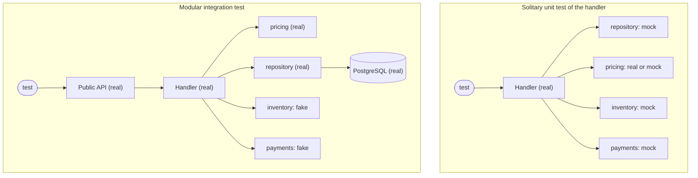

# Modular Integration vs Unit — Concepts & Boundaries

"Unit" and "integration" sound like clear levels, but teams draw the lines in different places. One team calls a test of a service class with a real repository a unit test; another calls it an integration test; a third says "component test". The names matter less than two questions every test answers, whether the author thought about them or not: **where does the test enter**, and **what is real behind that entry point**.

## What Is a Module

A module is a part of the system with a **job**, a **public API** and **data it owns**. Code outside the module talks to it only through that API; nothing outside reads its tables.

| Architecture | What a "module" usually is |
|--------------|----------------------------|
| Modular monolith | A package per business area (`orders`, `inventory`, `billing`) with its own schema and a facade; other packages import only the facade |
| Microservice | The whole service; its public API is HTTP / gRPC / messages, its data is its own database |
| Layered app without clear modules | A vertical slice: one feature's route + service + repository + tables |
| Library | The package's public functions and classes |

If the codebase has no clear modules, a modular integration test is still possible — it enters through a route or a service function and treats one feature slice as the module. Writing such tests often shows where the module borders should be: the place where a test needs a fake is a border.

## Unit Tests: Solitary and Sociable

Martin Fowler's terms describe the two styles of unit test that most teams mix without noticing.

| Style | What is real | Collaborators | Example |
|-------|--------------|---------------|---------|
| **Solitary** | One class or function | Every collaborator is a mock or stub | `PlaceOrderHandler` with a mocked repository, inventory and payment gateway |
| **Sociable** | One class plus the plain objects it uses | Real, as long as they are fast and in-memory | `PlaceOrderHandler` with real `pricing` and an in-memory repository |
| **Pure function** | The function | None — nothing to replace | `pricing.total(lines, coupon)` |

Pure functions are the best case: no doubles, no setup, any number of inputs in a parametrized table. Solitary tests of classes that coordinate other classes are the worst case: the test repeats the implementation as a list of expected calls.

## Integration Tests: Narrow and Broad

| Kind | What it connects | Example |
|------|------------------|---------|
| **Narrow integration** | Your code + one real dependency | `OrderRepository` against real PostgreSQL; an HTTP client against a stub server |
| **Modular integration** (this guide) | One whole module, its own database, fakes for its neighbours | `OrdersModule.place_order()` with real handler, pricing, repository and PostgreSQL; fake inventory and payments |
| **Broad integration / system** | Several modules or services, all real | Orders + inventory + billing deployed together |
| **End-to-end** | The whole product through its UI or public API | A browser places an order on a staging site |

Other names for a modular integration test: **component test** (common in microservices — the component is one service with its dependencies stubbed), **module test**, **service test**, **subcutaneous test** when it enters just below the UI. The defining features are the same: one module, real inside, fakes at the border.

## Where the Test Doubles Go

The difference between the two kinds of test is mostly *where* the doubles are.

| Dependency | Unit test | Modular integration test |
|------------|-----------|--------------------------|
| Pure helper functions of the module | Real | Real |
| The module's own repository / SQL | Mock, stub or in-memory fake | **Real**, on the real database engine |
| The module's own database | None | **Real** (Testcontainers or a CI service) |
| Framework layer (routes, validation, serialization) | Not involved | Real, if the test enters through HTTP |
| Another module of the same app | Mock | **Fake**, checked by contract tests |
| Third-party API (payments, email, SMS, LLM) | Mock | **Fake** or a stub server |
| Clock, random IDs | Injected or frozen | Injected or frozen; or assert without exact values |
| Message broker | Mock | Recording fake; or real broker in a narrow integration test |

The rule behind the table: **replace what the module does not own**. The module owns its classes, its SQL and its schema, so a test that replaces them tests something other than the module.

## Mocks vs Fakes at the Border

Both suites need doubles; they need different ones.

| | Mock | Fake |
|---|---|---|
| What it is | Records calls; returns what the test configured | A small working implementation (dict instead of a table, list instead of a queue) |
| The test checks | That certain calls happened, with certain arguments | The outcome: state of the fake, return values, stored rows |
| Breaks when | The calls change, even if behaviour stays the same | The behaviour changes |
| Can lie | Yes — it returns whatever you wrote, even impossible values | Yes, but contract tests can catch it |
| Typical use | Solitary unit tests; checking one side effect ("an email was sent") | Modular integration tests; stand-ins for neighbour modules and external services |

A fake is more code than a mock, but it is written once per neighbour and shared by every test. A mock is configured again in every test, and every configuration is a guess about how the real dependency behaves.

## Side by Side

| Question | Unit test | Modular integration test |
|----------|-----------|--------------------------|
| What is the system under test? | A function or class | A module |
| Who calls it in the test? | The test calls the function directly | The test calls the public API or sends HTTP requests |
| What does it prove? | The logic gives the right answer for these inputs | The module does the job for this scenario, with its real parts and database |
| How many per feature? | Many — one per rule, edge, input class | A few — one per scenario and error path |
| Needs Docker / a database? | No | Yes (or a CI service container) |
| Runs | On every save | On every commit and in every CI run |
| Typical failure message | `assert Decimal('107.49') == Decimal('100.00')` | `psycopg.errors.UndefinedColumn: column "paymentid" ...` or `assert 400 == 409` |
| Survives a refactor inside the module | If it tests a pure function — yes. If it checks calls — often not | Yes, while behaviour stays the same |

## Common Misconceptions

| Misconception | Reality |
|---------------|---------|
| "A test with a database is slow" | With one container per session and a clean-up per test, each test in this guide takes 10–30 ms |
| "Unit tests give better coverage" | Coverage counts executed lines, not checked behaviour. A mock-based test executes the handler and can still miss every SQL error |
| "Integration tests are the QA team's job" | Modular integration tests live next to the code and run in the same `pytest` command; the module's authors write them |
| "Mocking the repository is fine, it's our own code" | It is exactly the code that most needs testing against the real engine — and the mock cannot fail the way PostgreSQL does |
| "SQLite in memory is close enough" | Types, constraints, `RETURNING`, JSON operators, locking and error classes differ. Test against the engine you run in production |
| "Modular tests replace unit tests" | They check a few scenarios each. Boundaries and combinations of inputs still need cheap unit tests — see [page 03](./03-what-each-test-catches.md) |

---
## See also
- [Modular Integration Testing vs Unit Testing](./index.md)
- [Modular Integration vs Unit — One Feature, Both Ways](./02-one-feature-both-ways.md)
- [Unit Tests — Concept & Examples](../01-unit-tests/01-concept-and-examples.md)
- [Integration Tests — Concept & Examples](../02-integration-tests/01-concept-and-examples.md)
- [Test Types and Levels](../../test-design-patterns/01-fundamentals/01-test-types-levels.md)
- [Mocking and Stubbing](../../test-design-patterns/05-data-mocking-env/02-mocking-stubbing.md)
