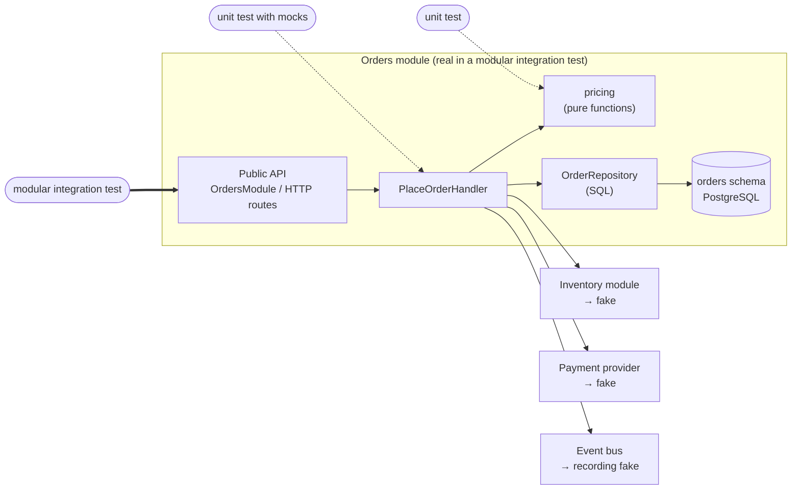

# Modular Integration Testing vs Unit Testing

A **unit test** checks one small piece of logic on its own: a function, a class, a rule. A **modular integration test** checks one whole module — say, *orders* in a shop — through the door other code uses (its public API or its HTTP endpoints), with everything inside the module real: its classes, its SQL, its own database. Only the module's neighbours are replaced: other modules and third-party services get fakes.

Both are fast enough to run on every commit, and both are written by the same people in the same repository, so teams often argue about which one to write. They answer different questions. A unit test asks *"is this rule right?"*. A modular integration test asks *"does this module do its job when its parts and its database work together?"*. Most bugs that reach production live between the parts — wrong SQL, a missing transaction, a mapping error, a mock that lies — and only the second kind of test sees them.

## Where Each Test Sits



The unit tests go straight to one box. The modular integration test enters where real callers enter and lets the call travel through every box inside the module — down to the database.

## Section Map

| File | Topics |
|------|--------|
| [01 Concepts & Boundaries](./01-concepts-boundaries.md) | What a "module" is, solitary vs sociable unit tests, narrow vs broad integration, component tests, where to put the test doubles, side-by-side comparison |
| [02 One Feature, Both Ways](./02-one-feature-both-ways.md) | A modular monolith example (orders + inventory), pure unit tests, unit tests with mocks, modular integration tests through the Python API and through HTTP, fakes |
| [03 What Each Test Catches](./03-what-each-test-catches.md) | Six real changes run against both suites: a refactor, an SQL typo, swapped fields, a boundary bug, a wrong status code, a fake that drifted; contract tests for fakes; speed |
| [04 Database, Isolation & CI](./04-database-isolation-ci.md) | PostgreSQL in Testcontainers, a database per xdist worker, cleaning between tests (TRUNCATE vs rollback vs templates), markers, GitHub Actions |
| [05 Strategy & Mistakes](./05-strategy-mistakes.md) | Which test for which code, the mix for logic-heavy vs glue-heavy modules, common mistakes on both sides, checklist |

## In One Table

| | Unit test | Modular integration test |
|---|---|---|
| **Enters through** | A function or a class | The module's public API or HTTP routes |
| **Real inside the test** | The code under test only | Every class of the module, its SQL, its database |
| **Replaced** | Collaborators (often with mocks) | Only other modules and external services (fakes) |
| **Speed in the example** | ~1 ms per test | 10–30 ms per test, plus ~3 s once to start PostgreSQL |
| **Good at** | Edge cases, rules, calculations, many inputs | Wiring, SQL, transactions, mappings, error paths across layers |
| **Breaks on refactoring** | Often, when it checks calls to collaborators | Rarely — only when behaviour visible from outside changes |
| **When it fails, you know** | The exact function | The module and the scenario; the traceback names the layer |

## Installation

```bash
uv add fastapi "psycopg[binary]"
uv add --dev pytest pytest-xdist testcontainers httpx2
```

Examples in this guide were run with **pytest 9.1.1**, **pytest-xdist 3.8.0**, **testcontainers 4.15.0**, FastAPI 0.142.2 (Starlette 1.7.0), psycopg 3.3.6, httpx2 2.13.1 and Pydantic 2.13.5 on **Python 3.13.6**, against PostgreSQL 18 (`postgres:18-alpine`). The full suite (14 unit tests, 21 modular integration and contract tests) passed both serially and with `-n 4`.

## Quick Rules

1. **Unit-test the logic, module-test the wiring.** Rules and calculations get unit tests with many inputs; everything that touches SQL, transactions, HTTP or another module gets a modular integration test.
2. **Enter a module where its callers enter** — its public API or its routes — not through an internal class.
3. **Keep the inside real.** Do not mock the module's own repository or helper classes in a modular integration test.
4. **Replace only the neighbours**, and prefer fakes (small working implementations) over mocks (call recorders).
5. **Run the same contract tests against the fake and the real neighbour**, so the fake cannot drift.
6. **Use the real database engine** (Testcontainers), not SQLite in place of PostgreSQL.
7. **Assert outcomes, not calls** — the stored row, the returned value, the published event, the status code.
8. **One database per test worker, cleaned between tests**, so tests run in any order and in parallel.
9. **A mock-heavy unit test that breaks on every refactor is a cost, not a safety net** — replace it with a modular integration test.
10. **Keep the edges in unit tests** — a modular suite with five scenarios will not find the off-by-one cent.

---
## See also
- [Testing Pyramid](../index.md)
- [Unit Tests](../01-unit-tests/index.md)
- [Integration Tests](../02-integration-tests/index.md)
- [Pyramid Shape, Anti-Patterns & Alternatives](../04-pyramid-strategy/01-shape-antipatterns-alternatives.md)
- [Mocking and Stubbing](../../test-design-patterns/05-data-mocking-env/02-mocking-stubbing.md)
- [Testing with pytest](../../python-guide/03-testing-pytest/index.md)
