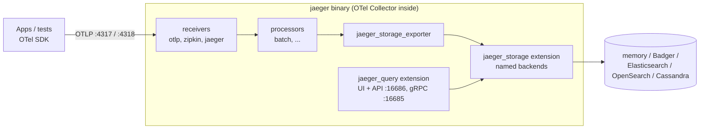

# Jaeger — Setup & Architecture

Jaeger v2 is a distribution of the OpenTelemetry Collector: one `jaeger` binary with OTel receivers and processors plus Jaeger-specific extensions for storage and the query UI. It is configured with the same YAML format as the Collector.

## Architecture



| Component | Kind | Role |
|-----------|------|------|
| `otlp`, `zipkin`, `jaeger` | Receivers | Accept spans (OTLP is the one to use; the others exist for legacy clients) |
| `batch`, `memory_limiter`, `tail_sampling`, ... | Processors | Standard Collector processors |
| `jaeger_storage` | Extension | Declares named storage backends (`backends:` for traces, `metric_backends:` for SPM) |
| `jaeger_storage_exporter` | Exporter | Writes spans to one backend from `jaeger_storage` |
| `jaeger_query` | Extension | Serves the UI and query APIs, reads from a backend |
| `remote_sampling` | Extension | Serves sampling strategies to SDKs on `:5778` |

What changed from v1: no separate `jaeger-agent`, no `SPAN_STORAGE_TYPE`-style env vars or v1 CLI flags. Everything is in the YAML config; v1 images (`jaegertracing/all-in-one`, `jaeger-collector`, `jaeger-query`) are end-of-life.

## Deployment Roles

The same binary takes a different role depending on which components the config enables.

| Role | Enabled components | Use for |
|------|--------------------|---------|
| **All-in-one** | Receivers + storage exporter + query, in-memory storage | Local debugging, CI jobs, demos (default config of the image) |
| **Collector** | Receivers + processors + `jaeger_storage_exporter` | Ingest tier in production, scaled horizontally |
| **Query** | `jaeger_query` + `jaeger_storage` | UI/API tier reading the shared storage |
| **Ingester** | `kafka` receiver + storage exporter | Reading spans from Kafka when Kafka buffers ingest |

## Ports

| Port | Protocol | Purpose |
|------|----------|---------|
| `4317` | gRPC | OTLP receiver |
| `4318` | HTTP | OTLP receiver, path `/v1/traces` |
| `16686` | HTTP | UI, query HTTP API (`/api/...`, `/api/v3/...`) |
| `16685` | gRPC | Query gRPC API |
| `5778` | HTTP | Remote sampling strategies |
| `9411` | HTTP | Zipkin receiver |
| `13133` | HTTP | Health check (`healthcheckv2` extension) |
| `8888` | HTTP | Jaeger's own Prometheus metrics |

## Running Locally with Docker

```bash
# All-in-one, in-memory storage: data is gone when the container stops
docker run --rm -d --name jaeger \
  -p 16686:16686 \
  -p 4317:4317 \
  -p 4318:4318 \
  -p 5778:5778 \
  -p 9411:9411 \
  jaegertracing/jaeger:latest

# Wait until the query API answers
until curl -sf http://localhost:16686/api/v3/services > /dev/null; do sleep 1; done
```

Open `http://localhost:16686`. A service appears in the **Service** dropdown only after its first span has been exported and stored.

!!! tip "Pin the tag"
    Use `jaegertracing/jaeger:<version>` (for example the version you tested with) in CI and Compose files. Jaeger v2 follows the OTel Collector release pace, and config keys occasionally change between minor versions.

## Custom Config File

The image runs the built-in all-in-one config unless `--config` is given. A minimal config with in-memory storage, written out explicitly:

```yaml
# jaeger-memory.yaml
service:
  extensions: [jaeger_storage, jaeger_query, healthcheckv2]
  pipelines:
    traces:
      receivers: [otlp]
      processors: [batch]
      exporters: [jaeger_storage_exporter]

extensions:
  healthcheckv2:
    use_v2: true
    http:
      endpoint: 0.0.0.0:13133
  jaeger_storage:
    backends:
      main_store:
        memory:
          max_traces: 100000       # oldest traces are evicted beyond this
  jaeger_query:
    storage:
      traces: main_store
    http:
      endpoint: 0.0.0.0:16686
    grpc:
      endpoint: 0.0.0.0:16685

receivers:
  otlp:
    protocols:
      grpc:
        endpoint: 0.0.0.0:4317     # bind all interfaces inside a container
      http:
        endpoint: 0.0.0.0:4318

processors:
  batch: {}

exporters:
  jaeger_storage_exporter:
    trace_storage: main_store
```

```bash
docker run --rm -d --name jaeger \
  -p 16686:16686 -p 4317:4317 -p 4318:4318 \
  -v "$PWD/jaeger-memory.yaml:/etc/jaeger/config.yaml:ro" \
  jaegertracing/jaeger:latest --config /etc/jaeger/config.yaml
```

- The names under `backends:` (`main_store`) are yours; the exporter and `jaeger_query` refer to them.
- `${env:VAR}` works in values, as in any Collector config: `server_urls: ["${env:ES_URL}"]`.
- Recent Collector versions bind receivers to `localhost` by default — inside a container set `0.0.0.0` explicitly, or the ports are published but nothing answers. The built-in config of the image reads `JAEGER_LISTEN_HOST` (set to `0.0.0.0` in the image); your own config does not, unless you use `${env:JAEGER_LISTEN_HOST}` too.

## Storage Backends

| Backend | Config key | Use for | Notes |
|---------|-----------|---------|-------|
| Memory | `memory` | Local runs, CI | Lost on restart; capped by `max_traces` |
| Badger | `badger` | Single-node persistent setup, long local sessions | Embedded key-value store on local disk; not shared between instances |
| Elasticsearch | `elasticsearch` | Production, search-heavy use | Daily indices; needs index cleanup / ILM |
| OpenSearch | `opensearch` | Production, AWS OpenSearch | Same model as Elasticsearch |
| Cassandra | `cassandra` | Production, very high write volume | Keyspace schema must be created first |
| Remote storage | `grpc` | Custom or third-party storage via the gRPC storage API | Storage runs as a separate process |

Badger backend for a persistent single-node setup:

```yaml
extensions:
  jaeger_storage:
    backends:
      main_store:
        badger:
          directories:
            keys: /badger/keys
            values: /badger/values
          ephemeral: false          # true = temp dir, data lost on restart
          ttl:
            spans: 168h             # keep 7 days
```

Elasticsearch backend (trimmed to the essentials):

```yaml
extensions:
  jaeger_storage:
    backends:
      main_store:
        elasticsearch:
          server_urls:
            - http://elasticsearch:9200
          indices:
            index_prefix: jaeger-main
```

## Docker Compose: Jaeger with Badger

```yaml
# compose.yaml
services:
  jaeger-init:                              # the image runs as uid 10001; a new volume is owned by root
    image: busybox
    command: ["chown", "-R", "10001", "/badger"]
    volumes:
      - jaeger_data:/badger

  jaeger:
    image: jaegertracing/jaeger:latest     # pin a version
    command: ["--config", "/etc/jaeger/config.yaml"]
    volumes:
      - ./jaeger-badger.yaml:/etc/jaeger/config.yaml:ro
      - jaeger_data:/badger
    depends_on:
      jaeger-init:
        condition: service_completed_successfully
    ports:
      - "16686:16686"   # UI + query API
      - "4317:4317"     # OTLP gRPC
      - "4318:4318"     # OTLP HTTP

  orders-api:
    build: .
    environment:
      OTEL_SERVICE_NAME: orders-api
      OTEL_EXPORTER_OTLP_ENDPOINT: http://jaeger:4317   # service name, not localhost
      OTEL_EXPORTER_OTLP_PROTOCOL: grpc
    ports:
      - "8000:8000"
    depends_on: [jaeger]

volumes:
  jaeger_data:
```

`jaeger-badger.yaml` is `jaeger-memory.yaml` from above with the Badger backend instead of `memory`.

!!! warning "Volume permissions"
    The Jaeger image runs as the non-root user `10001`. Without the `jaeger-init` step Badger fails on startup with `mkdir /badger/keys: permission denied`, because a fresh named volume is owned by root. The same applies to bind mounts: the host directory must be writable by uid `10001`.

For a shared stack with an OTel Collector in front of Jaeger (tail sampling, redaction, fan-out to several backends), see [OpenTelemetry — Collector & Backends](../../libs/opentelemetry/05-collector-backends.md): the app sends to the Collector, the Collector exports `otlp` to `jaeger:4317`.

## Setup Checklist

- [ ] `jaegertracing/jaeger` (v2) image, version pinned
- [ ] Receivers bound to `0.0.0.0` when running in a container
- [ ] Storage chosen deliberately: memory only for local and CI, persistent backend for shared use
- [ ] Retention set (`ttl` for Badger, index cleanup / ILM for Elasticsearch and OpenSearch)
- [ ] UI not exposed publicly without an authenticating reverse proxy (Jaeger has no user management)
- [ ] Readiness check on `/api/v3/services` or the health check port before tests start
- [ ] Apps and tests reach Jaeger by its network name, not `localhost`, inside Docker

---
## See also
- [Jaeger — Distributed Tracing for OpenTelemetry](./index.md)
- [Jaeger — Sending Traces from Python](./02-sending-traces-python.md)
- [OpenTelemetry — Collector & Backends](../../libs/opentelemetry/05-collector-backends.md)
- [Docker Compose](../docker/03-docker-compose.md)
- [Kubernetes — Security & Observability](../kubernetes/06-security-observability.md)
