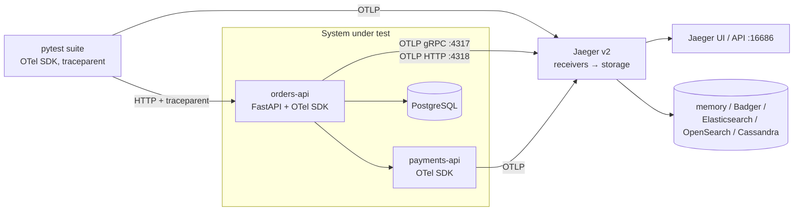

# Jaeger — Distributed Tracing for OpenTelemetry

Open-source (Apache 2.0, CNCF graduated) backend for distributed traces: it receives OTLP spans, stores them and shows the path of one request through all services. Jaeger v2 is built on the OpenTelemetry Collector.

## Where Jaeger Fits



- **OpenTelemetry** — produces the spans. Instrumentation, SDK setup and the Collector are covered in [OpenTelemetry — Python Observability](../../libs/opentelemetry/index.md).
- **Jaeger** — stores spans, searches traces, renders the timeline, compares traces, builds the service dependency graph.
- **Tests** — start the trace and pass `traceparent` to the system under test, so one Jaeger trace shows the test and every backend call it caused.

## Section Map

| File | Topics |
|------|--------|
| [01 Setup & Architecture](./01-setup-architecture.md) | v2 on the OTel Collector, roles, ports, Docker, config file, storage backends, Compose |
| [02 Sending Traces from Python](./02-sending-traces-python.md) | OTel SDK + OTLP exporter, FastAPI and requests instrumentation, env vars, sampling |
| [03 UI & Trace Analysis](./03-ui-trace-analysis.md) | Search, timeline, span details, errors, compare traces, dependency graph, SPM, HTTP API |
| [04 Testing, CI & Troubleshooting](./04-testing-ci-troubleshooting.md) | Tracing pytest runs, `traceparent` from API tests, asserting on spans, CI, common pitfalls |

## Minimal Setup

```bash
docker run --rm --name jaeger \
  -p 16686:16686 -p 4317:4317 -p 4318:4318 \
  jaegertracing/jaeger:latest        # pin a version in CI
```

```python
# uv add opentelemetry-sdk opentelemetry-exporter-otlp-proto-grpc
from opentelemetry import trace
from opentelemetry.exporter.otlp.proto.grpc.trace_exporter import OTLPSpanExporter
from opentelemetry.sdk.resources import Resource
from opentelemetry.sdk.trace import TracerProvider
from opentelemetry.sdk.trace.export import BatchSpanProcessor

provider = TracerProvider(resource=Resource.create({"service.name": "orders-api"}))
provider.add_span_processor(BatchSpanProcessor(OTLPSpanExporter(endpoint="http://localhost:4317", insecure=True)))
trace.set_tracer_provider(provider)

with trace.get_tracer(__name__).start_as_current_span("checkout") as span:
    span.set_attribute("order.id", "ord-42")

provider.shutdown()   # flush before the script exits
# Open http://localhost:16686 -> Service "orders-api" -> Find Traces
```

## Quick Commands

| Command | Use |
|---------|-----|
| `docker run -p 16686:16686 -p 4317:4317 -p 4318:4318 jaegertracing/jaeger` | All-in-one with in-memory storage |
| `docker run ... -v ./config.yaml:/etc/jaeger/config.yaml jaegertracing/jaeger --config /etc/jaeger/config.yaml` | Run with your own config (storage, roles) |
| `curl -s http://localhost:16686/api/v3/services` | Readiness check and list of services that sent spans |
| `curl -s http://localhost:16686/api/v3/traces/<trace_id>` | One trace as OTLP JSON |
| `open http://localhost:16686/trace/<trace_id>` | Deep link to one trace |
| `OTEL_TRACES_EXPORTER=console opentelemetry-instrument python app.py` | Print spans to stdout — check the app side before blaming Jaeger |

## Ports

| Port | Protocol | Purpose |
|------|----------|---------|
| `4317` | gRPC | OTLP receiver |
| `4318` | HTTP | OTLP receiver (`/v1/traces`) |
| `16686` | HTTP | UI and query HTTP API |
| `16685` | gRPC | Query gRPC API |
| `5778` | HTTP | Remote sampling strategies |
| `9411` | HTTP | Zipkin-compatible receiver |
| `13133` | HTTP | Health check extension |

## Jaeger vs Phoenix, Langfuse and Tempo

| Aspect | Jaeger | [Phoenix](../phoenix/index.md) / [Langfuse](../langfuse/index.md) | Grafana Tempo |
|--------|--------|-------------------------|---------------|
| Focus | Any service: HTTP, DB, queues, RPC | LLM apps: prompts, tokens, tool calls, evals | Any service, at large scale |
| Span model | Plain OTel spans and semantic conventions | OpenInference / LLM-specific attributes | Plain OTel spans |
| Extras | Trace compare, dependency graph, SPM | Datasets, experiments, LLM-as-judge, prompts | TraceQL, Grafana dashboards |
| Storage | Memory, Badger, Elasticsearch, OpenSearch, Cassandra | SQLite/Postgres or Postgres + ClickHouse | Object storage (S3, GCS) |
| Best fit | Debugging microservices and API tests locally and in CI | Evaluating and debugging LLM behaviour | Production tracing in a Grafana stack |

Rule of thumb: Jaeger answers *which service was slow or failed*; Phoenix and Langfuse answer *what the LLM saw and said*. Both can receive the same OTLP stream through one [Collector](../../libs/opentelemetry/05-collector-backends.md).

## Quick Rules

1. **Use OTLP only** — the old Jaeger client libraries and `opentelemetry-exporter-jaeger` are retired; every current SDK speaks OTLP to Jaeger.
2. **Use the v2 image `jaegertracing/jaeger`** — `jaegertracing/all-in-one` and the separate v1 images are Jaeger v1, which is end-of-life.
3. **Always set `service.name`** — otherwise the service list shows `unknown_service`.
4. **Memory storage is for local runs and CI only** — it is lost on restart and capped by `max_traces`.
5. **Start traces in the tests** and propagate `traceparent`, so a failed test points to exactly one trace.
6. **Flush spans** (`provider.shutdown()`) at the end of test sessions and short-lived scripts.
7. **Pin the image version** in CI and upgrade on purpose.
8. **Put a Collector in front** in shared environments — tail sampling and redaction happen there, not in Jaeger.

---
## See also
- [Digital Garden: Knowledge Base](../../index.md)
- [Tools — Practical Reference Guides](../index.md)
- [OpenTelemetry — Python Observability](../../libs/opentelemetry/index.md)
- [OpenTelemetry — Collector & Backends](../../libs/opentelemetry/05-collector-backends.md)
- [Arize Phoenix — LLM Tracing & Evaluation](../phoenix/index.md)
- [Langfuse — LLM Tracing, Prompts & Evals](../langfuse/index.md)
- [MLflow — Experiment Tracking, LLM Tracing & Evaluation](../mlflow/index.md)
- [Client–Server: Observability](../../client-server-architecture/06-reliability-security-observability/03-observability.md)
