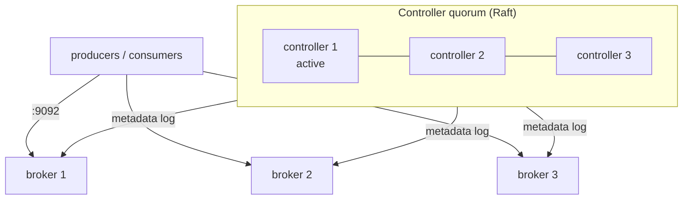

# Kafka — Core Concepts

Kafka stores every topic as a set of append-only logs. Most surprises in tests and production — lost ordering, duplicates, "missing" messages, stuck consumers — come from one of the concepts below.

## Vocabulary

| Term | Meaning |
|------|---------|
| **Record** (message, event) | Key (optional bytes), value (bytes), headers (key/value list), timestamp |
| **Topic** | Named stream of records, for example `orders` |
| **Partition** | One ordered, append-only log; a topic has 1..N partitions |
| **Offset** | Position of a record in its partition: 0, 1, 2… Never reused, never renumbered |
| **Broker** | Server that stores partitions and serves clients |
| **Controller** | Node that holds cluster metadata (topics, leaders, configs) in KRaft mode |
| **Leader / follower** | Each partition has one leader replica that serves writes and reads; followers copy it |
| **ISR** | In-sync replicas: the leader plus followers that are caught up |
| **Consumer group** | Consumers sharing one `group.id`; the partitions are divided between them |
| **Committed offset** | Next offset the group will read after a restart, stored in `__consumer_offsets` |
| **Log-end offset** | Offset the next produced record will get |
| **Lag** | Log-end offset minus committed offset — how far a group is behind |

## Topics, Partitions and Offsets

```
topic "orders", 3 partitions

P0 | 0 ord-1 created | 1 ord-4 created | 2 ord-1 paid    | 3 ord-1 shipped |  <- append
P1 | 0 ord-2 created | 1 ord-2 paid    |                                      <- append
P2 | 0 ord-3 created | 1 ord-5 created | 2 ord-3 cancelled |                  <- append

group billing:   P0 committed=4   P1 committed=1   P2 committed=3   -> lag 0 + 1 + 0 = 1
group analytics: P0 committed=0   P1 committed=0   P2 committed=0   -> reads everything again
```

- Reading does not remove records. Each group keeps its own offsets, so a new group or an offset reset replays history.
- Offsets are per partition: "offset 2" means nothing without the partition number.
- Partitions are the unit of parallelism: in one group, one partition is read by at most one consumer at a time. Six consumers on a three-partition topic leave three idle.
- The partition count can be increased (`kafka-topics --alter --partitions`) but never decreased.

## Keys, Partitioning and Ordering

The producer picks the partition:

| Record | Partition |
|--------|-----------|
| Explicit `partition=` in `produce()` | That partition |
| Key set | Hash of the key modulo the partition count — same key, same partition |
| No key | Spread across partitions (batch-level distribution); no ordering between records |

**Ordering is guaranteed only within one partition.** Use the entity that needs ordered events as the key (`order_id`, `account_id`, `document_id`): all events of `ord-1` then land in one partition in produce order.

!!! warning "Adding partitions breaks key placement"
    The partition is `hash(key) % partition_count`. After growing from 3 to 6 partitions, new events of `ord-1` can land in a different partition than its old events, and a consumer may process them out of order during the switch. Size partitions up front for the expected peak.

!!! warning "Python and Java producers hash keys differently"
    `confluent-kafka` (librdkafka) uses `partitioner=consistent_random` (CRC32) by default; the Java client uses murmur2. The same key from a Python and a Java producer can land in different partitions. Set `"partitioner": "murmur2_random"` in the Python producer when both write to one topic.

Ordering can also break inside one partition when a producer retries without idempotence and several requests are in flight — see [producer settings](./03-producers-consumers-python.md#producer-configuration).

## Brokers and KRaft



- **KRaft** (Kafka Raft) keeps cluster metadata in an internal Raft log replicated between controller nodes. It replaced ZooKeeper; **Kafka 4.0 removed ZooKeeper mode completely**, so every 4.x cluster is KRaft.
- `process.roles` decides what a node does: `broker`, `controller`, or `broker,controller` (combined). Combined mode on one node is what local Docker setups use; production runs separate controllers — 3 (tolerates 1 failure) or 5 (tolerates 2).
- Clients only talk to brokers; `bootstrap.servers` is the entry point, after which the client learns all brokers from metadata.
- A ZooKeeper-based cluster cannot be upgraded straight to 4.x: migrate it to KRaft on 3.x first.

## Replication and ISR

Each partition has `replication.factor` copies on different brokers: one leader, the rest followers.

| Setting | Level | Effect |
|---------|-------|--------|
| `replication.factor` | Topic | Number of copies; 3 is the usual production value |
| `min.insync.replicas` | Topic / broker | Minimum ISR size for a write with `acks=all` to succeed (default 1) |
| `acks` | Producer | `0` — no wait; `1` — leader only; `all` — all current ISR members |
| `unclean.leader.election.enable` | Topic / broker | `false` (default): an out-of-sync replica never becomes leader, so no acknowledged data is lost |

- With RF 3, `min.insync.replicas=2` and `acks=all`, a write is acknowledged only when at least two brokers have it; one broker can fail without data loss or write downtime.
- If the ISR shrinks below `min.insync.replicas`, producers with `acks=all` get `NOT_ENOUGH_REPLICAS` errors instead of silently writing to a single copy.
- Consumers only see records up to the **high watermark** — the offset replicated to the whole ISR — so they never read a record that could disappear after a leader change.

`kafka-topics --describe` shows it per partition:

```
Topic: orders  Partition: 0  Leader: 1  Replicas: 1,2,3  Isr: 1,2,3
Topic: orders  Partition: 1  Leader: 2  Replicas: 2,3,1  Isr: 2,3      <- broker 1 fell behind
```

## Retention and Compaction

| `cleanup.policy` | What is kept | Typical use |
|------------------|--------------|-------------|
| `delete` (default) | Records newer than `retention.ms` (default 7 days) and within `retention.bytes` (default unlimited) | Event streams, logs, metrics |
| `compact` | At least the latest record for every key | Current state: customer profile, config, CDC tables |
| `compact,delete` | Latest per key, and nothing older than retention | State with an age limit |

- Retention deletes whole **segments** (`segment.bytes`, 1 GiB by default; `segment.ms`, 7 days). A record can live longer than `retention.ms` until its segment is closed and removed.
- Compaction runs in the background and never touches the active segment, so older values of a key stay readable for a while. Consumers must handle both old and new values.
- A record with a key and a **null value** is a tombstone: after compaction and `delete.retention.ms` (default 1 day) the key disappears.
- Compaction removes records but keeps offsets: after it, a partition reads `1, 3, 4` — gaps are normal.

```bash
kafka-topics.sh --bootstrap-server localhost:9092 --create --topic customer-state \
  --partitions 3 --config cleanup.policy=compact
```

## Consumer Groups and Rebalancing

- Every consumer in a group subscribes to topics; the group coordinator (a broker) splits the partitions between the live members.
- A **rebalance** moves partitions when a member joins, leaves, crashes (no heartbeat for `session.timeout.ms`) or stops polling for longer than `max.poll.interval.ms` (default 5 minutes).
- Two group protocols exist:

| Protocol | Setting | How it works |
|----------|---------|--------------|
| Classic | `group.protocol=classic` (default in `confluent-kafka` 2.15) | Client-side assignment; eager strategies stop all consumers during a rebalance, `cooperative-sticky` moves only the changed partitions |
| Consumer (KIP-848) | `group.protocol=consumer` | Broker-side assignment, incremental by design; production-ready since Kafka 4.0; session timeout and heartbeat interval are configured on the broker |

- Committed offsets survive restarts and rebalances; uncommitted progress is re-read by whoever gets the partition next — the source of duplicates in at-least-once processing.

## Share Groups (Queues for Kafka)

Share groups (KIP-932) add queue-style consumption: many consumers can read the **same** partition, each record is handed to one consumer and acknowledged individually (accept, release for redelivery, reject). The number of workers is no longer capped by the partition count, but there is no per-key ordering.

The 4.3 broker used in this guide supports them (`kafka-share-groups.sh`, `kafka-console-share-consumer.sh`); in `confluent-kafka` 2.15 the `ShareConsumer` is still marked *Preview*. Use consumer groups for anything that needs ordering or replay.

## Delivery Guarantees in One Table

| Guarantee | Producer | Consumer |
|-----------|----------|----------|
| At-most-once | `acks=0` or no retries | Commit before processing |
| At-least-once | `acks=all`, retries | Commit after processing; handler is idempotent |
| Exactly-once (Kafka to Kafka) | Transactions (`transactional.id`) | `isolation.level=read_committed`, offsets committed in the transaction |

Exactly-once covers only reads and writes inside Kafka. A side effect outside Kafka (a DB write, an HTTP call, an email) still needs idempotency on that side. The general trade-offs are in [Queues vs Streams — Message Delivery Semantics](../../software-design-patterns/05-composition-architectural/04-queues-streams-messaging.md#message-delivery-semantics).

## Choosing the Partition Count

| Question | Guideline |
|----------|-----------|
| How many consumers in one group at peak? | At least that many partitions |
| Expected throughput? | Measure one partition's throughput with `kafka-producer-perf-test` / `kafka-consumer-perf-test`, divide |
| Need strict global order? | One partition — and accept a single consumer |
| Many hot keys? | More partitions spread them, but one hot key always stays on one partition |
| Local or CI test topic? | 1–3 partitions: enough to catch ordering and rebalance bugs, fast to create |

---
## See also
- [Apache Kafka — Overview](./index.md)
- [Kafka — Local Setup & CLI](./02-local-setup-cli.md)
- [Kafka — Producers & Consumers in Python](./03-producers-consumers-python.md)
- [Queues vs Streams: Message Delivery, Ordering & Reliability](../../software-design-patterns/05-composition-architectural/04-queues-streams-messaging.md)
- [Architectural Patterns: Microservices, Event-Driven, Isomorphic](../../software-design-patterns/05-composition-architectural/03-event-driven-isomorphic.md)
