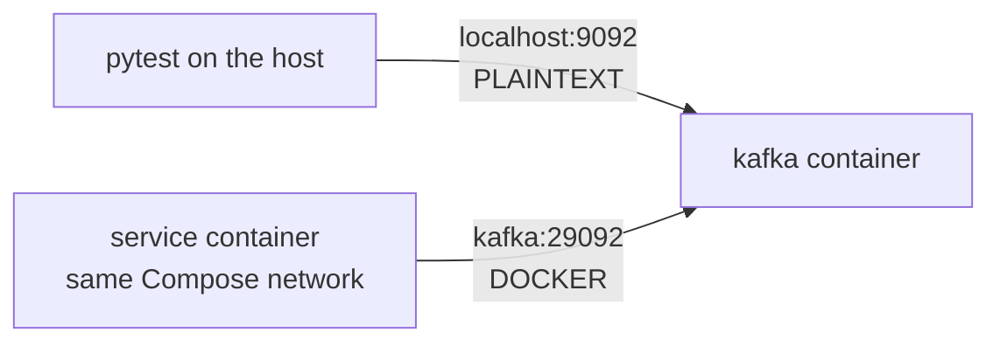

# Kafka — Local Setup & CLI

A single-node KRaft broker in Docker is enough for development, integration tests and CI. Everything on this page was checked against the official `apache/kafka:4.3.1` image.

## Images

| Image | What it is | Use |
|-------|------------|-----|
| `apache/kafka` | Official Apache image: JVM broker, CLI tools in `/opt/kafka/bin` | Local runs, Compose, CI; CLI tools inside the container |
| `apache/kafka-native` | Same broker compiled with GraalVM native image; no CLI scripts inside | Tests: starts in about a second instead of several; intended for local development and testing |
| `confluentinc/cp-kafka` | Confluent Platform build of Kafka (8.x line is KRaft-only) | Stacks built on Confluent images, Testcontainers `KafkaContainer` |

Pin the tag (`apache/kafka:4.3.1`), not `latest` — client and broker upgrades should be deliberate.

## One Container, Default Config

```bash
docker run -d --name kafka -p 9092:9092 apache/kafka:4.3.1
docker logs kafka 2>&1 | grep "Kafka Server started"
```

Without any `KAFKA_*` variable the image uses its built-in `server.properties`: one node with `process.roles=broker,controller`, listener `PLAINTEXT://localhost:9092`, controller on `9093`, data in `/tmp/kraft-combined-logs`, topic auto-creation on. Good for a quick try; the data is lost when the container is removed.

!!! warning "Any `KAFKA_*` variable replaces the whole default config"
    As soon as one `KAFKA_*` variable is passed, the image stops using its default `server.properties` and builds the config only from the environment. `docker run -e KAFKA_NUM_PARTITIONS=3 apache/kafka:4.3.1` exits with `Missing required configuration "process.roles"`. Always pass the full set shown below.

## Environment Variables

Every broker property maps to `KAFKA_` + the property name in upper case with dots replaced by underscores: `num.partitions` → `KAFKA_NUM_PARTITIONS`.

| Variable | Value for a single node | Why |
|----------|-------------------------|-----|
| `KAFKA_NODE_ID` | `1` | Unique node ID |
| `KAFKA_PROCESS_ROLES` | `broker,controller` | Combined mode, one node |
| `KAFKA_LISTENERS` | `PLAINTEXT://:9092,CONTROLLER://:9093` | Sockets the broker binds |
| `KAFKA_ADVERTISED_LISTENERS` | `PLAINTEXT://localhost:9092` | Address clients are told to connect to |
| `KAFKA_LISTENER_SECURITY_PROTOCOL_MAP` | `PLAINTEXT:PLAINTEXT,CONTROLLER:PLAINTEXT` | Protocol per listener name |
| `KAFKA_CONTROLLER_LISTENER_NAMES` | `CONTROLLER` | Which listener the controller uses |
| `KAFKA_CONTROLLER_QUORUM_VOTERS` | `1@localhost:9093` | Controller quorum: `id@host:port` |
| `KAFKA_OFFSETS_TOPIC_REPLICATION_FACTOR` | `1` | `__consumer_offsets` on one broker (default 3 fails on a single node) |
| `KAFKA_TRANSACTION_STATE_LOG_REPLICATION_FACTOR` | `1` | Same for the transaction log |
| `KAFKA_TRANSACTION_STATE_LOG_MIN_ISR` | `1` | Transactions work on one node |
| `KAFKA_SHARE_COORDINATOR_STATE_TOPIC_REPLICATION_FACTOR`, `..._MIN_ISR` | `1` | Share groups on one node |
| `KAFKA_GROUP_INITIAL_REBALANCE_DELAY_MS` | `0` | First consumer joins without the default 3 s delay — faster tests |
| `KAFKA_AUTO_CREATE_TOPICS_ENABLE` | `false` | Typos in topic names fail instead of creating topics |
| `KAFKA_NUM_PARTITIONS` | `3` | Default partition count for auto-created topics |
| `KAFKA_LOG_DIRS` | `/var/lib/kafka/data` | Data directory; mount a volume here |
| `CLUSTER_ID` | Output of `kafka-storage.sh random-uuid` | Optional for one node (the image sets a default and logs it); must be identical on every node of a multi-node cluster |

## Listeners: Host vs Container Network

The broker returns its **advertised** address to clients, and clients then connect to that address. A broker advertising `localhost:9092` works for code on the host but not for another container, where `localhost` is the container itself. Use two listeners:



## Docker Compose

```yaml
# compose.yaml
services:
  kafka:
    image: apache/kafka:4.3.1
    container_name: kafka
    ports:
      - "9092:9092"
    environment:
      KAFKA_NODE_ID: 1
      KAFKA_PROCESS_ROLES: broker,controller
      KAFKA_LISTENERS: PLAINTEXT://:9092,DOCKER://:29092,CONTROLLER://:9093
      KAFKA_ADVERTISED_LISTENERS: PLAINTEXT://localhost:9092,DOCKER://kafka:29092
      KAFKA_LISTENER_SECURITY_PROTOCOL_MAP: PLAINTEXT:PLAINTEXT,DOCKER:PLAINTEXT,CONTROLLER:PLAINTEXT
      KAFKA_CONTROLLER_LISTENER_NAMES: CONTROLLER
      KAFKA_INTER_BROKER_LISTENER_NAME: DOCKER
      KAFKA_CONTROLLER_QUORUM_VOTERS: 1@kafka:9093
      KAFKA_OFFSETS_TOPIC_REPLICATION_FACTOR: 1
      KAFKA_TRANSACTION_STATE_LOG_REPLICATION_FACTOR: 1
      KAFKA_TRANSACTION_STATE_LOG_MIN_ISR: 1
      KAFKA_SHARE_COORDINATOR_STATE_TOPIC_REPLICATION_FACTOR: 1
      KAFKA_SHARE_COORDINATOR_STATE_TOPIC_MIN_ISR: 1
      KAFKA_GROUP_INITIAL_REBALANCE_DELAY_MS: 0
      KAFKA_AUTO_CREATE_TOPICS_ENABLE: "false"
      KAFKA_NUM_PARTITIONS: 3
      KAFKA_LOG_DIRS: /var/lib/kafka/data
    volumes:
      - kafka-data:/var/lib/kafka/data
    healthcheck:
      test: ["CMD-SHELL", "/opt/kafka/bin/kafka-broker-api-versions.sh --bootstrap-server localhost:9092 > /dev/null 2>&1"]
      interval: 5s
      timeout: 10s
      retries: 20
      start_period: 10s

  orders-service:
    build: .
    environment:
      KAFKA_BOOTSTRAP_SERVERS: kafka:29092       # container-to-container listener
    depends_on:
      kafka:
        condition: service_healthy

volumes:
  kafka-data:
```

```bash
docker compose up -d --wait kafka      # returns when the healthcheck passes
docker compose down                    # keep data in the volume
docker compose down -v                 # drop the volume: a clean cluster next time
```

- The healthcheck runs a real client request, so `--wait` and `depends_on: service_healthy` hold until the broker answers — no `sleep 10` in scripts.
- With the named volume, topics and offsets survive `docker compose restart` and `down`/`up`.
- More on Compose itself: [Docker — Docker Compose](../docker/03-docker-compose.md).

## CLI Tools

The scripts live in `/opt/kafka/bin` of the `apache/kafka` image. A shell alias keeps commands short:

```bash
kt() { docker exec -i kafka /opt/kafka/bin/"$1".sh --bootstrap-server localhost:9092 "${@:2}"; }
kt kafka-topics --list
```

The commands below use the full form without the alias.

!!! note "Kafka 4.x option names"
    `--property`, `--producer-property` and `--consumer-property` still work but print deprecation warnings. Use `--reader-property` (console producer input format), `--formatter-property` (console consumer output format) and `--command-property` / `--command-config` (client settings).

### Topics

```bash
B="--bootstrap-server localhost:9092"
K=/opt/kafka/bin

docker exec kafka $K/kafka-topics.sh $B --create --topic orders --partitions 3 --replication-factor 1 \
  --config retention.ms=86400000
docker exec kafka $K/kafka-topics.sh $B --list
docker exec kafka $K/kafka-topics.sh $B --describe --topic orders
docker exec kafka $K/kafka-topics.sh $B --alter --topic orders --partitions 6    # only up, never down
docker exec kafka $K/kafka-topics.sh $B --delete --topic orders

# Topic configs
docker exec kafka $K/kafka-configs.sh $B --entity-type topics --entity-name orders --alter --add-config retention.ms=3600000
docker exec kafka $K/kafka-configs.sh $B --entity-type topics --entity-name orders --describe

# Log-end offset per partition (topic:partition:offset)
docker exec kafka $K/kafka-get-offsets.sh $B --topic orders
```

### Console Producer

```bash
# key:value per line; -i keeps stdin open for docker exec
printf 'ord-1:{"status":"created"}\nord-2:{"status":"created"}\nord-1:{"status":"paid"}\n' | \
  docker exec -i kafka $K/kafka-console-producer.sh $B --topic orders \
    --reader-property parse.key=true --reader-property key.separator=:

# With headers: headers<TAB>key<TAB>value, headers as k1:v1,k2:v2
printf 'event-type:created\tord-5\t{"id":5}\n' | \
  docker exec -i kafka $K/kafka-console-producer.sh $B --topic orders \
    --reader-property parse.key=true --reader-property parse.headers=true
```

### Console Consumer

```bash
# Everything from the start, with key, partition, offset, headers and timestamp
docker exec kafka $K/kafka-console-consumer.sh $B --topic orders --from-beginning \
  --formatter-property print.key=true --formatter-property print.partition=true \
  --formatter-property print.offset=true --formatter-property print.headers=true \
  --formatter-property print.timestamp=true \
  --max-messages 10 --timeout-ms 10000

# One partition from a given offset
docker exec kafka $K/kafka-console-consumer.sh $B --topic orders --partition 0 --offset 2 --max-messages 1
```

Output of the first command (tab-separated):

```
CreateTime:1790789417789	Partition:0	Offset:0	event-type:order-status-changed,schema-version:1	ord-1	{"status":"created"}
```

- Without `--group` the console consumer uses a temporary group and commits nothing you care about. With `--group cli-check` it commits like a real consumer and shows up in `kafka-consumer-groups`.
- `--timeout-ms` exits when no message arrives in time and prints a `TimeoutException` — expected, not a failure.

### Consumer Groups

```bash
docker exec kafka $K/kafka-consumer-groups.sh $B --list
docker exec kafka $K/kafka-consumer-groups.sh $B --describe --group billing
docker exec kafka $K/kafka-consumer-groups.sh $B --describe --group billing --members
docker exec kafka $K/kafka-groups.sh $B --list          # all groups with type: Classic / Consumer / Share
```

```
GROUP    TOPIC   PARTITION  CURRENT-OFFSET  LOG-END-OFFSET  LAG  CONSUMER-ID  HOST  CLIENT-ID
billing  orders  0          2               2               0    -            -     -
billing  orders  1          1               3               2    -            -     -
```

- `CURRENT-OFFSET` is the committed offset, `LAG = LOG-END-OFFSET - CURRENT-OFFSET`.
- A dash in `CONSUMER-ID` means no member is connected right now; the committed offsets are still there.
- Partitions the group has never committed are not listed.

### Resetting Offsets (Replay)

The group must have no active members.

```bash
# Preview, then apply
docker exec kafka $K/kafka-consumer-groups.sh $B --group billing --topic orders --reset-offsets --to-earliest --dry-run
docker exec kafka $K/kafka-consumer-groups.sh $B --group billing --topic orders --reset-offsets --to-earliest --execute

# Other targets
--to-latest                          # skip the backlog
--to-offset 42                       # every listed partition to offset 42
--shift-by -10                       # 10 records back
--to-datetime 2026-09-30T12:00:00.000
--topic orders:1                     # only partition 1

docker exec kafka $K/kafka-consumer-groups.sh $B --delete --group billing
```

- `--shift-by` needs a committed offset for the partition; `--to-earliest`, `--to-latest` and `--to-offset` do not.

### Cluster and Transactions

```bash
docker exec kafka $K/kafka-metadata-quorum.sh $B describe --status    # leader, voters, follower lag
docker exec kafka $K/kafka-broker-api-versions.sh $B > /dev/null && echo up
docker exec kafka $K/kafka-transactions.sh $B list                    # transactional IDs and their state
```

---
## See also
- [Apache Kafka — Overview](./index.md)
- [Kafka — Core Concepts](./01-core-concepts.md)
- [Kafka — Testing Kafka-Based Systems](./05-testing-kafka-systems.md)
- [Docker — Docker Compose](../docker/03-docker-compose.md)
- [Docker — Networking & Volumes](../docker/04-networking-volumes.md)
