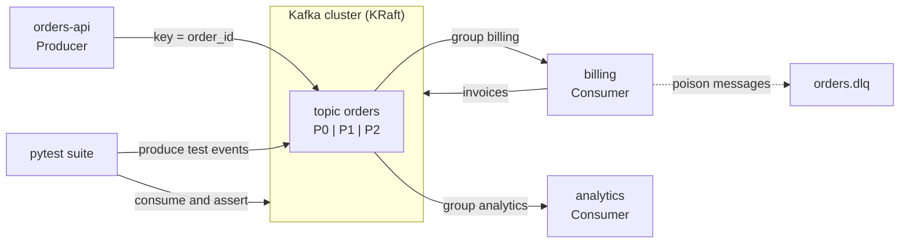

# Apache Kafka — Event Streaming for Python and QA

Open-source (Apache 2.0) distributed event log. Producers append records to topics, the brokers keep them for a configured time, and any number of consumer groups read them at their own pace. Since Kafka 4.0 a cluster runs in KRaft mode only — ZooKeeper is gone.

This guide is written for testing and building Python services around Kafka. Queue vs stream concepts, delivery semantics, retries and DLQ patterns in general are in [Queues vs Streams](../../software-design-patterns/05-composition-architectural/04-queues-streams-messaging.md); this section is about Kafka itself.

## Where Kafka Fits



- **Producers** write keyed records; the key picks the partition, so all events of one order stay in order.
- **Consumer groups** read independently: `billing` and `analytics` both get every record, each keeps its own offsets.
- **Tests** produce events into the real broker and assert on what the system under test writes back — see [05 Testing Kafka-Based Systems](./05-testing-kafka-systems.md) and [06 Testing Scenarios, Load & CI](./06-testing-scenarios-ci.md).

## Section Map

| File | Topics |
|------|--------|
| [01 Core Concepts](./01-core-concepts.md) | Topics, partitions, offsets, brokers, KRaft, replication, ISR, retention, compaction, keys and ordering, consumer and share groups |
| [02 Local Setup & CLI](./02-local-setup-cli.md) | `apache/kafka` image, KRaft env vars, listeners, Docker Compose, `kafka-topics`, console producer/consumer, `kafka-consumer-groups`, offset reset |
| [03 Producers & Consumers in Python](./03-producers-consumers-python.md) | `confluent-kafka`, acks, idempotence, batching, headers, delivery reports, commit strategies, rebalancing, KIP-848, transactions, asyncio, other clients |
| [04 Schemas & Observability](./04-schemas-observability.md) | JSON vs Avro/Protobuf, Schema Registry, compatibility, consumer lag, key metrics, librdkafka statistics, OpenTelemetry |
| [05 Testing Kafka-Based Systems](./05-testing-kafka-systems.md) | What to test where, pure handlers, unit tests without Kafka, contract and schema tests, Testcontainers broker fixture, unique topics and groups, assertions with deadlines |
| [06 Testing Scenarios, Load & CI](./06-testing-scenarios-ci.md) | Ordering by key, duplicates and redelivery, poison messages and DLQ, consumer lag in load tests, flakiness pitfalls, GitHub Actions, QA checklist |

## Minimal Setup

```bash
docker run -d --name kafka -p 9092:9092 apache/kafka:4.3.1    # single-node KRaft, data lost on removal
```

```python
# uv add confluent-kafka
from confluent_kafka import Consumer, Producer

producer = Producer({"bootstrap.servers": "localhost:9092"})
producer.produce("orders", key="ord-1", value=b'{"status": "created"}')   # topic is auto-created by this image's defaults
assert producer.flush(10) == 0            # 0 = every message delivered

consumer = Consumer({
    "bootstrap.servers": "localhost:9092",
    "group.id": "demo",
    "auto.offset.reset": "earliest",
})
consumer.subscribe(["orders"])
msg = None
while msg is None:
    msg = consumer.poll(1.0)
print(msg.key(), msg.value(), msg.partition(), msg.offset())
consumer.close()
```

## Quick Commands

Run inside the container: `docker exec kafka /opt/kafka/bin/<tool>.sh --bootstrap-server localhost:9092 ...`

| Command | Use |
|---------|-----|
| `kafka-topics.sh --create --topic orders --partitions 3` | Create a topic |
| `kafka-topics.sh --describe --topic orders` | Partitions, leader, replicas, ISR, topic configs |
| `kafka-console-producer.sh --topic orders --reader-property parse.key=true --reader-property key.separator=:` | Type `key:value` lines into a topic |
| `kafka-console-consumer.sh --topic orders --from-beginning --formatter-property print.key=true` | Read a topic from the start |
| `kafka-consumer-groups.sh --describe --group billing` | Committed offset, log-end offset and lag per partition |
| `kafka-consumer-groups.sh --group billing --topic orders --reset-offsets --to-earliest --execute` | Replay a topic for a stopped group |
| `kafka-get-offsets.sh --topic orders` | Log-end offset per partition |
| `kafka-metadata-quorum.sh describe --status` | KRaft controller quorum health |

## Ports

| Port | Purpose |
|------|---------|
| `9092` | Client listener (producers, consumers, admin tools) |
| `9093` | KRaft controller listener (internal, do not publish) |
| `8081` | Schema Registry REST API (separate service, optional) |

## Kafka vs RabbitMQ vs Redis Streams

| Aspect | Kafka | RabbitMQ | Redis Streams |
|--------|-------|----------|---------------|
| Model | Partitioned, replicated log | Broker with exchanges, queues and routing (also has RabbitMQ Streams) | Append-only stream inside Redis |
| After consumption | Kept until retention or compaction | Queue message removed on ack | Kept until trimmed (`XTRIM`, `MAXLEN`) |
| Replay | Yes — reset offsets, new group | Queues: no; RabbitMQ Streams: yes | Yes — read from an ID |
| Ordering | Per partition | Per queue, weakens with competing consumers | Per stream |
| Consumer scaling | Up to one consumer per partition in a group; share groups lift that limit | Any number of competing consumers | Consumer groups with pending entries list |
| Routing | Topic and key only | Direct, topic, fanout, headers exchanges, priorities, TTL, dead-letter exchange | Stream key only |
| Storage | Disk, sized for days to forever | Memory and disk, sized for backlog | Memory (with persistence), sized for a short window |
| Operations | Heaviest: cluster, partitions, retention planning | Medium | Lightest if Redis is already there |
| Best fit | Event bus, audit log, CDC, many independent consumers, high throughput | Task queues, per-message routing, request/reply | Light streams and job queues next to an existing Redis |

Rule of thumb: pick Kafka when events must be **kept and re-read** by several independent consumers; pick RabbitMQ for **task distribution with routing**; Redis Streams when the volume is modest and Redis is already in the stack.

## Quick Rules

1. **Choose the key on purpose** — ordering exists only within a partition, and the key decides the partition.
2. **Plan partitions up front** — adding partitions later changes which partition a key maps to; they can never be removed.
3. **`acks=all` + idempotence on producers** that carry business events; `enable.idempotence` is off by default in `confluent-kafka`.
4. **Commit after processing**, not before — and make handlers idempotent, because at-least-once means duplicates.
5. **Replication factor 3 and `min.insync.replicas=2`** in production; a single broker with RF 1 is for local runs and CI only.
6. **Disable topic auto-creation** outside local sandboxes — a typo in a topic name should fail, not create a new topic.
7. **Watch consumer lag**, not only broker health — it is the first sign that a consumer is slow or stuck.
8. **Pin the image and client versions** in CI and upgrade on purpose.

---
## See also
- [Digital Garden: Knowledge Base](../../index.md)
- [Tools — Practical Reference Guides](../index.md)
- [Queues vs Streams: Message Delivery, Ordering & Reliability](../../software-design-patterns/05-composition-architectural/04-queues-streams-messaging.md)
- [Architectural Patterns: Microservices, Event-Driven, Isomorphic](../../software-design-patterns/05-composition-architectural/03-event-driven-isomorphic.md)
- [Docker & Docker Compose](../docker/index.md)
- [OpenTelemetry — Python Observability](../../libs/opentelemetry/index.md)
- [Pytest — Python Testing Framework](../../libs/pytest/index.md)
