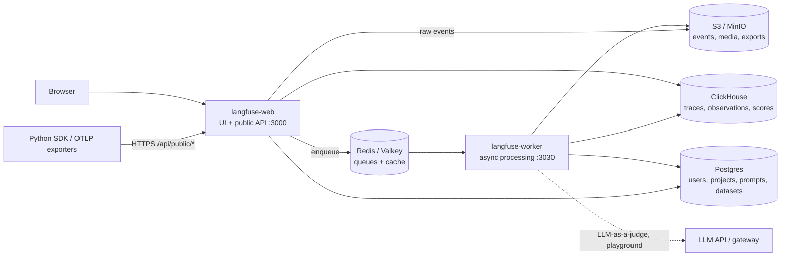

# Langfuse — Setup & Architecture

## Cloud vs Self-Hosted

| Aspect | Langfuse Cloud | Self-hosted (OSS / Enterprise Edition) |
|--------|----------------|----------------------------------------|
| Start time | Minutes: sign up, create project, copy keys | Docker Compose in minutes, production (Helm/Terraform) in days |
| Regions | EU (`cloud.langfuse.com`), US (`us.cloud.langfuse.com`), JP, HIPAA | Wherever you run it |
| Data residency | Vendor-managed | Full control — often required for prompts with customer data |
| Upgrades, backups, scaling | Vendor | You: Postgres, ClickHouse, Redis, S3 |
| Data access window | Plan-based (Hobby 30 days, Core 90 days, Pro/Enterprise 3 years) | Unlimited by default |
| Paid features | Plan tiers (Hobby, Core, Pro, Enterprise) | Some features (project-level RBAC, data retention, SSO enforcement, audit logs) need an Enterprise license key |

!!! tip "For a QA team"
    Use a **separate project** (or a separate self-hosted instance) for test and CI traffic. Test traces then never pollute production dashboards, and retention can be short.

## Self-Hosting Architecture



| Component | Role | Notes |
|-----------|------|-------|
| **langfuse-web** | Next.js app: UI and public REST/OTLP API | Stateless, scale horizontally |
| **langfuse-worker** | Consumes queues, writes events to ClickHouse, runs evals and exports | Stateless, scale by queue depth |
| **Postgres** | Transactional data: orgs, projects, API keys, prompts, datasets, score configs | Back up like any OLTP DB |
| **ClickHouse** | OLAP store for traces, observations, scores | Largest storage consumer |
| **Redis / Valkey** | Ingestion queue and cache | Must be persistent enough not to lose the queue on restart |
| **S3 / MinIO / Blob** | Raw event payloads, multi-modal media, batch exports | Any S3-compatible storage |

Ingestion is **asynchronous**: the API accepts the batch, stores the raw event in S3, enqueues it, and the worker writes it to ClickHouse. Expect a delay of a few seconds before a trace is queryable — important when tests read traces back.

## Docker Compose Quick Start

```bash
git clone https://github.com/langfuse/langfuse.git
cd langfuse
# edit every line marked "# CHANGEME" in docker-compose.yml (or override via .env)
docker compose up -d
docker compose ps          # web, worker, postgres, clickhouse, redis, minio
open http://localhost:3000 # sign up → create org → create project → API keys
```

| Service | Image (current major) | Port on host |
|---------|------------------------|--------------|
| `langfuse-web` | `docker.langfuse.com/langfuse/langfuse:4` | `3000` |
| `langfuse-worker` | `docker.langfuse.com/langfuse/langfuse-worker:4` | `127.0.0.1:3030` |
| `postgres` | `postgres:17` | `127.0.0.1:5432` |
| `clickhouse` | `clickhouse/clickhouse-server` | `127.0.0.1:8123`, `127.0.0.1:9000` |
| `redis` | `redis:7` | `127.0.0.1:6379` |
| `minio` | MinIO | `9090` (S3 API for media uploads) |

- Compose is for **local and test** use: single VM, no HA. For production use the Helm chart or the cloud Terraform modules.
- VM sizing for Compose: at least 4 cores, 16 GiB RAM, ~100 GiB disk.
- Secrets to replace: `SALT`, `ENCRYPTION_KEY` (`openssl rand -hex 32`), `NEXTAUTH_SECRET`, DB/ClickHouse/Redis/MinIO passwords.
- `NEXTAUTH_URL` must match the URL users type in the browser.

### Headless initialization (ephemeral CI instance)

The web container can create an org, project, user and API keys on first start — useful for a throwaway Langfuse in a CI job:

```bash
# .env next to docker-compose.yml
LANGFUSE_INIT_ORG_ID=qa-org
LANGFUSE_INIT_ORG_NAME=QA
LANGFUSE_INIT_PROJECT_ID=llm-tests
LANGFUSE_INIT_PROJECT_NAME=llm-tests
LANGFUSE_INIT_PROJECT_PUBLIC_KEY=pk-lf-ci-local
LANGFUSE_INIT_PROJECT_SECRET_KEY=sk-lf-ci-local
LANGFUSE_INIT_USER_EMAIL=qa@example.com
LANGFUSE_INIT_USER_NAME=qa
LANGFUSE_INIT_USER_PASSWORD=change-me-please
```

```bash
docker compose up -d
until curl -fsS http://localhost:3000/api/public/health; do sleep 2; done
export LANGFUSE_BASE_URL=http://localhost:3000
export LANGFUSE_PUBLIC_KEY=pk-lf-ci-local LANGFUSE_SECRET_KEY=sk-lf-ci-local
```

## SDK Environment Variables

| Variable | Default | Purpose |
|----------|---------|---------|
| `LANGFUSE_PUBLIC_KEY` | — | Project public key (`pk-lf-...`) |
| `LANGFUSE_SECRET_KEY` | — | Project secret key (`sk-lf-...`), server-side only |
| `LANGFUSE_BASE_URL` | `https://cloud.langfuse.com` | API URL; `LANGFUSE_HOST` is the deprecated alias |
| `LANGFUSE_TRACING_ENVIRONMENT` | `default` | Environment label: `production`, `staging`, `ci` |
| `LANGFUSE_RELEASE` | — | Release / git SHA attached to traces |
| `LANGFUSE_TRACING_ENABLED` | `true` | Kill switch — `false` disables export |
| `LANGFUSE_SAMPLE_RATE` | `1.0` | Fraction of traces to send |
| `LANGFUSE_FLUSH_AT` / `LANGFUSE_FLUSH_INTERVAL` | SDK defaults | Batch size / interval (seconds) |
| `LANGFUSE_TIMEOUT` | SDK default | HTTP timeout in seconds |
| `LANGFUSE_DEBUG` | `false` | Verbose SDK logs |
| `LANGFUSE_PROMPT_CACHE_DEFAULT_TTL_SECONDS` | `60` | Prompt cache TTL |

The same settings are constructor arguments when you need them in code:

```python
from langfuse import Langfuse

langfuse = Langfuse(
    public_key="pk-lf-...",
    secret_key="sk-lf-...",
    base_url="http://localhost:3000",
    environment="ci",
    release="a1b2c3d",
    sample_rate=1.0,
)
assert langfuse.auth_check(), "Langfuse keys or base URL are wrong"
```

!!! warning "Environment names"
    Environments are free-form strings but must be lowercase letters, digits, `-` or `_`, and cannot start with `langfuse`. Pick a fixed set (`production`, `staging`, `ci`, `local`) and filter dashboards by it.

## Organizations, Projects, API Keys

```text
Organization (billing, members, SSO)
 └── Project  (traces, prompts, datasets, scores, API keys, retention)
      ├── Public key  pk-lf-…   identifies the project (safe in browser for feedback scores)
      └── Secret key  sk-lf-…   full API access — backend and CI secrets only
```

- API keys are **per project**; data never crosses projects.
- Create a dedicated key pair per consumer (app, CI, notebook) so you can rotate one without breaking the others.
- Public API authentication is HTTP Basic: `public_key:secret_key`.

```bash
curl -s -u "$LANGFUSE_PUBLIC_KEY:$LANGFUSE_SECRET_KEY" \
  "$LANGFUSE_BASE_URL/api/public/traces?limit=5&tags=ci" | jq '.data[].id'
```

## RBAC

| Role | Can do |
|------|--------|
| **Owner** | Everything, including deleting the org/project and billing |
| **Admin** | Edit project settings, manage members and API keys |
| **Member** | View all data, create scores and annotations, work with prompts and datasets; no project configuration |
| **Viewer** | Read-only; most configuration hidden |
| **None** | No org-wide access — combine with a project-level role to grant a single project |

- Roles are assigned at **organization** level and inherited by projects.
- **Project-level roles** (override per project) require Pro + Teams add-on, Enterprise, or self-hosted Enterprise Edition.
- Typical QA setup: QA engineers are `Member` on the test project (create datasets, annotate) and `Viewer` on production.

---
## See also
- [Langfuse — LLM Tracing, Prompts & Evals](./index.md)
- [Langfuse — Tracing with the Python SDK](./02-tracing-sdk.md)
- [Docker & Docker Compose — Compose](../docker/03-docker-compose.md)
- [OpenTelemetry — Python Observability](../../libs/opentelemetry/index.md)
- [Arize Phoenix](../phoenix/index.md)
