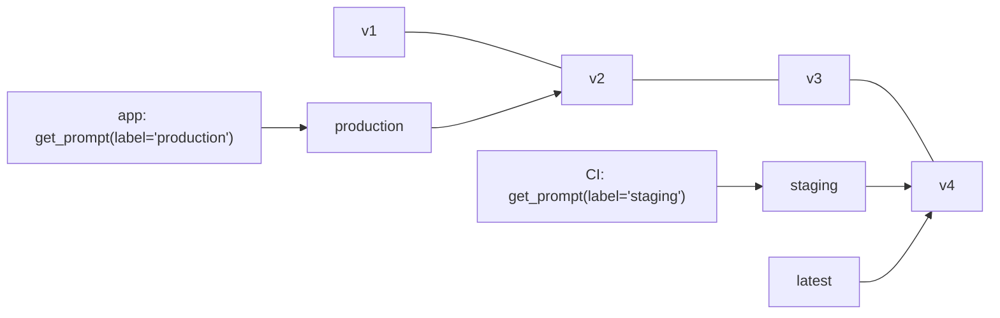

# Langfuse — Prompt Management

Prompts live in Langfuse, not in the code. The application fetches a prompt **by label**, compiles variables in, and links the resulting generation to the exact prompt version — so every trace, cost and score can be sliced by prompt version.

## Concepts

| Term | Meaning |
|------|---------|
| **Prompt** | Named template, type `text` or `chat` |
| **Version** | Immutable, auto-incremented on every change (1, 2, 3, …) |
| **Label** | Movable pointer to one version: `production`, `staging`, `canary`, `qa-approved` |
| `production` | Default label served when no label/version is requested |
| `latest` | Reserved label, always the newest version, managed by Langfuse |
| **Config** | JSON stored with the version: model, temperature, JSON schema, tool definitions |
| **Variables** | `{{mustache}}` placeholders filled by `compile()` |
| **Placeholder** | Chat-only slot for a list of messages (e.g. conversation history) |



Promotion = moving a label. Rollback = moving it back. No deploy in either case.

## Create and Version

```python
from langfuse import get_client

langfuse = get_client()

langfuse.create_prompt(
    name="ticket-triage",
    type="chat",
    prompt=[
        {"role": "system", "content": "You triage support tickets for {{product}}. Reply with JSON: {\"priority\": \"P1|P2|P3|P4\", \"team\": str}."},
        {"type": "placeholder", "name": "history"},
        {"role": "user", "content": "{{ticket}}"},
    ],
    labels=["staging"],                                   # not production yet
    config={"model": "gpt-4o-mini", "temperature": 0, "response_format": {"type": "json_object"}},
    tags=["support-bot"],
    commit_message="Add team routing to output schema",
)
```

- Creating a prompt with an existing name creates a **new version**.
- Labels are unique per prompt: assigning `production` to v4 removes it from v2.
- Changes are also possible in the UI (editor, diff between versions, playground).

Promote after the regression suite passes:

```python
langfuse.update_prompt(name="ticket-triage", version=4, new_labels=["production", "qa-approved"])
```

## Fetch and Compile

```python
prompt = langfuse.get_prompt("ticket-triage", type="chat")                     # label=production by default
staging = langfuse.get_prompt("ticket-triage", type="chat", label="staging")
pinned = langfuse.get_prompt("ticket-triage", type="chat", version=3)           # reproduce an old run

messages = prompt.compile(
    product="WebShop",
    ticket="Checkout returns 500 for all EU users since 10:05",
    history=[{"role": "user", "content": "Hi, I have an urgent problem"}],
)
model_cfg = prompt.config            # {"model": "gpt-4o-mini", "temperature": 0, ...}
print(prompt.name, prompt.version, prompt.labels, prompt.variables)
```

| Attribute / method | Use |
|--------------------|-----|
| `compile(**vars)` | Text prompt → `str`; chat prompt → list of messages |
| `variables` | Names of `{{variables}}` in the template |
| `config` | Model settings stored with the version |
| `version`, `labels` | What was served — log them in test reports |
| `is_fallback` | `True` if the SDK returned the local fallback instead of a fetched prompt |
| `get_langchain_prompt()` | Template converted to LangChain `{var}` syntax |

!!! warning "Missing variables are not an error"
    `compile()` leaves unknown `{{placeholders}}` untouched: `"Hi {{name}}"` stays literal if `name` is not passed. Unresolved chat placeholders are kept and a warning is logged. Add a test for it (below).

## Caching and Availability

| Behavior | Detail |
|----------|--------|
| Client-side cache | In-memory per process, key = name + label/version |
| Default TTL | 60 s (`cache_ttl_seconds=` or `LANGFUSE_PROMPT_CACHE_DEFAULT_TTL_SECONDS`) |
| After TTL | **Stale-while-revalidate**: cached version is returned immediately, refresh happens in the background |
| First fetch | Blocking network call — prefetch at startup if latency matters |
| Langfuse unreachable, no cache | Raises, unless `fallback=` is given |
| Disable cache | `cache_ttl_seconds=0` — tests and local development |

```python
TRIAGE_FALLBACK = [
    {"role": "system", "content": "You triage support tickets for {{product}}. Reply with JSON."},
    {"role": "user", "content": "{{ticket}}"},
]

prompt = langfuse.get_prompt(
    "ticket-triage",
    type="chat",
    fallback=TRIAGE_FALLBACK,
    max_retries=2,
    fetch_timeout_seconds=3,
)
if prompt.is_fallback:
    log.warning("Serving fallback prompt for ticket-triage")
```

- Label changes reach running services within one TTL — plan for that when testing a rollout.
- In CI use `cache_ttl_seconds=0` so a freshly promoted version is always picked up.

## Linking Prompts to Generations

Linking is what makes "cost / latency / score by prompt version" work in dashboards and the Metrics API.

```python
from langfuse import get_client, observe
from langfuse.openai import openai

langfuse = get_client()


@observe()
def triage(ticket: str) -> str:
    prompt = langfuse.get_prompt("ticket-triage", type="chat")
    resp = openai.chat.completions.create(
        model=prompt.config["model"],
        temperature=prompt.config["temperature"],
        messages=prompt.compile(product="WebShop", ticket=ticket, history=[]),
        langfuse_prompt=prompt,              # OpenAI integration: link generation → prompt version
    )
    return resp.choices[0].message.content
```

Manual generations take the prompt as an argument:

```python
with langfuse.start_as_current_observation(
    as_type="generation", name="triage-llm", model="gpt-4o-mini", prompt=prompt
) as gen:
    ...
```

Or propagate it to all generations in a block: `propagate_attributes(prompt=prompt)`.

## Testing Prompts in pytest

```python
import pytest
from langfuse import get_client

langfuse = get_client()
PROMPTS = {"ticket-triage": {"product": "WebShop", "ticket": "x", "history": []}}


@pytest.mark.parametrize("name,variables", PROMPTS.items())
@pytest.mark.parametrize("label", ["production", "staging"])
def test_prompt_compiles_without_leftovers(name, variables, label):
    prompt = langfuse.get_prompt(name, type="chat", label=label, cache_ttl_seconds=0)

    assert not prompt.is_fallback, "Langfuse unreachable — fallback served"
    assert set(prompt.variables) <= set(variables), f"Unknown variables: {prompt.variables}"
    messages = prompt.compile(**variables)
    assert all("{{" not in m.get("content", "") for m in messages)
    assert {"model", "temperature"} <= prompt.config.keys()
```

Cheap, fast, no LLM call — catches a broken template before a label is moved to `production`.

## Prompt Experiments (UI)

Run a prompt version against a dataset without writing code:

1. Configure an **LLM connection** (provider API key) in project settings.
2. Create a dataset whose item `input` keys match the prompt variables (`product`, `ticket`).
3. Prompt → **Experiments** → pick version, model, dataset, and evaluators (e.g. LLM-as-a-judge).
4. Compare runs side by side: outputs, scores, latency and cost per version.

Use it for quick A/B checks by product or prompt owners; keep the automated gate in code (see [Datasets & Evaluations](./04-datasets-evaluations.md)).

## Rules

- Fetch by **label** in application code; pin **versions** only for reproducing old runs.
- Always pass a `fallback` in production paths.
- Put model name and parameters in `config`, so a prompt change and its model change ship together.
- Protect `production` with a process: staging label → experiment → promote.
- Log `prompt.name` + `prompt.version` in test output so failures are traceable.

---
## See also
- [Langfuse — LLM Tracing, Prompts & Evals](./index.md)
- [Langfuse — Tracing with the Python SDK](./02-tracing-sdk.md)
- [Langfuse — Datasets & Evaluations](./04-datasets-evaluations.md)
- [LangChain — LLM Application Framework](../../libs/langchain/index.md)
- [Pytest — Python Testing Framework](../../libs/pytest/index.md)
