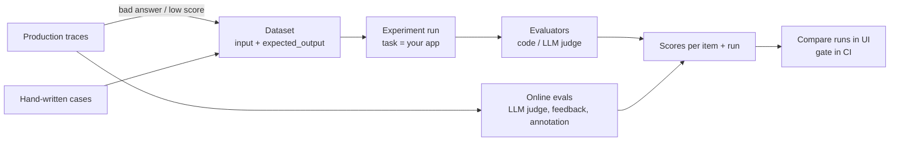

# Langfuse — Datasets & Evaluations

Datasets are the LLM equivalent of a regression suite: fixed inputs with expected outputs. **Experiments** run your application over a dataset, **evaluators** turn outputs into **scores**, and Langfuse stores every run so versions can be compared.

## Evaluation Loop



| Mode | Data | Evaluated by | When |
|------|------|--------------|------|
| **Offline** (experiments) | Dataset items with ground truth | SDK evaluators, LLM-as-a-judge on experiments | Before merge / release |
| **Online** | Live production observations | LLM-as-a-judge rules, user feedback, annotation queues | Continuously |

## Datasets

```python
from langfuse import get_client

langfuse = get_client()

langfuse.create_dataset(
    name="triage-regression",
    description="Support ticket triage: priority + routing",
    metadata={"owner": "qa", "component": "support-bot"},
)

CASES = [
    ("Checkout returns 500 for all EU users", {"priority": "P1", "team": "payments"}),
    ("Typo on the About page", {"priority": "P4", "team": "content"}),
    ("Password reset email never arrives", {"priority": "P2", "team": "identity"}),
]
for ticket, expected in CASES:
    langfuse.create_dataset_item(
        dataset_name="triage-regression",
        input={"ticket": ticket},
        expected_output=expected,
        metadata={"source": "manual", "category": "smoke"},
    )
```

| Field | Use |
|-------|-----|
| `input` | Whatever your task function needs (dict recommended) |
| `expected_output` | Ground truth for evaluators; optional for judge-only checks |
| `metadata` | Category, difficulty, source — group results by it |
| `source_trace_id` / `source_observation_id` | Link item back to the production trace it came from |
| `id` | Pass your own stable id to upsert instead of duplicating |
| `status` | `ARCHIVED` hides an item from new runs without deleting history |

- `create_dataset(..., input_schema=..., expected_output_schema=...)` enforces a JSON schema on new items.
- Datasets are versioned by time: `get_dataset(name, version=<datetime>)` returns the items as they were — reproducible runs.

### From production traces

In the UI: open a trace or observation → **Add to dataset** (input/output are prefilled, edit the expected output). In code, e.g. every trace with negative user feedback:

```python
from datetime import datetime, timedelta, timezone

since = datetime.now(timezone.utc) - timedelta(days=1)
bad = langfuse.api.scores.get_many(name="user_feedback", operator="=", value=0, from_timestamp=since, limit=50)

for score in bad.data:
    trace = langfuse.api.trace.get(score.trace_id)
    langfuse.create_dataset_item(
        dataset_name="triage-regression",
        id=f"prod-{score.trace_id}",           # idempotent re-runs
        input=trace.input,
        expected_output=None,                   # fill in during review
        source_trace_id=score.trace_id,
        metadata={"source": "negative-feedback"},
    )
```

## Experiments via SDK

```python
import json
from langfuse import Evaluation, get_client
from langfuse.openai import openai

langfuse = get_client()


def triage_task(*, item, **kwargs) -> dict:
    prompt = langfuse.get_prompt("ticket-triage", type="chat", label="staging", cache_ttl_seconds=0)
    resp = openai.chat.completions.create(
        model=prompt.config["model"],
        messages=prompt.compile(product="WebShop", ticket=item.input["ticket"], history=[]),
        response_format={"type": "json_object"},
        langfuse_prompt=prompt,
    )
    return json.loads(resp.choices[0].message.content)


def priority_match(*, input, output, expected_output, metadata, **kwargs) -> Evaluation:
    ok = output.get("priority") == expected_output["priority"]
    return Evaluation(name="priority_match", value=1.0 if ok else 0.0,
                      comment=f"got {output.get('priority')}, want {expected_output['priority']}")


def team_match(*, input, output, expected_output, **kwargs) -> Evaluation:
    return Evaluation(name="team_match", value=output.get("team") == expected_output["team"], data_type="BOOLEAN")


def accuracy(*, item_results, **kwargs) -> Evaluation:
    vals = [e.value for r in item_results for e in r.evaluations if e.name == "priority_match"]
    return Evaluation(name="priority_accuracy", value=sum(vals) / max(len(vals), 1))


dataset = langfuse.get_dataset("triage-regression")
result = dataset.run_experiment(
    name="triage-prompt-v4",
    run_name="v4-gpt-4o-mini-2026-09-27",
    description="New routing schema",
    task=triage_task,
    evaluators=[priority_match, team_match],
    run_evaluators=[accuracy],
    max_concurrency=5,                           # respect provider rate limits
    metadata={"prompt_label": "staging", "model": "gpt-4o-mini"},
)
print(result.format())
print(result.dataset_run_url)
```

| Piece | Signature / notes |
|-------|-------------------|
| Task | `task(*, item, **kwargs)` — sync or async; item is a `DatasetItem` (`.input`, `.expected_output`) or a dict for local data |
| Item evaluator | <code>(&#42;, input, output, expected&#95;output, metadata, &#42;&#42;kwargs) -&gt; Evaluation &#124; list[Evaluation]</code> |
| Run evaluator | `(*, item_results, **kwargs) -> Evaluation` — aggregates (accuracy, pass rate) |
| `Evaluation` | `name`, `value` (number, string, bool), `comment`, `metadata`, `data_type` |
| Result | `item_results` (output, evaluations, trace_id), `run_evaluations`, `dataset_run_url`, `format()` |

- Each item runs in its own trace; the dataset run links items ↔ traces ↔ scores.
- `langfuse.run_experiment(name=..., data=[{"input": ..., "expected_output": ...}], task=...)` runs over **local** data — handy in unit tests; results are traced but not stored as a dataset run.
- Task exceptions are logged and the item is skipped — check `len(result.item_results)` against the dataset size.
- v3's `for item in dataset.items: with item.run(...)` loop is gone in v4.

## Scores

| Data type | `value` | Example |
|-----------|---------|---------|
| `NUMERIC` | float | `faithfulness=0.83`, `latency_budget_ratio=1.2` |
| `CATEGORICAL` | string | `priority_error="over-escalated"` |
| `BOOLEAN` | `1` / `0` | `json_valid=1`, `user_feedback=0` |
| `TEXT` | string | Free-text reviewer note |

```python
# Inside an active trace
langfuse.score_current_trace(name="json_valid", value=1, data_type="BOOLEAN")
langfuse.score_current_span(name="retrieval_hit", value=1, data_type="BOOLEAN")

# Later, by id (async job, feedback endpoint, CI)
langfuse.create_score(
    trace_id=trace_id,
    observation_id=generation_id,            # optional: score one step
    name="priority_error",
    value="over-escalated",
    data_type="CATEGORICAL",
    comment="P1 for a cosmetic typo",
    config_id="cfg-priority-error",          # optional: validate against a score config
)
```

- **Score configs** (Project settings → Scores) define name, type, range or categories; `config_id` rejects out-of-range values — use them so humans, judges and code write comparable scores.
- Scores can target a trace, observation, session (`session_id=`) or dataset run (`dataset_run_id=`).
- Score `source` is `API`, `EVAL` (LLM judge) or `ANNOTATION` (human) — filterable.

## LLM-as-a-Judge (UI)

1. Add an **LLM connection** (OpenAI, Anthropic, Azure, Bedrock, …) in project settings.
2. **Evaluators → New**: start from a template (hallucination, relevance, toxicity, correctness…) or write your own judge prompt with `{{variables}}`.
3. Choose score type (numeric 0–1, categorical, boolean) and the judge model, e.g. `claude-haiku-4-5`.
4. Choose the target:
    - **Observations** — recommended for production: filter by observation type/name plus trace filters (tags, user, version), set a sampling rate.
    - **Experiments** — runs automatically on new dataset runs; can map `expected_output`.
    - **Traces** — legacy target, being phased out.
5. Map variables to `input`, `output`, `metadata` of the matched observation; preview on real data before saving.

!!! tip
    Judges cost money and drift too. Sample production (5–10%), pin the judge model, and keep a small human-labelled dataset to measure judge agreement.

## Annotation Queues

Human review workflow for traces, observations or sessions:

- Create a queue with one or more score configs (e.g. `correctness`, `priority_error`).
- Add items from table filters in the UI, or via API.
- Reviewers work through the queue; scores get `source=ANNOTATION`.

```python
queue = langfuse.api.annotation_queues.create_queue(name="triage-weekly-review", score_config_ids=["cfg-correctness"])
langfuse.api.annotation_queues.create_queue_item(queue.id, object_id=trace_id, object_type="TRACE")
```

## User Feedback

```python
# FastAPI endpoint receiving thumbs up/down from the chat UI
@app.post("/feedback")
def feedback(body: FeedbackIn):
    langfuse.create_score(
        trace_id=body.trace_id,              # returned to the frontend with the answer
        name="user_feedback",
        value=1 if body.thumbs_up else 0,
        data_type="BOOLEAN",
        comment=body.comment,
    )
    return {"ok": True}
```

Return `langfuse.get_current_trace_id()` with every answer so the UI can send feedback for the right trace.

---
## See also
- [Langfuse — LLM Tracing, Prompts & Evals](./index.md)
- [Langfuse — Prompt Management](./03-prompt-management.md)
- [Langfuse — Testing, CI & Production](./05-testing-ci-production.md)
- [DeepEval — LLM Testing Guide](../../llm-evaluation/index.md)
- [Arize Phoenix](../phoenix/index.md)
