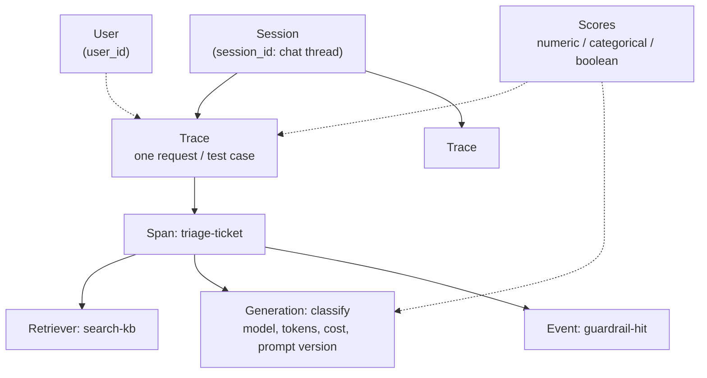

# Langfuse — LLM Tracing, Prompts & Evals

Open-source LLM engineering platform: trace every LLM call, version prompts outside the code, build datasets from real traffic and score outputs with code, humans or LLM judges.

## What Langfuse Gives a QA Engineer

| Need | Langfuse feature |
|------|------------------|
| "Why did the bot answer that?" | Trace tree with inputs, outputs, prompts, tool calls, latency, cost |
| Reproduce a bad answer | Save the trace to a **dataset** and replay it in an **experiment** |
| Regression gate for prompt/model changes | Dataset experiments with evaluators, run from pytest or CI |
| Quality signal in production | **Scores**: user feedback, LLM-as-a-judge, annotation queues |
| Change prompts without redeploying | **Prompt management** with versions and labels (`production`, `staging`) |
| Budget and SLO checks | Cost / latency / token dashboards and the Metrics API |

## Installation

```bash
uv add langfuse                      # Python SDK v4 (OpenTelemetry-based)
uv add openai litellm langchain      # optional: integrations you actually use

export LANGFUSE_PUBLIC_KEY="pk-lf-..."
export LANGFUSE_SECRET_KEY="sk-lf-..."
export LANGFUSE_BASE_URL="https://cloud.langfuse.com"   # or http://localhost:3000 when self-hosted
```

## Data Model



| Object | What it is | Typical QA use |
|--------|-----------|----------------|
| **Trace** | One end-to-end request (API call, chat turn, test case) | One trace per test, filter by tags |
| **Observation** | Step inside a trace; nested tree | Assert which steps ran and in what order |
| — *span* | Generic unit of work (also `agent`, `tool`, `chain`, `retriever`, `evaluator`, `guardrail`) | Timing of retrieval, tool calls |
| — *generation* | LLM call: model, parameters, usage, cost, linked prompt | Cost/latency per model and prompt version |
| — *event* | Point-in-time marker, no duration | Guardrail triggered, cache hit |
| **Session** | Group of traces sharing `session_id` | Replay a whole multi-turn conversation |
| **User** | `user_id` attached to traces | Per-user cost, feedback, abuse checks |
| **Score** | Evaluation result on a trace, observation, session or dataset run | Quality metric, gate threshold |
| **Dataset / run** | Test cases (`input`, `expected_output`) and executions against them | Regression suite for the LLM |

## Section Map

| File | Topics |
|------|--------|
| [01 Setup & Architecture](./01-setup-architecture.md) | Cloud vs self-hosted, web/worker/Postgres/ClickHouse/Redis/S3, Docker Compose, env vars, projects, API keys, RBAC |
| [02 Tracing with the Python SDK](./02-tracing-sdk.md) | `get_client()`, `@observe`, context managers, `propagate_attributes`, OpenAI/LangChain/LiteLLM/OTel, flushing, sampling, masking |
| [03 Prompt Management](./03-prompt-management.md) | Versions, labels, `get_prompt`, `compile`, caching, fallback, linking prompts to generations, prompt experiments |
| [04 Datasets & Evaluations](./04-datasets-evaluations.md) | Datasets from code and traces, `run_experiment`, evaluators, scores, LLM-as-a-judge, annotation queues, user feedback |
| [05 Testing, CI & Production](./05-testing-ci-production.md) | pytest integration, experiments as CI gates, Metrics API, dashboards, retention, PII, production checklist |

## Minimal Trace

```python
from langfuse import get_client, observe, propagate_attributes
from langfuse.openai import openai   # drop-in: every call becomes a generation

langfuse = get_client()


@observe()
def triage(ticket: str) -> str:
    with propagate_attributes(user_id="qa-bot", tags=["triage", "smoke"]):
        resp = openai.chat.completions.create(
            model="gpt-4o-mini",
            messages=[{"role": "user", "content": f"Classify priority P1-P4: {ticket}"}],
        )
        return resp.choices[0].message.content


print(triage("Checkout returns 500 for all EU users"))
langfuse.flush()   # short-lived script: send buffered spans before exit
```

## Quick Commands

| Command | Use |
|---------|-----|
| `git clone https://github.com/langfuse/langfuse.git && cd langfuse && docker compose up` | Local self-hosted stack, UI on `http://localhost:3000` |
| `uv add langfuse` | Install the Python SDK |
| `uv run python -c "from langfuse import get_client; print(get_client().auth_check())"` | Verify keys and base URL |
| `curl http://localhost:3000/api/public/health` | Health check of the web container |
| `LANGFUSE_TRACING_ENABLED=false uv run pytest` | Run tests without sending traces |
| `LANGFUSE_DEBUG=true uv run python app.py` | Verbose SDK logging when traces don't show up |

## Langfuse vs Phoenix

| Aspect | Langfuse | [Phoenix](../phoenix/index.md) |
|--------|----------|---------|
| Focus | Production LLM platform: tracing, prompts, datasets, evals, dashboards | Tracing + evaluation workbench, strong in notebooks and local debugging |
| Instrumentation | Own SDK on top of OpenTelemetry; accepts any OTLP/HTTP spans | OpenInference conventions on OpenTelemetry |
| Prompt management | Built in: versions, labels, caching, playground | Available, less central |
| Storage | Postgres + ClickHouse + Redis + S3 | Lightweight; SQLite or Postgres |
| Self-hosting effort | Several services (Compose / Helm) | Single container or `pip install` |
| License | MIT core, some features in Enterprise Edition | Elastic License 2.0 |

Rule of thumb: Phoenix for quick local debugging and eval notebooks; Langfuse when a team needs a shared, long-lived place for traces, prompts, datasets and scores.

## Quick Rules

1. **Use the v4 SDK API** — `start_as_current_observation`, `@observe`, `propagate_attributes`; ignore v2 examples with `langfuse.trace()`.
2. **Set `LANGFUSE_BASE_URL`**, not the deprecated `LANGFUSE_HOST`.
3. **Always `flush()`** at the end of scripts, tests, jobs and serverless handlers.
4. **Propagate `user_id`, `session_id`, `tags` early** in the request so every span gets them.
5. **Tag test traffic** (`tags=["test", run_id]`) and use a separate environment or project for it.
6. **Fetch prompts by label**, never hard-code a version in production code.
7. **Turn bad production traces into dataset items** — the dataset is your LLM regression suite.
8. **Gate CI on experiment scores**, not on exact string matches.
9. **Mask PII before export** — the SDK sends raw inputs/outputs by default.

---
## See also
- [Digital Garden: Knowledge Base](../../index.md)
- [Tools — Practical Reference Guides](../index.md)
- [Arize Phoenix](../phoenix/index.md)
- [MLflow — Experiment Tracking, LLM Tracing & Evaluation](../mlflow/index.md)
- [OpenTelemetry — Python Observability](../../libs/opentelemetry/index.md)
- [LiteLLM — One API for 100+ LLM Providers](../../libs/litellm/index.md)
- [DeepEval — LLM Testing Guide](../../llm-evaluation/index.md)
- [Jaeger — Distributed Tracing for OpenTelemetry](../jaeger/index.md)
