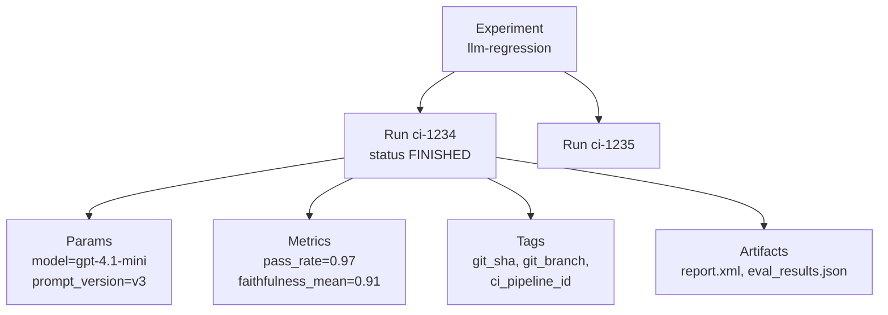

# MLflow — Experiment Tracking

Experiment tracking is the original core of MLflow: every execution is a **run** with its inputs (params), results (metrics), labels (tags) and files (artifacts). For a QA engineer a run is a test or eval execution — one CI job, one benchmark, one prompt variant — and the experiment is the history of all of them.

## Data Model



| Entity | Type | Mutability | Use for |
|--------|------|------------|---------|
| Experiment | Named container | Name can be changed | One test suite or one app under evaluation |
| Run | One execution | Ends as `FINISHED`, `FAILED` or `KILLED` | One CI job, one eval, one benchmark |
| Param | `str` key → `str` value | **Write-once**: a different value for the same key raises `INVALID_PARAMETER_VALUE` | Inputs: model, prompt version, dataset, config |
| Metric | `str` key → `float`, with step and timestamp | Append-only history | Results: pass rate, latency, scores |
| Tag | `str` key → `str` value | Overwritable | Search keys: git SHA, branch, suite, owner |
| Artifact | File or directory | Upload-only | Reports, logs, tables, models |

## Logging a Run

```python
import mlflow

mlflow.set_tracking_uri("http://localhost:5000")   # or MLFLOW_TRACKING_URI
mlflow.set_experiment("checkout-api-tests")        # created on first use

with mlflow.start_run(run_name="ci-1234") as run:
    mlflow.set_tags({"git_sha": "a1b2c3d", "ci_pipeline_id": "1234", "suite": "smoke"})
    mlflow.log_params({"base_url": "https://staging.example.com", "workers": 4})
    mlflow.log_metrics({"tests_total": 120, "tests_failed": 3, "pass_rate": 0.975})

    for step, latency in enumerate([120, 135, 128]):          # a series, plotted as a chart
        mlflow.log_metric("p95_latency_ms", latency, step=step)

    mlflow.log_dict({"failed": ["test_refund", "test_cancel"]}, "failures.json")
    mlflow.log_text("staging, feature flags: new-checkout", "notes/env.txt")
    mlflow.log_artifact("report.xml", artifact_path="reports")  # an existing local file
    print(run.info.run_id, run.info.experiment_id)
```

- The `with` block ends the run as `FINISHED`, or as `FAILED` if an exception escapes it.
- The run is active only in this process and thread; `mlflow.log_*` outside a run starts a new one implicitly — always use `start_run()` explicitly.
- `log_params` values are converted to strings: `4` becomes `"4"`, so filter as `params.workers = '4'`.

## Artifact Helpers

| Function | Writes | Good for |
|----------|--------|----------|
| `mlflow.log_artifact(path, artifact_path=...)` | One local file | JUnit XML, Allure archive, HAR, screenshots |
| `mlflow.log_artifacts(dir, artifact_path=...)` | A whole directory | `allure-results/`, `playwright-report/` |
| `mlflow.log_text(text, "file.txt")` | A string | Environment description, diffs |
| `mlflow.log_dict(obj, "file.json")` | JSON / YAML from a dict | Failure lists, configs |
| `mlflow.log_table(data=df, artifact_file="t.json")` | A `pandas.DataFrame` (or dict of lists) as a table | Per-case eval results, viewable and comparable in the UI |
| `mlflow.log_figure(fig, "chart.png")` | A matplotlib / plotly figure | Score distributions |

## System Tags

MLflow sets some tags itself: `mlflow.runName`, `mlflow.user`, `mlflow.source.name`, `mlflow.source.type` and — when the entry-point script lives in a git repository — `mlflow.source.git.commit` and `mlflow.source.git.branch`.

!!! warning "No git tags under pytest"
    Under `pytest` the entry point is `.venv/.../pytest`, outside the repository, so `mlflow.source.git.commit` is **not** set. Set your own `git_sha` / `git_branch` tags from CI variables (`GITHUB_SHA`, `CI_COMMIT_SHA`) — see [Testing, CI & Model Registry](./05-testing-ci-registry.md).

## Autologging

`mlflow.autolog()` patches supported libraries so params, metrics and models are logged without explicit calls.

```python
import mlflow
from sklearn.datasets import load_iris
from sklearn.linear_model import LogisticRegression

mlflow.set_experiment("iris")
mlflow.autolog()                       # or only one library: mlflow.sklearn.autolog()

X, y = load_iris(return_X_y=True)
with mlflow.start_run():
    LogisticRegression(max_iter=200).fit(X, y)
# Params: C, max_iter, ...; metrics: training_accuracy_score, training_f1_score, ...; the model as an artifact
```

| Call | Captures |
|------|----------|
| `mlflow.autolog()` | All installed and supported libraries |
| `mlflow.sklearn.autolog()`, `mlflow.pytorch.autolog()`, `mlflow.xgboost.autolog()` ... | Classic ML: params, training metrics, model |
| `mlflow.openai.autolog()`, `mlflow.langchain.autolog()`, `mlflow.anthropic.autolog()` ... | GenAI: traces of every call — see [GenAI Tracing](./03-genai-tracing.md) |
| `mlflow.autolog(disable=True)` | Turns autologging off again |

## Searching Runs

```python
import mlflow

runs = mlflow.search_runs(
    experiment_names=["checkout-api-tests"],
    filter_string="tags.suite = 'smoke' and metrics.pass_rate < 0.99",
    order_by=["attributes.start_time DESC"],
    max_results=20,
)                                              # pandas.DataFrame: run_id, metrics.*, params.*, tags.*
print(runs[["run_id", "metrics.pass_rate", "tags.git_sha"]])

latest = mlflow.search_runs(
    experiment_names=["checkout-api-tests"],
    filter_string="attributes.status = 'FINISHED'",
    order_by=["attributes.start_time DESC"],
    max_results=1,
    output_format="list",                      # list[Run] instead of a DataFrame
)[0]
print(latest.data.metrics["pass_rate"], latest.data.tags["git_sha"])
```

Filter syntax essentials:

| Filter | Meaning |
|--------|---------|
| `metrics.pass_rate < 0.95` | Numeric comparison on the last logged value |
| `params.model = 'gpt-4.1-mini'` | Params and tags are strings — quote the value |
| `tags.git_branch = 'main'` | Exact match on a tag |
| `tags.git_branch LIKE 'release/%'` | Pattern match (`ILIKE` for case-insensitive) |
| ``tags.`git.sha` = 'a1b2c3d'`` | Backticks for keys with dots, dashes or spaces |
| ``metrics.`correctness/mean` > 0.8`` | Backticks for eval metrics named `<scorer>/mean` |
| `attributes.status = 'FINISHED'` | Run attributes: `status`, `start_time`, `run_name`, ... |
| `a = 1 and b = 2` | Only `and` — there is no `or`; run two searches instead |

For metric history (all steps) use `MlflowClient().get_metric_history(run_id, "p95_latency_ms")`.

## Comparing Runs in the UI

1. **Experiments → your experiment → Runs** — the table shows params, metrics and tags as columns; the search box takes the same filter syntax.
2. Select two or more runs → **Compare** — side-by-side params and metrics, parallel-coordinates and scatter plots, metric charts over steps.
3. **Chart view** — one chart per metric across runs, good for "pass rate over the last 30 builds".
4. **Artifacts** tab of a run — download reports, preview JSON, text, images and tables.

## Naming Conventions for Test Runs

| Thing | Convention | Example |
|-------|-----------|---------|
| Experiment | `<app>-<suite>` | `support-bot-regression`, `checkout-api-smoke` |
| Run name | `ci-<pipeline id>` or `local-<user>` | `ci-18231` |
| Tags | Lower-case, underscores, no dots | `git_sha`, `git_branch`, `ci_pipeline_id`, `trigger` |
| Params | Everything that defines the run's inputs | `model`, `prompt_version`, `dataset_version`, `judge_model` |
| Metrics | Aggregates, one value per run | `pass_rate`, `tests_failed`, `faithfulness_mean`, `p95_latency_ms` |

## Tracking Checklist

- [ ] One experiment per suite; experiment name comes from `MLFLOW_EXPERIMENT_NAME` in CI
- [ ] Every run has `git_sha`, `git_branch` and `ci_pipeline_id` tags
- [ ] Everything that changes the result is a param (model, prompt version, dataset version, judge)
- [ ] Metrics are aggregates with stable names; per-case detail goes to a table artifact
- [ ] Reports (JUnit XML, Allure, HTML) are attached as artifacts
- [ ] Runs are always started explicitly with `start_run()` inside a `with` block

---
## See also
- [MLflow — Experiment Tracking, LLM Tracing & Evaluation](./index.md)
- [MLflow — Setup & Architecture](./01-setup-architecture.md)
- [MLflow — GenAI Tracing](./03-genai-tracing.md)
- [MLflow — Testing, CI & Model Registry](./05-testing-ci-registry.md)
- [Pytest — Python Testing Framework](../../libs/pytest/index.md)
