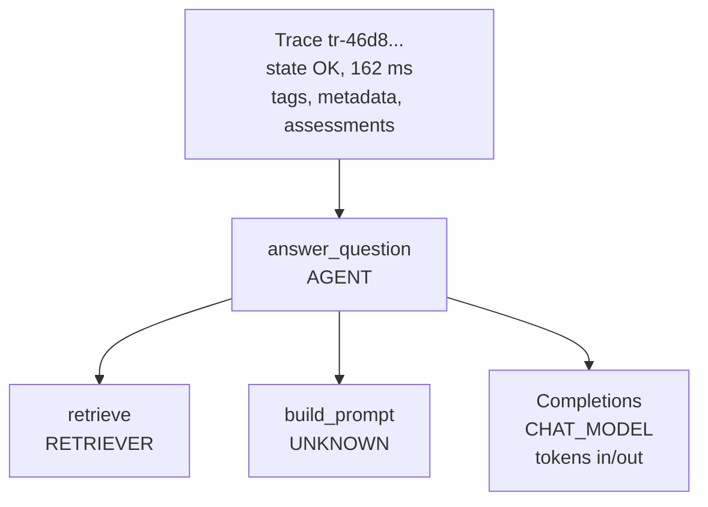

# MLflow — GenAI Tracing

MLflow Tracing records what an LLM app or agent did on one request: every LLM call, tool call, retrieval and custom step as a span, with inputs, outputs, token usage and latency. Traces are stored in the tracking server next to runs, are OpenTelemetry-compatible, and are what evaluation scorers read.

## Trace Model



| Part | Contains | Set by |
|------|----------|--------|
| Trace info | `trace_id` (`tr-...`), state (`OK` / `ERROR` / `IN_PROGRESS`), duration, request / response preview, token usage | MLflow |
| Tags | Mutable key-value labels (`test.run.id`, `env`) | `mlflow.update_current_trace(tags=...)`, `mlflow.set_trace_tag()` |
| Metadata | Immutable key-value pairs: session, user, source run, app version | `update_current_trace(metadata=...)`, MLflow |
| Spans | Tree of operations with `span_type`, inputs, outputs, attributes, events, status | Autolog, `@mlflow.trace`, `mlflow.start_span()` |
| Assessments | Feedback (scores, judge results, human ratings) and expectations (ground truth) | `mlflow.log_feedback()`, `mlflow.log_expectation()`, `mlflow.genai.evaluate()` |

Span types (`mlflow.entities.SpanType`): `LLM`, `CHAT_MODEL`, `AGENT`, `CHAIN`, `TOOL`, `RETRIEVER`, `EMBEDDING`, `RERANKER`, `PARSER`, `MEMORY`, `GUARDRAIL`, `EVALUATOR`, `WORKFLOW`, `TASK`, `UNKNOWN`. Built-in scorers depend on them — retrieval judges need `RETRIEVER` spans, tool-call judges need `TOOL` spans.

## Autologging

One call per framework instruments every call of that library:

```python
import mlflow

mlflow.set_tracking_uri("http://localhost:5000")
mlflow.set_experiment("support-bot")
mlflow.openai.autolog()          # call before the client is used
```

| Library | Call |
|---------|------|
| OpenAI SDK (also OpenAI-compatible servers: vLLM, Ollama, LM Studio) | `mlflow.openai.autolog()` |
| Anthropic SDK | `mlflow.anthropic.autolog()` |
| LangChain and LangGraph | `mlflow.langchain.autolog()` (there is no separate `langgraph` flavor) |
| LiteLLM | `mlflow.litellm.autolog()` |
| Google Gemini | `mlflow.gemini.autolog()` |
| Amazon Bedrock | `mlflow.bedrock.autolog()` |
| LlamaIndex, DSPy, CrewAI, AutoGen, Pydantic AI, smolagents | `mlflow.llama_index.autolog()`, `mlflow.dspy.autolog()`, `mlflow.crewai.autolog()`, ... |
| Mistral, Groq | `mlflow.mistral.autolog()`, `mlflow.groq.autolog()` |

Enable only the flavors the app uses. `mlflow.autolog()` without a flavor turns on every installed integration — more spans than you need when one library calls another under the hood.

## Tracing Your Own Code

```python
import mlflow
from mlflow.entities import SpanType
from openai import OpenAI

mlflow.openai.autolog()
client = OpenAI()


@mlflow.trace(span_type=SpanType.RETRIEVER)
def retrieve(question: str) -> list[str]:
    return ["France: capital Paris"]                       # inputs and return value are captured


@mlflow.trace(name="answer_question", span_type=SpanType.AGENT)
def answer(question: str, session_id: str) -> str:
    mlflow.update_current_trace(
        tags={"test.run.id": "ci-1234"},
        metadata={"mlflow.trace.session": session_id, "mlflow.trace.user": "qa-bot"},
    )
    docs = retrieve(question)

    with mlflow.start_span(name="build_prompt") as span:  # a block, not a function
        span.set_inputs({"docs": docs, "question": question})
        prompt = f"Context: {docs}\nQuestion: {question}"
        span.set_outputs({"prompt": prompt})
        span.set_attribute("prompt.chars", len(prompt))

    reply = client.chat.completions.create(               # CHAT_MODEL span from autolog
        model="gpt-4.1-mini",
        messages=[{"role": "user", "content": prompt}],
    )
    return reply.choices[0].message.content
```

- `@mlflow.trace` captures arguments and the return value; `mlflow.start_span()` captures nothing unless you call `set_inputs()` / `set_outputs()`.
- An exception inside a span marks the span and the trace as `ERROR` and records the exception as a span event.
- `mlflow.trace.session` and `mlflow.trace.user` are the standard metadata keys for multi-turn chats; the UI groups traces into sessions by them.
- Do not decorate functions that autolog already traces — you get two spans for one call.

## Where Traces Go

| Situation | Traces end up |
|-----------|---------------|
| No run active | Directly in the active experiment (Traces tab) |
| Inside `mlflow.start_run()` | Same experiment, linked to the run (`mlflow.sourceRun` metadata; `search_traces(run_id=...)`) |
| Inside `mlflow.genai.evaluate()` | Linked to the evaluation run, with scorer results as assessments |
| After `mlflow.set_active_model(name="support-bot-a1b2c3d")` | Linked to that app version (`search_traces(model_id=...)`) |

Linking traces to an app version lets you compare quality and latency between releases:

```python
active = mlflow.set_active_model(name=f"support-bot-{git_sha}")   # created on first use
# ... serve requests / run tests ...
traces = mlflow.search_traces(model_id=active.model_id)
```

## Reading Traces Back

```python
import mlflow
from mlflow.entities import SpanType

answer("What is the capital of France?", session_id="s-1")

mlflow.flush_trace_async_logging()                 # traces are exported in the background
trace = mlflow.get_trace(mlflow.get_last_active_trace_id())

print(trace.info.state, trace.info.execution_duration, trace.info.token_usage)
# OK 162 {'input_tokens': 10, 'output_tokens': 7, 'total_tokens': 17}
for span in trace.data.spans:
    print(span.name, span.span_type, span.inputs, span.outputs)
llm_spans = trace.search_spans(span_type=SpanType.CHAT_MODEL)

df = mlflow.search_traces(                          # pandas.DataFrame
    filter_string="tags.`test.run.id` = 'ci-1234'",
    max_results=100,
)
failed = mlflow.search_traces(filter_string="trace.status = 'ERROR'", return_type="list")
```

| Filter | Meaning |
|--------|---------|
| `trace.status = 'ERROR'` | Only failed traces |
| ``tags.`test.run.id` = 'ci-1234'`` | By a tag (backticks for dotted keys) |
| ``metadata.`mlflow.trace.user` = 'user-42'`` | By user; `mlflow.trace.session` for a session |
| `trace.execution_time_ms > 5000` | Slow traces |

CLI equivalent: `mlflow traces search --experiment-id 1 --max-results 10`, `mlflow traces get --trace-id tr-...`.

## Feedback and Expectations

Human ratings and ground truth are attached to traces as assessments — the same place LLM judges write to, so they can be compared later:

```python
import mlflow
from mlflow.entities import AssessmentSource, AssessmentSourceType

trace_id = mlflow.get_last_active_trace_id()       # or the id returned to the client with the answer
mlflow.log_feedback(
    trace_id=trace_id,
    name="user_thumbs_up",
    value=False,
    rationale="Answered with the wrong city",
    source=AssessmentSource(source_type=AssessmentSourceType.HUMAN, source_id="qa@example.com"),
)
mlflow.log_expectation(trace_id=trace_id, name="expected_response", value="Paris")
```

Traces with negative feedback plus an expectation are ready-made regression cases for an [evaluation dataset](./04-evaluation-prompts.md#evaluation-datasets).

## OpenTelemetry Compatibility

### Sending OTel spans to MLflow

The server accepts OTLP over HTTP on `/v1/traces`. The target experiment comes from the `x-mlflow-experiment-id` header:

```python
# uv add opentelemetry-sdk opentelemetry-exporter-otlp-proto-http
from opentelemetry.exporter.otlp.proto.http.trace_exporter import OTLPSpanExporter
from opentelemetry.sdk.resources import Resource
from opentelemetry.sdk.trace import TracerProvider
from opentelemetry.sdk.trace.export import BatchSpanProcessor

provider = TracerProvider(resource=Resource.create({"service.name": "rag-service"}))
provider.add_span_processor(BatchSpanProcessor(OTLPSpanExporter(
    endpoint="http://localhost:5000/v1/traces",
    headers={"x-mlflow-experiment-id": "3"},
)))
```

Or with env vars only: `OTEL_EXPORTER_OTLP_TRACES_ENDPOINT=http://localhost:5000/v1/traces` and `OTEL_EXPORTER_OTLP_TRACES_HEADERS=x-mlflow-experiment-id=3`. This works for services in any language and for OTel Collectors (`otlphttp` exporter).

### Sending MLflow traces to an OTel backend

| Env vars | Result |
|----------|--------|
| none | Traces go to the MLflow tracking server |
| `OTEL_EXPORTER_OTLP_TRACES_ENDPOINT=http://jaeger:4318/v1/traces` + `OTEL_EXPORTER_OTLP_TRACES_PROTOCOL=http/protobuf` | Traces go **only** to the OTLP endpoint (Jaeger, Collector), not to MLflow |
| the above + `MLFLOW_TRACE_ENABLE_OTLP_DUAL_EXPORT=true` | Traces go to both |
| the above + `MLFLOW_ENABLE_OTLP_EXPORTER=false` | OTLP export off, even though the OTel endpoint is set for other libraries |

- The default protocol is `grpc` (needs `opentelemetry-exporter-otlp-proto-grpc` and port `4317`); for `http/protobuf` install `opentelemetry-exporter-otlp-proto-http` and use `4318` with the `/v1/traces` path.
- `OTEL_SERVICE_NAME` sets the service name shown in Jaeger.
- To pass the trace context to a downstream service in the same trace, see the Collector and propagation patterns in [OpenTelemetry — Collector & Backends](../../libs/opentelemetry/05-collector-backends.md).

## Production Settings

| Setting | Effect |
|---------|--------|
| `MLFLOW_TRACE_SAMPLING_RATIO=0.1` | Keep 10% of traces (per trace, all spans or none) |
| Async trace export | On by default: spans are queued and uploaded in a background thread; `mlflow.flush_trace_async_logging()` before a script or test reads traces |
| `mlflow.tracing.disable()` / `mlflow.tracing.enable()` | Switch tracing off and on at runtime |
| `mlflow-tracing` package | Tracing-only SDK with minimal dependencies for services |
| Custom span processing | Mask PII in inputs and outputs before export (for example an OTel span processor or a Collector `redaction` processor) |

## Tracing Checklist

- [ ] One `autolog()` per framework in use, called before the first client call
- [ ] Custom steps (retrieval, tools, routing) traced with the right `span_type`
- [ ] Session and user metadata set for chat flows
- [ ] Test traffic tagged (`test.run.id`, `git_sha`) or sent to a separate experiment
- [ ] `flush_trace_async_logging()` before reading traces in tests and at the end of scripts
- [ ] Sampling ratio and PII masking decided before production traffic
- [ ] OTLP export configured on purpose — setting `OTEL_EXPORTER_OTLP_TRACES_ENDPOINT` alone moves traces away from MLflow

---
## See also
- [MLflow — Experiment Tracking, LLM Tracing & Evaluation](./index.md)
- [MLflow — Evaluation & Prompts](./04-evaluation-prompts.md)
- [OpenTelemetry — Tracing](../../libs/opentelemetry/02-tracing.md)
- [OpenTelemetry — Collector & Backends](../../libs/opentelemetry/05-collector-backends.md)
- [Jaeger — Distributed Tracing for OpenTelemetry](../jaeger/index.md)
- [Phoenix — Tracing & Instrumentation](../phoenix/02-tracing-instrumentation.md)
- [Langfuse — Tracing with the Python SDK](../langfuse/02-tracing-sdk.md)
- [LangGraph — Observability & Deployment](../../libs/langgraph/06-observability-deployment.md)
