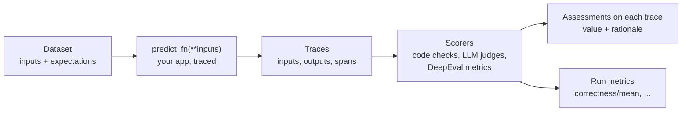

# MLflow — Evaluation & Prompts

`mlflow.genai.evaluate()` runs an app over a dataset, traces every call and applies **scorers** to the results. Each evaluation is an MLflow run: aggregated scores become run metrics (`<scorer>/mean`), per-row results become assessments on the traces. That makes quality comparable between builds exactly like any other metric.

## How Evaluation Works



| Piece | What it is |
|-------|-----------|
| `data` | List of dicts, `pandas.DataFrame`, an MLflow evaluation dataset, or traces from `search_traces()` |
| `inputs` | Dict of keyword arguments for `predict_fn` — `{"question": "..."}` calls `predict_fn(question="...")` |
| `expectations` | Ground truth: `expected_response`, `expected_facts`, `guidelines`, or your own keys |
| `outputs` | Pre-computed answers — when present and `predict_fn` is omitted, nothing is called |
| `predict_fn` | The app under test; called once per row, traced automatically |
| `scorers` | List of built-in scorers, `@scorer` functions, judges from `make_judge`, third-party scorers |

## First Evaluation

```python
import mlflow
from mlflow.entities import Feedback
from mlflow.genai.scorers import Correctness, Guidelines, scorer
from openai import OpenAI

mlflow.set_tracking_uri("http://localhost:5000")
mlflow.set_experiment("support-bot")
mlflow.openai.autolog()
client = OpenAI()

JUDGE = "openai:/gpt-4.1-mini"          # pin the judge model


def predict_fn(question: str) -> str:
    reply = client.chat.completions.create(
        model="gpt-4.1-mini",
        messages=[{"role": "user", "content": question}],
    )
    return reply.choices[0].message.content


data = [
    {"inputs": {"question": "What is the capital of France?"}, "expectations": {"expected_facts": ["Paris"]}},
    {"inputs": {"question": "What is the capital of Spain?"}, "expectations": {"expected_facts": ["Madrid"]}},
]


@scorer
def contains_expected_facts(outputs: str, expectations: dict) -> bool:
    return all(fact.lower() in outputs.lower() for fact in expectations["expected_facts"])


@scorer
def short_answer(outputs: str) -> Feedback:
    words = len(outputs.split())
    return Feedback(value=words <= 50, rationale=f"{words} words")


@scorer
def fast_enough(trace) -> bool:
    return trace.info.execution_duration < 5000          # ms


results = mlflow.genai.evaluate(
    data=data,
    predict_fn=predict_fn,
    scorers=[
        contains_expected_facts,
        short_answer,
        fast_enough,
        Correctness(model=JUDGE),
        Guidelines(name="no_apology", guidelines="The response must not apologize.", model=JUDGE),
    ],
)
print(results.run_id)
print(results.metrics)      # {'contains_expected_facts/mean': 1.0, 'correctness/mean': 1.0, ...}
df = results.result_df      # one row per case: <scorer>/value, <scorer>/rationale, trace, ...
```

- Before the full run, MLflow calls `predict_fn` once on the first row to validate it (`MLFLOW_GENAI_EVAL_SKIP_TRACE_VALIDATION=true` skips that).
- Rows run in parallel (`MLFLOW_GENAI_EVAL_MAX_WORKERS`, default 10) — lower it when the app or the judge provider rate-limits.
- Called inside `mlflow.start_run()`, the evaluation logs into that run, so you can add your own params and tags to it.

## Built-in Scorers

`mlflow scorers list -b` prints the current list with the data each scorer needs.

| Scorer | Needs | Checks |
|--------|-------|--------|
| `Correctness` | inputs, outputs, expectations (`expected_response` or `expected_facts`) | Answer matches the ground truth |
| `RelevanceToQuery` | inputs, outputs | Answer addresses the question |
| `Guidelines(guidelines=...)` | inputs, outputs | Your own rule in plain language |
| `ExpectationsGuidelines` | inputs, outputs, `guidelines` in expectations | Per-row rules from the dataset |
| `Completeness`, `Fluency`, `Summarization` | inputs, outputs | Coverage, readability, summary quality |
| `Safety` / `PIIDetection` | inputs, outputs / outputs | Harmful content; personal data in the answer |
| `Equivalence` | outputs, expectations | Output equivalent to the expected output |
| `RegexMatch(pattern=...)`, `ResponseLength(max_length=...)` | outputs | Deterministic format and length checks, no LLM |
| `RetrievalGroundedness`, `RetrievalRelevance`, `RetrievalSufficiency` | inputs, trace with `RETRIEVER` spans | RAG: answer grounded in and supported by retrieved docs |
| `ToolCallCorrectness`, `ToolCallEfficiency` | trace with `TOOL` spans | Agent picked the right tools without redundant calls |
| `UserFrustration`, `ConversationCompleteness`, `KnowledgeRetention`, `ConversationalSafety`, ... | session traces | Multi-turn conversations |

Except for the regex and length checks, built-ins are LLM judges. `model=` takes `<provider>:/<model>`: `openai:/gpt-4.1-mini` (the default when omitted, needs `OPENAI_API_KEY`), `anthropic:/<model>`, `gemini:/<model>`, `databricks:/<endpoint>`. The provider's API key comes from its usual env var.

!!! warning "Retrieval judges need `RETRIEVER` spans"
    `RetrievalGroundedness` and friends fail on traces where the lookup is traced as `TOOL` or `UNKNOWN`. Trace the retrieval step with `@mlflow.trace(span_type=SpanType.RETRIEVER)` first.

## Custom Scorers

A `@scorer` function declares which of `inputs`, `outputs`, `expectations`, `trace` it needs by its parameter names:

| Return type | Aggregated into run metrics |
|-------------|-----------------------------|
| `bool` | Yes — mean = pass rate |
| `int` / `float` | Yes — mean |
| `"yes"` / `"no"` | Yes — treated as 1 / 0 |
| Any other string (`"pass"`, `"fail"`) | **No** — stored on the trace but silently missing from `results.metrics` |
| `Feedback(value=..., rationale=...)` | By its `value`, with the rationale shown in the UI |
| `list[Feedback]` | One metric per `Feedback(name=...)`, e.g. `has_citation/mean` |

Trace-based scorer — asserts on what the agent did, not only on what it said:

```python
from mlflow.entities import Feedback, SpanType
from mlflow.genai.scorers import scorer


@scorer
def called_refund_tool_once(trace) -> Feedback:
    tools = [s.name for s in trace.search_spans(span_type=SpanType.TOOL)]
    count = tools.count("issue_refund")
    return Feedback(value=count == 1, rationale=f"tool calls: {tools}")
```

## LLM Judges with `make_judge`

For a criterion no built-in covers, write the judge instructions yourself. Template variables: `{{ inputs }}`, `{{ outputs }}`, `{{ expectations }}`, `{{ trace }}` (and `{{ conversation }}` for sessions).

```python
from mlflow.genai.judges import make_judge

escalates_billing_disputes = make_judge(
    name="escalates_billing_disputes",
    instructions=(
        "The user question is in {{ inputs }} and the support bot answer is in {{ outputs }}. "
        "If the user disputes a charge, the answer must offer to hand over to a human agent. "
        "If there is no billing dispute, answer yes. Otherwise answer yes only if the hand-over is offered."
    ),
    feedback_value_type=bool,
    model="openai:/gpt-4.1-mini",
)
```

- One judge, one criterion — split "correct and polite" into two judges, otherwise a failure tells you nothing.
- Return `bool` or `"yes"`/`"no"`, never a 1–10 scale without calibration.
- Check the judge against a small set of human-labelled cases before using it as a CI gate; pin the judge model like any dependency.
- Try a code check first: length, JSON shape, required phrases and forbidden words need no LLM.

## DeepEval Metrics as MLflow Scorers

MLflow wraps [DeepEval](../../llm-evaluation/index.md) metrics as scorers, so DeepEval's RAG, agent, conversational and safety metrics run inside `mlflow.genai.evaluate()` and their scores land in the same run:

```python
# uv add deepeval
from mlflow.genai.scorers.deepeval import AnswerRelevancy, ExactMatch, Faithfulness

scorers = [
    ExactMatch(),                                               # deterministic, reads expectations["expected_output"]
    AnswerRelevancy(threshold=0.7, model="openai:/gpt-4.1-mini"),
    Faithfulness(threshold=0.8, model="openai:/gpt-4.1-mini"),  # retrieval context comes from RETRIEVER spans
]
results = mlflow.genai.evaluate(data=data, predict_fn=predict_fn, scorers=scorers)
```

Available wrappers include `AnswerRelevancy`, `Faithfulness`, `ContextualPrecision` / `Recall` / `Relevancy`, `Hallucination`, `TaskCompletion`, `ToolCorrectness`, `ArgumentCorrectness`, `PlanAdherence`, `TurnRelevancy`, `RoleAdherence`, `Bias`, `Toxicity`, `PIILeakage`, `JsonCorrectness`, `ExactMatch`, `PatternMatch`. Similar wrappers exist for RAGAS (`mlflow.genai.scorers.ragas`), TruLens, Phoenix evals and Guardrails AI.

How the two tools split the work:

| Need | DeepEval | MLflow |
|------|----------|--------|
| Metric library (G-Eval, RAG triad, agent metrics, red teaming) | Main strength | Uses DeepEval metrics via wrappers |
| pytest-style assertions (`assert_test`, `deepeval test run`) | Yes | Plain pytest + scorers |
| History of runs, comparison between builds, dashboards | Confident AI (hosted) | Built in, self-hosted |
| Traces of the app under test | Own tracing | Autolog + OTLP, shared with production traces |
| Prompt and model versions tied to results | — | Prompt registry, model registry |

A common setup: keep DeepEval tests as they are and log their results to MLflow per CI run (see [Testing, CI & Model Registry](./05-testing-ci-registry.md)), or move the metrics into `mlflow.genai.evaluate()` when you want per-trace assessments in the MLflow UI.

## Evaluation Datasets

A dataset stored in MLflow is versioned with the experiment and reusable across runs:

```python
import mlflow
from mlflow.genai.datasets import create_dataset, get_dataset

exp = mlflow.set_experiment("support-bot")

dataset = create_dataset(name="capitals_golden", experiment_id=[exp.experiment_id], tags={"owner": "qa"})
dataset.merge_records([
    {"inputs": {"question": "Capital of France?"}, "expectations": {"expected_response": "Paris"}},
    {"inputs": {"question": "Capital of Spain?"}, "expectations": {"expected_response": "Madrid"}},
])

dataset = get_dataset(name="capitals_golden")             # later, in CI
print(dataset.to_df()[["inputs", "expectations"]])
results = mlflow.genai.evaluate(data=dataset, predict_fn=predict_fn, scorers=[...])
```

- `merge_records()` also accepts a DataFrame and traces (`mlflow.search_traces(...)` result) — production traces with negative feedback become regression cases.
- Keep the golden dataset small and curated (50–300 cases); add a case for every bug found.
- A dataset in a JSON / CSV file in the repo works too — pass the list of dicts directly. The MLflow dataset wins when non-developers add cases through the UI.

Evaluating traces that already exist — for example yesterday's production sample — needs no `predict_fn`:

```python
traces = mlflow.search_traces(filter_string="tags.env = 'prod'", max_results=200)
mlflow.genai.evaluate(data=traces, scorers=[RelevanceToQuery(model=JUDGE), Safety(model=JUDGE)])
```

## Comparing Evaluation Runs

- **UI:** the experiment's evaluation runs view (the link printed by `evaluate()`) → select two runs → side-by-side view of every case: both answers, every scorer value and rationale, and which cases flipped from pass to fail.
- **Code:** evaluation metrics are ordinary run metrics.

```python
runs = mlflow.search_runs(
    experiment_names=["support-bot"],
    filter_string="tags.prompt_version = 'v2'",
    order_by=["attributes.start_time DESC"],
)
print(runs[["run_id", "metrics.correctness/mean", "metrics.no_apology/mean"]])
```

## Prompt Registry

Prompts are versioned objects in MLflow: every `register_prompt` with the same name creates a new immutable version; aliases point to versions.

```python
import mlflow

mlflow.genai.register_prompt(
    name="support-answer",
    template="Answer using the context.\nContext: {{context}}\nQuestion: {{question}}",
    commit_message="initial",
    tags={"owner": "qa"},
)
mlflow.genai.register_prompt(
    name="support-answer",
    template="Be concise.\nContext: {{context}}\nQuestion: {{question}}",
    commit_message="shorter answers",
)

mlflow.genai.set_prompt_alias("support-answer", alias="production", version=1)
mlflow.genai.set_prompt_alias("support-answer", alias="candidate", version=2)

prompt = mlflow.genai.load_prompt("prompts:/support-answer@candidate")
text = prompt.format(context="France: capital Paris", question="Capital of France?")
```

| URI | Loads |
|-----|-------|
| `prompts:/support-answer/2` | Exactly version 2 |
| `prompts:/support-answer@production` | Whatever the alias points to |
| `prompts:/support-answer@latest` | The newest version |

Variables use double braces (`{{question}}`); `prompt.template` gives the raw text, `prompt.version` the version number.

Evaluating a candidate prompt against production:

```python
for alias in ["production", "candidate"]:
    prompt = mlflow.genai.load_prompt(f"prompts:/support-answer@{alias}")

    def predict_fn(question: str, context: str) -> str:
        reply = client.chat.completions.create(
            model="gpt-4.1-mini",
            messages=[{"role": "user", "content": prompt.format(context=context, question=question)}],
        )
        return reply.choices[0].message.content

    with mlflow.start_run(run_name=f"prompt-{alias}-v{prompt.version}"):
        mlflow.set_tags({"prompt_alias": alias, "prompt_version": str(prompt.version)})
        mlflow.genai.evaluate(data=dataset, predict_fn=predict_fn, scorers=[Correctness(model=JUDGE)])
```

Move `production` to the candidate version only when its run is at least as good — the same pattern as model aliases in [Testing, CI & Model Registry](./05-testing-ci-registry.md#model-registry-for-release-gating).

## Evaluation Checklist

- [ ] Golden dataset in MLflow or in the repo, with expectations for every case
- [ ] 3–5 scorers, one criterion each; code checks before LLM judges
- [ ] Judge model pinned and passed explicitly (`model=`)
- [ ] Scorers return `bool`, numbers or `"yes"`/`"no"` so they show up in run metrics
- [ ] Retrieval and tool steps traced with `RETRIEVER` / `TOOL` span types before using those judges
- [ ] Evaluation runs tagged with prompt version, model and git SHA
- [ ] LLM judges checked against human labels before gating CI on them

---
## See also
- [MLflow — Experiment Tracking, LLM Tracing & Evaluation](./index.md)
- [MLflow — GenAI Tracing](./03-genai-tracing.md)
- [MLflow — Testing, CI & Model Registry](./05-testing-ci-registry.md)
- [DeepEval — LLM Testing Guide](../../llm-evaluation/index.md)
- [DeepEval — Datasets](../../llm-evaluation/03_practical/16_datasets.md)
- [Phoenix — Evaluations](../phoenix/04-evaluations.md)
- [Langfuse — Datasets & Evaluations](../langfuse/04-datasets-evaluations.md)
