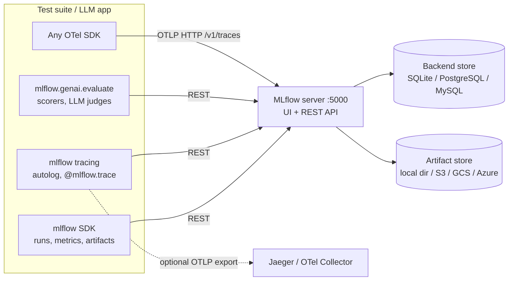

# MLflow — Experiment Tracking, LLM Tracing & Evaluation

Open-source (Apache 2.0, Linux Foundation) platform for the ML and GenAI lifecycle: experiment tracking, a model registry, and — since MLflow 3 — tracing, evaluation and a prompt registry for LLM apps and agents. One server with a UI and REST API, backed by a SQL database and an artifact store.

## What MLflow Gives a QA Engineer

1. **A history of every test and eval run** — params, metrics, tags and report files per CI run, searchable and comparable in the UI.
2. **LLM traces** — autologging for OpenAI, Anthropic, LangChain / LangGraph, LiteLLM and others; `@mlflow.trace` for your own code.
3. **Evaluation** — `mlflow.genai.evaluate()` with built-in LLM judges, custom scorers, DeepEval metrics as scorers, versioned datasets.
4. **Release gates** — prompt and model versions with aliases (`@candidate`, `@production`), promoted only when the eval run passes.

## Where MLflow Fits



| Area | Entities | Used for in QA |
|------|----------|----------------|
| [Experiment tracking](02-experiment-tracking.md) | Experiment → Run → params, metrics, tags, artifacts | One run per CI job or eval, compared over time |
| [Tracing](03-genai-tracing.md) | Trace → spans, tags, metadata, assessments | Debugging LLM calls, asserting on tool calls |
| [Evaluation](04-evaluation-prompts.md) | Dataset, scorer, evaluation run | Quality scores on a golden dataset per build |
| [Prompt registry](04-evaluation-prompts.md) | Prompt → versions → aliases | Testing a prompt version before promoting it |
| [Model registry](05-testing-ci-registry.md) | Registered model → versions → aliases, tags | Gating which model / app version goes to production |

## Section Map

| File | Topics |
|------|--------|
| [01 Setup & Architecture](./01-setup-architecture.md) | `mlflow server`, backend and artifact stores, Docker Compose + Postgres, allowed hosts, auth, env vars |
| [02 Experiment Tracking](./02-experiment-tracking.md) | Experiments, runs, params, metrics, tags, artifacts, autolog, `search_runs`, comparing runs |
| [03 GenAI Tracing](./03-genai-tracing.md) | `mlflow.<flavor>.autolog()`, `@mlflow.trace`, span types, sessions, feedback, search, OpenTelemetry in and out |
| [04 Evaluation & Prompts](./04-evaluation-prompts.md) | `mlflow.genai.evaluate`, built-in judges, `@scorer`, `make_judge`, DeepEval scorers, datasets, prompt registry |
| [05 Testing, CI & Model Registry](./05-testing-ci-registry.md) | pytest + DeepEval results per CI run, trace assertions, regression gate, GitHub Actions, aliases, pitfalls |

## Installation

```bash
uv add mlflow                  # full package: SDK, server, UI, evaluation
uv add mlflow-tracing          # lightweight tracing-only SDK for production services
```

`mlflow-tracing` contains only the tracing SDK with a minimal set of dependencies — enough for an app that sends traces to a remote MLflow server. The server, UI and evaluation need the full `mlflow` package.

## Minimal Setup

```bash
uv run mlflow server --port 5000        # SQLite ./mlflow.db + ./mlartifacts, UI on http://localhost:5000
```

```python
# uv add mlflow openai
import mlflow
from openai import OpenAI

mlflow.set_tracking_uri("http://localhost:5000")
mlflow.set_experiment("support-bot")
mlflow.openai.autolog()                  # every OpenAI call becomes a trace

with mlflow.start_run(run_name="smoke"):
    mlflow.log_param("model", "gpt-4.1-mini")
    reply = OpenAI().chat.completions.create(
        model="gpt-4.1-mini",
        messages=[{"role": "user", "content": "What is the capital of France?"}],
    )
    mlflow.log_metric("answer_chars", len(reply.choices[0].message.content))
# UI -> Experiments -> support-bot: the run on the Runs tab, the LLM call on the Traces tab
```

## Quick Commands

| Command | Use |
|---------|-----|
| `uv run mlflow server --port 5000` | Local server with SQLite and local artifacts |
| `uv run mlflow server --backend-store-uri postgresql://... --artifacts-destination s3://bucket --host 0.0.0.0` | Shared team server |
| `curl -sf http://localhost:5000/health` | Readiness check before tests start |
| `uv run mlflow experiments search` | List experiments |
| `uv run mlflow runs list --experiment-id 1` | List runs of one experiment |
| `uv run mlflow traces search --experiment-id 1 --max-results 10` | Latest traces from the CLI |
| `uv run mlflow scorers list -b` | Built-in scorers and the data they need |
| `uv run mlflow db upgrade <backend-store-uri>` | Migrate the database schema after an MLflow upgrade |
| `uv run mlflow doctor` | Versions and environment info for bug reports |

## Key Environment Variables

| Variable | Example | Purpose |
|----------|---------|---------|
| `MLFLOW_TRACKING_URI` | `http://mlflow:5000` | Where the SDK sends runs and traces (default: local `sqlite:///mlflow.db`) |
| `MLFLOW_EXPERIMENT_NAME` | `llm-regression` | Default experiment when `set_experiment()` is not called |
| `MLFLOW_EXPERIMENT_ID` | `5` | Same, by id; if both are set, they must point to the same experiment |
| `MLFLOW_TRACKING_USERNAME` / `MLFLOW_TRACKING_PASSWORD` | `ci-bot` / `***` | Basic auth against a server with `--app-name basic-auth` |
| `MLFLOW_TRACKING_TOKEN` | `***` | Bearer token when a proxy in front of MLflow expects one |
| `MLFLOW_TRACE_SAMPLING_RATIO` | `0.1` | Keep 10% of traces |
| `MLFLOW_GENAI_EVAL_MAX_WORKERS` | `4` | Parallelism of `mlflow.genai.evaluate` (default 10) |
| `OTEL_EXPORTER_OTLP_TRACES_ENDPOINT` | `http://jaeger:4318/v1/traces` | Send MLflow traces to an OTLP backend instead of MLflow |

## MLflow vs Phoenix, Langfuse and Jaeger

| Aspect | MLflow | [Phoenix](../phoenix/index.md) | [Langfuse](../langfuse/index.md) | [Jaeger](../jaeger/index.md) |
|--------|--------|---------|----------|--------|
| Focus | Whole ML / GenAI lifecycle | LLM tracing and evals | LLM tracing, prompts, analytics | Distributed tracing of services |
| Unique strength | Runs with params and metrics, model registry | Light, OTel-native, notebooks | Prompt management, team workflows | Service map, trace compare |
| Tracing | Own SDK + autolog, accepts and exports OTLP | OTLP + OpenInference | Own SDK (OTel-based), OTLP endpoint | Plain OTLP |
| Evaluation | `mlflow.genai.evaluate`, judges, DeepEval / RAGAS scorers | `phoenix.evals`, experiments | Experiments, managed LLM judges | — |
| Deployment | One server + SQL DB + artifact store | One container, SQLite / Postgres | Web + worker, Postgres + ClickHouse + Redis + S3 | One binary, several storages |
| Best fit | Teams that already track ML experiments, or need runs + registry + LLM evals in one place | Local LLM debugging and CI evals | Shared LLM product platform | Microservice and API debugging |

Rule of thumb: pick MLflow when you want **test and eval runs as first-class, comparable records** and a registry to gate releases; pick Phoenix or Langfuse when LLM observability is the only need; keep Jaeger for non-LLM service traces.

## Quick Rules

1. **Always set `MLFLOW_TRACKING_URI`** in CI — without it every job writes to a throwaway local `mlflow.db`.
2. **One experiment per suite**, one run per CI job; the run name carries the pipeline id.
3. **Tag every run** with `git_sha`, `git_branch`, `ci_pipeline_id` — regressions are found by these tags.
4. **Params for inputs, metrics for results** — params are immutable strings; metrics are numbers with history.
5. **Autolog once per framework** (`mlflow.openai.autolog()`) and add `@mlflow.trace` only for your own code — not on top of autologged calls.
6. **Prefer code scorers**, then built-in judges, then custom judges — and pin the judge model.
7. **Use aliases, not version numbers**, for prompts and models that tests and apps load.
8. **Pin the server version** and run `mlflow db upgrade` on purpose when upgrading.

---
## See also
- [Digital Garden: Knowledge Base](../../index.md)
- [Tools — Practical Reference Guides](../index.md)
- [DeepEval — LLM Testing Guide](../../llm-evaluation/index.md)
- [Arize Phoenix — LLM Tracing & Evaluation](../phoenix/index.md)
- [Langfuse — LLM Tracing, Prompts & Evals](../langfuse/index.md)
- [Jaeger — Distributed Tracing for OpenTelemetry](../jaeger/index.md)
- [OpenTelemetry — Python Observability](../../libs/opentelemetry/index.md)
- [Eval Harness — Tools, Testing & CI](../../ai-harness/04-eval-harness-tools-ci.md)
