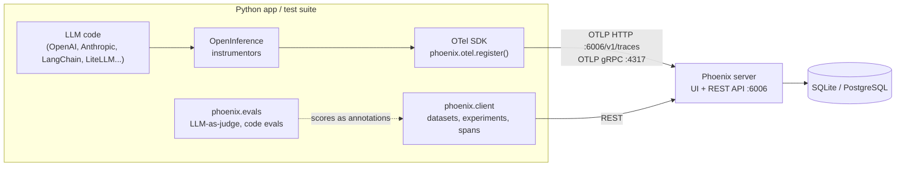

# Arize Phoenix — LLM Tracing & Evaluation

Open-source (Elastic License 2.0) platform for tracing, evaluating and testing LLM applications: agents, RAG pipelines, tool calls. Self-hosted in one container, built on OpenTelemetry.

## Where Phoenix Fits



- **OpenTelemetry** — the transport. Phoenix is an OTLP backend; any OTel exporter or Collector can send to it.
- **OpenInference** — Arize's semantic conventions on top of OTel for LLM spans: span kinds (`LLM`, `CHAIN`, `TOOL`, `RETRIEVER`, `AGENT`...), `input.value`, `llm.token_count.*`, `session.id`.
- **Phoenix** — stores spans, renders traces and sessions, holds datasets, experiments, prompts and annotations.

## Installation

```bash
# Server (UI + collector) — for local runs and CI
uv add --dev arize-phoenix

# Lightweight client-side packages — for the app and the tests
uv add arize-phoenix-otel            # register(): OTel + OpenInference setup
uv add arize-phoenix-client          # REST client: datasets, experiments, spans, prompts, pytest plugin
uv add arize-phoenix-evals           # evaluators: LLM-as-judge and code metrics

# Instrumentors — only for the libraries you use
uv add openinference-instrumentation-openai openinference-instrumentation-anthropic
uv add openinference-instrumentation-litellm openinference-instrumentation-langchain
```

!!! warning "Old API: `px.Client()`"
    `import phoenix as px; px.Client()` is gone in current `arize-phoenix` releases. Use `from phoenix.client import Client` (package `arize-phoenix-client`). The same goes for `llm_classify` and the old prompt templates in `phoenix.evals`: replaced by `create_classifier` and `phoenix.evals.metrics` in `arize-phoenix-evals` 3.x.

## Section Map

| File | Topics |
|------|--------|
| [01 Setup & Architecture](./01-setup-architecture.md) | `phoenix serve`, Docker, Compose + Postgres, ports, projects, auth, env vars |
| [02 Tracing & Instrumentation](./02-tracing-instrumentation.md) | `register()`, OpenInference instrumentors, manual spans, sessions, users, Collector, annotations |
| [03 Datasets & Experiments](./03-datasets-experiments.md) | Datasets from DataFrame / CSV / traces, `run_experiment`, evaluators, comparisons, prompts |
| [04 Evaluations](./04-evaluations.md) | `phoenix.evals`, built-in metrics, `create_classifier`, code evals, logging results to spans, judge calibration |
| [05 Testing, CI & Production](./05-testing-ci-production.md) | pytest plugin, asserting on spans, CI regression gates, retention, sampling, PII |

## Minimal Setup

```python
from openai import OpenAI
from phoenix.otel import register

tracer_provider = register(
    project_name="ticket-triage",
    endpoint="http://localhost:6006/v1/traces",
    auto_instrument=True,        # instruments every installed openinference-instrumentation-* package
)

client = OpenAI()
client.chat.completions.create(
    model="gpt-4o-mini",
    messages=[{"role": "user", "content": "Route this ticket: 'I was charged twice'"}],
)
# Open http://localhost:6006 -> project "ticket-triage" -> LLM span with prompt, output, tokens
```

## Quick Commands

| Command | Use |
|---------|-----|
| `uv run phoenix serve` | Local server, UI on `http://localhost:6006`, data in `~/.phoenix` |
| `docker run -p 6006:6006 -p 4317:4317 arizephoenix/phoenix:latest` | Server in Docker (pin a version in CI) |
| `PHOENIX_WORKING_DIR=/tmp/phx uv run phoenix serve` | Throwaway instance with isolated SQLite |
| `curl -s http://localhost:6006/healthz` | Readiness check before tests start |
| `PHOENIX_TEST_TRACKING=false uv run pytest` | Run `@pytest.mark.phoenix` tests without recording |

## Key Environment Variables

| Variable | Example | Read by |
|----------|---------|---------|
| `PHOENIX_COLLECTOR_ENDPOINT` | `http://localhost:6006` | `register()` and `Client()` |
| `PHOENIX_PROJECT_NAME` | `ticket-triage` | `register()` — default project for spans |
| `PHOENIX_API_KEY` | `eyJhbGciOi...` | `register()` and `Client()` when auth is on |
| `PHOENIX_CLIENT_HEADERS` | `x-team=qa` | Extra headers for OTLP / REST |
| `PHOENIX_PORT` / `PHOENIX_GRPC_PORT` | `6006` / `4317` | Server ports |
| `PHOENIX_SQL_DATABASE_URL` | `postgresql://user:pass@db:5432/phoenix` | Server storage (default: SQLite) |

## Phoenix vs Langfuse

| Aspect | Phoenix | [Langfuse](../langfuse/index.md) |
|--------|---------|----------|
| Licence | Elastic License 2.0, all features self-hostable | MIT core, some enterprise features paid |
| Deployment | Single container, SQLite or Postgres | Web + worker, Postgres + ClickHouse + Redis + S3 |
| Tracing model | Native OTLP + OpenInference conventions | Own SDK (OTel-based in v3), OTLP endpoint |
| Evals | `phoenix.evals` library, runs in your process | Managed LLM-as-judge in the UI + SDK scores |
| Experiments | `run_experiment` on datasets, pytest plugin | Datasets + experiment runs via SDK |
| Best fit | Local debugging, notebooks, CI test runs, OTel shops | Team-wide prompt management, product analytics, cost dashboards |

Rule of thumb: Phoenix is the lighter choice for a QA engineer running it next to a test suite; Langfuse is heavier but stronger as a shared production platform.

## Quick Rules

1. **Instrument with OpenInference, not ad-hoc logging** — Phoenix renders LLM, tool and retriever spans only when OpenInference attributes are present.
2. **One project per app and environment** (`triage-dev`, `triage-ci`, `triage-prod`) — never mix test runs with production traffic.
3. **Pin the server version** in Docker and CI; the client packages check server capabilities and fail on old servers.
4. **Use `batch=True` in services**, the default `SimpleSpanProcessor` only in tests and scripts.
5. **Tag every test run** with a session id or metadata (test node id, git SHA) so traces can be found and asserted.
6. **Turn failures into dataset examples** — a production bug becomes a regression test in the next experiment.
7. **Calibrate LLM judges against human labels** before using their scores as CI gates.
8. **Set a retention policy and mask PII** before pointing production traffic at Phoenix.

---
## See also
- [Digital Garden: Knowledge Base](../../index.md)
- [Tools — Practical Reference Guides](../index.md)
- [Langfuse — LLM Tracing, Prompts & Evals](../langfuse/index.md)
- [MLflow — Experiment Tracking, LLM Tracing & Evaluation](../mlflow/index.md)
- [OpenTelemetry — Python Observability](../../libs/opentelemetry/index.md)
- [DeepEval — LLM Testing Guide](../../llm-evaluation/index.md)
- [Agentic AI — Testing, Evaluation & Observability](../../agentic-ai-architecture/06-testing-observability.md)
- [Jaeger — Distributed Tracing for OpenTelemetry](../jaeger/index.md)
