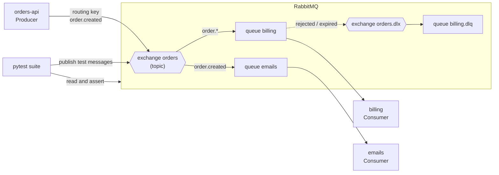

# RabbitMQ — Message Broker, Routing & Queues

Open-source (MPL 2.0) message broker. Producers publish messages to **exchanges**, exchanges route them to **queues** by **bindings**, and consumers take messages from queues and **acknowledge** them. The main protocol is AMQP 0-9-1; RabbitMQ 4.x also speaks AMQP 1.0, MQTT and STOMP, and has **streams** for Kafka-like replayable logs.

This guide is about RabbitMQ itself: the routing model, running it locally, Python clients and testing services that use it. Queue vs stream concepts, delivery semantics, retries and DLQ patterns in general are in [Queues vs Streams](../../software-design-patterns/05-composition-architectural/04-queues-streams-messaging.md).

## Where RabbitMQ Fits



- **The producer never writes to a queue directly** — it publishes to an exchange with a routing key; bindings decide which queues get a copy.
- **Each queue is a work queue**: several consumers on one queue share its messages (competing consumers); a message is gone once acked.
- **Tests** publish into the real broker and assert on what the system under test consumes or publishes back — see [04 Testing RabbitMQ-Based Systems](./04-testing.md).

## Section Map

| File | Topics |
|------|--------|
| [01 Core Concepts](./01-core-concepts.md) | Exchanges (direct, topic, fanout, headers), queues, bindings, routing keys, vhosts, connections and channels, acks, prefetch, durability, queue types (quorum, classic, streams), TTL, dead lettering, publisher confirms |
| [02 Local Setup & CLI](./02-local-setup-cli.md) | Docker image with the management UI, ports, Docker Compose with a healthcheck, users and vhosts, `rabbitmqctl`, `rabbitmq-diagnostics`, management UI and HTTP API, definitions |
| [03 Python Clients](./03-python-clients.md) | `pika` (blocking), `aio-pika` (asyncio), publishing with confirms, consuming with manual ack and prefetch, retries through a DLX, idempotency, connection recovery |
| [04 Testing RabbitMQ-Based Systems](./04-testing.md) | What to test where, pure handlers, Testcontainers fixture, isolated queues per test, assertions with deadlines, DLQ and redelivery tests, queue depth via the HTTP API, CI, pitfalls |

## Minimal Setup

```bash
docker run -d --name rabbitmq -p 5672:5672 -p 15672:15672 rabbitmq:4-management
# AMQP on 5672, management UI on http://localhost:15672 (guest / guest)
```

```python
# uv add pika
import pika

connection = pika.BlockingConnection(pika.ConnectionParameters("localhost"))
channel = connection.channel()
channel.queue_declare(queue="orders", durable=True)

channel.basic_publish(exchange="", routing_key="orders", body=b'{"id": "ord-1"}')   # default exchange: routing key = queue name

method, properties, body = channel.basic_get(queue="orders", auto_ack=True)
print(body)                 # b'{"id": "ord-1"}'
connection.close()
```

## Quick Commands

```bash
docker exec rabbitmq rabbitmq-diagnostics -q ping                              # is the node up?
docker exec rabbitmq rabbitmqctl list_queues name messages consumers           # depth and consumers per queue
docker exec rabbitmq rabbitmqctl list_exchanges name type
docker exec rabbitmq rabbitmqctl list_bindings source_name routing_key destination_name
docker exec rabbitmq rabbitmqctl purge_queue orders                            # drop all ready messages
```

## Ports

| Port | Purpose |
|------|---------|
| 5672 | AMQP 0-9-1 and AMQP 1.0 (clients) |
| 5671 | AMQP over TLS |
| 15672 | Management UI and HTTP API (management plugin) |
| 5552 | Stream protocol (stream plugin) |
| 15692 | Prometheus metrics (prometheus plugin) |

## RabbitMQ vs Kafka vs Redis Streams

| | RabbitMQ | Kafka | Redis Streams |
|---|---|---|---|
| Model | Broker routes messages to queues; a message is removed after ack | Append-only log; consumers track offsets and can re-read | Append-only stream inside Redis, consumer groups |
| Routing | Rich: direct, topic, fanout, headers exchanges | By topic and key only | By stream name only |
| Replay | Only with streams | Built in, by retention | Built in, by length or age |
| Per-message features | TTL, dead lettering, priorities, delivery limit | None per message | Minimal |
| Best fit | Task queues, per-message routing, request/reply, work distribution | Event bus, audit log, many independent consumers, high throughput | Light streams next to an existing Redis |

Rule of thumb: pick RabbitMQ for **task distribution with routing** and per-message control; pick [Kafka](../kafka/index.md) when events must be **kept and re-read** by many consumers.

## Quick Rules

1. **Quorum queues for anything that matters** — they are replicated and survive node loss; classic queue mirroring was removed in RabbitMQ 4.0.
2. **Manual acks, ack after processing** — `auto_ack=True` loses the message if the consumer dies mid-way.
3. **Set a prefetch** (`basic_qos`) — without it the broker pushes the whole queue to one consumer.
4. **Publisher confirms + persistent messages + durable queues** — all three are needed for a message to survive a broker restart.
5. **Every queue with retries gets a dead-letter exchange** — poison messages must end up somewhere visible, not loop forever.
6. **Make consumers idempotent** — redelivery after a lost ack is normal, not an error.
7. **One connection per process, one channel per thread** — channels are not thread-safe; connections are expensive.
8. **Change `guest/guest`** and give each service its own user and vhost outside local runs.

---
## See also
- [Digital Garden: Knowledge Base](../../index.md)
- [Tools — Practical Reference Guides](../index.md)
- [Queues vs Streams: Message Delivery, Ordering & Reliability](../../software-design-patterns/05-composition-architectural/04-queues-streams-messaging.md)
- [Apache Kafka — Event Streaming, Producers & Consumers](../kafka/index.md)
- [Celery — Distributed Task Queue for Python](../../libs/celery/index.md)
- [Docker & Docker Compose](../docker/index.md)
- [Pytest — Python Testing Framework](../../libs/pytest/index.md)
